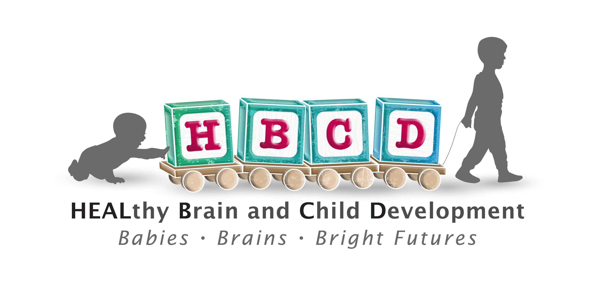

Welcome to the HEALthy Brain and Child Development (HBCD) Data Coordinating Center (HDCC) Docs site!

This is <b>internal</b> HDCC documentation and contains information pertinent to members of the HBCD consortium and those contributing to development in some fashion.
 

To reach the main HBCD Data Release Docs, please visit <a href="https://docs.hbcdstudy.org">https://docs.hbcdstudy.org</a>

## HDCC Data Release Framework

The HDCC is committed to a principled and transparent approach to data sharing. Our data release workflow strives emphasizes **clarity, quality, reproducibility, timeliness, and transparency**, drawing on international best practices and customized to the complexities of a large, multi-site longitudinal study (see [References](#references-and-frameworks)).

#### 1. Clear Objectives and Scope

Each data release begins with a clearly defined scope. We identify which data components will be made publicly available. This includes an organized document of instruments and visits to be released that is signed off by leadership groups across HDCC-HCAC, program, and HBCD Workgroups ([see details](../orgcharts.md#hbcd-workgroups)). It is archived and versioned within the Docs pages. 

* **Metadata and Documentation**: Each release includes standardized metadata, data dictionaries, and explanatory documentation, aligned with BIDS and accompanied by dedicated documentation pages for data and software.

* **Timeline**: Each release will also have an anticipated timeline for all parties to set expectations (see [Release Timeline](workflows/release-wf.md#release-timeline)).

**Why this matters:**  
Defining clear goals and timelines that are documented, versioned, and available centrally to all parties for transparency. It also helps prevent scope creep and confusion about which data elements are production ready.

#### 2. Data Quality Checks

We use a multi-layered strategy to ensure data accuracy and consistency across all sites and modalities:

* **Automated Validations**: Scripts check for unit consistency, value ranges, flagging of missing data, and adherence to schema at both intake and release stages.

* **Manual Checks**: Various manual check for various data types are used to supplement the automated validations to detect subtle or edge-case errors.

* **Peer Review**: Data joins and transformations are independently reviewed by a second analyst to verify logic and reproducibility. 

* **Statistical Profiling**: Summary statistics, outlier plots, checking participant-level scoring, are generated to identify unexpected patterns or anomalies in scoring or variable distributions. Done by SMEs and Biostatistics WG via Dashboards, and Lasso Pre-Release System. 

* **Provenance Tracking**: All data are traced from raw intake through every transformation to the final public version using version-controlled pipelines. All release changes and updates are tracked, documented, versioned, and shared for the consortium (see **Beta Release Notes** section in left-hand menu). 

**See full QC procedure details [here](workflows/qc.md).**

**Why this matters:**  
Data quality is foundational for scientific integrity and usability. Multiple validation layers ensure we catch both systemic and isolated issues before public release. Laying out every update, change, and error for all members of the consortium to view can be difficult, but it provides a level of transparency and helps with speed to assure deadlines are met. 

#### 3. Version Control

All data, code, and pipelines are managed using robust versioning systems, primarily Git and DataLad. Releases are versioned with the Beta Releases. Each transformation step and release ‘snapshot’ is tracked, documented, and reproducible.

**Why this matters:**  
Version control ensures that every release can be reconstructed exactly, supporting reproducibility, auditing, and collaborative development. It also provides transparency and protects against data loss or undocumented changes.

#### 4. Reproducibility

Our data processing workflows are built to be fully reproducible by both internal and external teams:

* **Reproducible Environments**: We use Docker, Conda, Puppet Orchestration, and Snakemake to containerize and automate our pipelines, ensuring consistency across computing environments.

* **Standardized & Reviewed Code**: All code is standardized and undergoes independent secondary review by external partners, such as the [NMIND Consortium](https://docs.hbcdstudy.org/latest/datacuration/nmind/).

* **Software Documentation**: Each software module is paired with its own documentation page and linked to the associated data release.

**Why this matters:**  
Reproducibility is a cornerstone of modern science. It ensures that results derived from HBCD data can be verified, trusted, and extended by the broader research community. Every element of our code base is available for the community to utilize and identify improvements and contribute to improvements of the code base. This ensures high quality packages and modernization with a fast changing scientific landscape. 

#### 5. Timeliness Planning

With the lessons learned from Release 1.0, we are now taking a proactive approach to timeline management and release readiness. The release timeline is now part of the approval process for the defined objectives and scope  (see [Release Timeline](workflows/release-wf.md#release-timeline)). 

* **Early Planning**: Development for a December/January release begins in July, ensuring enough time for quality control, documentation, and stakeholder review.

* **Staging Area**: We use a pre-release (“beta”) environment so internal teams can interact with the release as end users would, helping to detect and correct issues early.

* **Pre-mortem Reviews**: We are developing pre-mortem sessions to identify potential risks (e.g., missing data, corrupted files) before they can delay a release.

**Why this matters:**  
Timely releases and thoughtful approved timelines maintain community momentum and fulfill commitments. Early and iterative review avoids last-minute surprises and enables smoother rollout.

#### 6. Transparency

We commit to open and honest communication with all data users:

* **Changelogs**: Every version or beta release includes detailed notes outlining what changed, what was added, and what limitations remain.

* **Known Issues**: Known problems, caveats, and limitations are explicitly listed in each release.

* **Feedback Channels**: Users can report problems or request clarifications via the Lasso Help Center; all tickets are logged, triaged, and tracked in Monday’s.

* Working groups also have access to our HDCC liaison who attends WG meetings, assists with filling our change requests templates (also logged and documented), and directly triages and tracks the change request in our project management platform Monday’s. 

**Why this matters:**  
Transparency fosters trust and accountability. It empowers users to make informed decisions and strengthens the collaborative feedback loop between data producers and consumers.

### References and Frameworks

Our methods are informed by internationally recognized guidance and peer-reviewed literature, including:

* USGS “Fundamental Science Practices” Data Release Guide

* California Open Data Publisher’s Handbook

* Western Australia “Guide & Checklist to Identifying & Preparing Data for Release”

* Alberta/Open Government “Data Publishing – Assessment Checklist”

* International Open Data Charter

* Data Curation Primer – DataONE

* Frictionless Data Field Guide: [https://frictionlessdata.io/field-guide/](https://frictionlessdata.io/field-guide/)

* Open Data Handbook – Open Knowledge Foundation

* Peng RD. (2011). *Reproducible Research in Computational Science*. Science

* Leek JT & Peng RD. (2015). *Reproducible research can still be wrong*. PNAS

* Stodden et al. (2016). *Enhancing reproducibility for computational methods*. Science