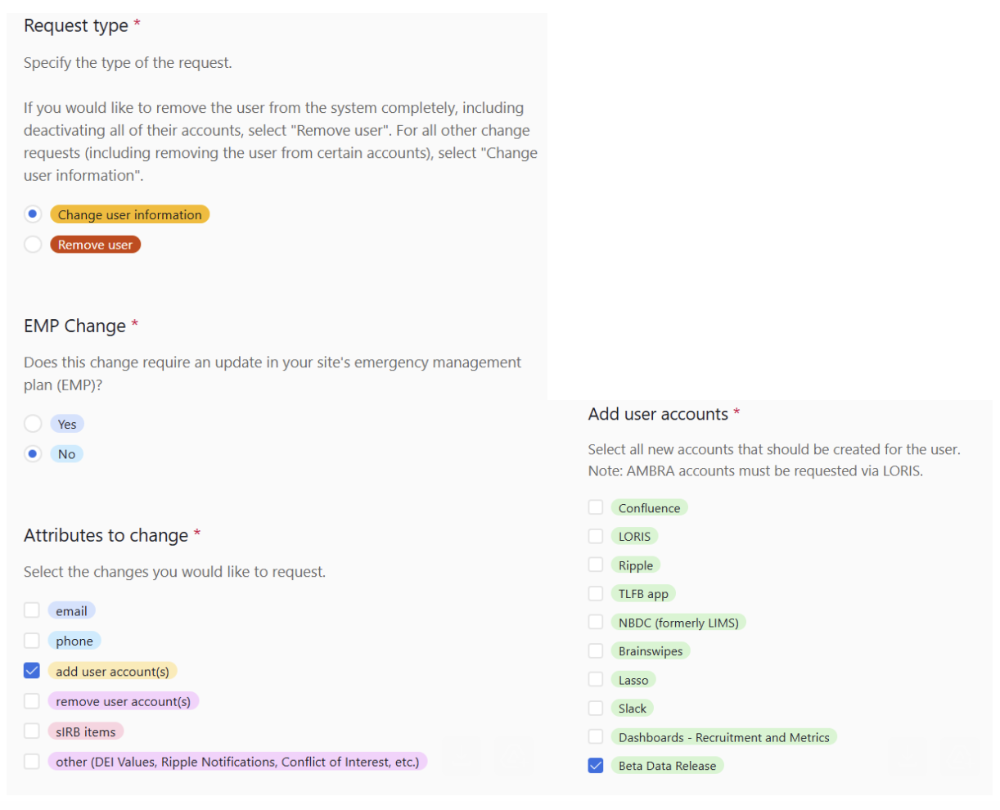

# Review Your Data & Report Issues

## Internal Data QC on Beta Lasso Platform

The Beta Data Release Site is used for quality control so that HBCD Consortium members to review their data as it appears on the Lasso platform prior to inclusion in a release. 

***HBCD Consortium members are HIGHLY ENCOURAGED to perform a detailed review of their data as soon as it is available so that any issues can be resolved in time before its inclusion in the release data.***

To access the beta site, please do the following:

1. Confirm that you have signed the [Data Access Policy](https://urldefense.com/v3/__https:/hbcdstudy.atlassian.net/wiki/spaces/PC/pages/447479809/Data*Access*Policy*Survey__;Kysr!!Mih3wA!CBflhwBRdkK1LbowcAAxH_XvAZEBWI14So443EvCMvsW78Ubw3uk2U746DWiCg_l41TKK7StVirKzBYHEv8BU_5x2A$).
2. Complete [this survey](https://urldefense.com/v3/__https:/hbcdstudy.atlassian.net/wiki/spaces/SH/pages/193232971/Airtable*Forms*2024__;Kys!!Mih3wA!CBflhwBRdkK1LbowcAAxH_XvAZEBWI14So443EvCMvsW78Ubw3uk2U746DWiCg_l41TKK7StVirKzBYHEv82-EsXkw$) to request access to the Beta Data Release. If you are a WG member, please list your WGs in the comment box. Only PIs and Lead RAs/CRCs can complete this survey. If you are unable to access this form, please reach out to the appropriate person at your site to submit on your behalf. 
3. Ellise Elamparo (Executive Administrator, Lasso) will schedule a training session and confirm the details.

## How to Report Issues - Lasso Help Center

HBCD Consortium members can submit help desks following the same process as other users via the [Lasso Help Center](https://nbdc-datashare.lassoinformatics.com/help-center). Detailed instructions for how to create and submit a ticket can be found [here](https://nbdc.lassoinformatics.com/issue-tracker).

***We encourage HBCD Consortium members to review their data and report any of the following issues:***

- Any issues with your data.
- Any issues in the Data Dictionary for your WG’s measures.
- Any feedback or feature requests to improve the ease and effectiveness of querying and analyzing data. 
- Any bugs that you may encounter in Lasso.
- Updates needed to the documentation on the [HBCD Data Release Docs](https://docs.hbcdstudy.org/latest/) website (*select "Documentation" under Category*).

If you are having trouble accessing the help center in Lasso, please reach out to **jzink@lassoinformatics.com** or **achaudhry@lassoinformatics.com**.