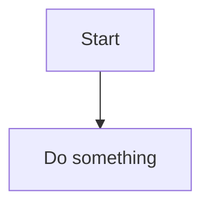
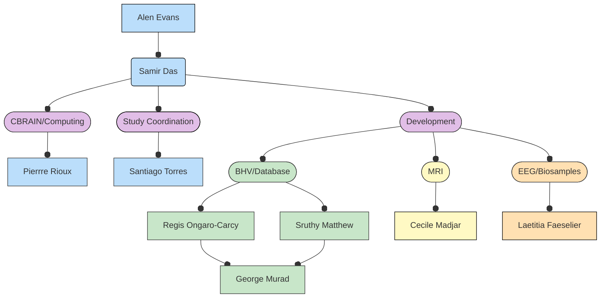
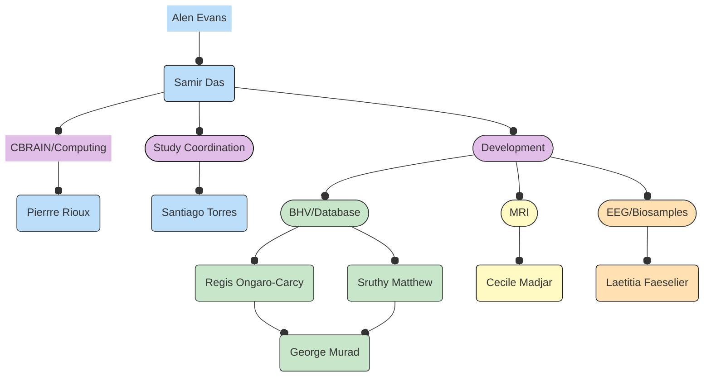

# HBCD Data Coordinating Center (HDCC) Organizational Charts

## LORIS

### Organization Chart

(ADD DETAILS OF FOLKS IN ORG CHART HERE)

## TEST

### Roles and Responsibilities

  Responsibilities
  ▸

<table style="width: 100%; border-collapse: collapse; table-layout: fixed; font-size: 13px;">
    <thead>
      <tr>
        <th style="width: 15%; border: 1px solid #ddd; padding: 5px; text-align: center;">Name</th>
        <th style="width: 15%; border: 1px solid #ddd; padding: 5px; text-align: center;">Title</th>
        <th style="width: 70%; border: 1px solid #ddd; padding: 5px; text-align: center;">Responsibilities</th>
    </thead>
    <tbody>
    <tr>
        <td style="border: 1px solid #ddd; padding: 4px; word-wrap: break-word; white-space: normal;">Alan Evans</td>
        <td style="border: 1px solid #ddd; padding: 4px; word-wrap: break-word; white-space: normal;">Principal Investigator</td>
        <td style="border: 1px solid #ddd; padding: 4px; word-wrap: break-word; white-space: normal;">Oversight and management of MCIN and LORIS operations</td>
    </tr>
</tbody>
</table>

- Ensure regulatory compliance between LORIS, McGill and affiliated institutions.
- Engage with stakeholders to ensure the study's relevance and applicability.
- Secure funding and resources for the study.

## LIBR
### Organization Chart
(ADD ORG CHART DIAGRAM HERE)

### Roles and Responsibilities

  Responsibilities
  ▸

<table style="width: 100%; border-collapse: collapse; table-layout: fixed; font-size: 13px;">
    <thead>
      <tr>
        <th style="width: 15%; border: 1px solid #ddd; padding: 5px; text-align: center;">Name</th>
        <th style="width: 15%; border: 1px solid #ddd; padding: 5px; text-align: center;">Title</th>
        <th style="width: 70%; border: 1px solid #ddd; padding: 5px; text-align: center;">Responsibilities</th>
    </thead>
    <tbody>
    <tr>
        <td style="border: 1px solid #ddd; padding: 4px; word-wrap: break-word; white-space: normal;">Wesley K. Thompson</td>
        <td style="border: 1px solid #ddd; padding: 4px; word-wrap: break-word; white-space: normal;">Associate Director</td>
        <td style="border: 1px solid #ddd; padding: 4px; word-wrap: break-word; white-space: normal;">TBD</td>
    </tr>
</tbody>
</table>

## Columbia
### Organization Chart
(ADD ORG CHART DIAGRAM HERE)

### Roles and Responsibilities

  Responsibilities
  ▸

<table style="width: 100%; border-collapse: collapse; table-layout: fixed; font-size: 13px;">
    <thead>
      <tr>
        <th style="width: 15%; border: 1px solid #ddd; padding: 5px; text-align: center;">Name</th>
        <th style="width: 15%; border: 1px solid #ddd; padding: 5px; text-align: center;">Title</th>
        <th style="width: 70%; border: 1px solid #ddd; padding: 5px; text-align: center;">Responsibilities</th>
    </thead>
    <tbody>
    <tr>
        <td style="border: 1px solid #ddd; padding: 4px; word-wrap: break-word; white-space: normal;"></td>
        <td style="border: 1px solid #ddd; padding: 4px; word-wrap: break-word; white-space: normal;"></td>
        <td style="border: 1px solid #ddd; padding: 4px; word-wrap: break-word; white-space: normal;"></td>
    </tr>
</tbody>
</table>

