#  HDCC Organizational Charts

🚧 <i>UNDER CONSTRUCTION</i> 🚧 

## HDCC Functional Structure

### Overview

The larger organizational structure of the HBCD Data Coordinating Center (HDCC) is as follows, with the HDCC Co-Directors listed at the top and the institutions/organizations listed below- ***click on individual teams to be directed to their organizational charts***. Please visit the [HDCC page](https://hbcdstudy.org/hbcd-data-coordinating-center/) of the HBCD Study website for a full list of all HDCC members. 

  <i class="fa-regular fa-lightbulb"></i>
    <b>NOTE:</b> These org charts emphasize functional structure within the context of HDCC, not reporting line details of individual organizations.

 

```mermaid
---
config:
  layout: elk
---
flowchart TB
    n2["<b>Anders Dale, PhD<br></b>HDCC Co-Director<br>JCVI"] --- jcvi["<b>JCVI</b> <i class="fa-solid fa-link" style="color: blue;"></i>"]
    E["<b>Damien Fair, PA-C, PhD</b><br>HDCC Co-Director<br>University of Minnesota"] --- lasso["<b>Lasso</b> <i class="fa-solid fa-link" style="color: blue;"></i>"] & umn["<b>UMN</b> <i class="fa-solid fa-link" style="color: blue;"></i>"] & n7["<b>LORIS</b> <i class="fa-solid fa-link" style="color: blue;"></i>"] & n8["<b>UMD EEG Core</b> <i class="fa-solid fa-link" style="color: blue;"></i>"] & n11["<b>Columbia</b>"]
    lasso --- lasso1["<b>Leigh MacIntyre</b><br>Lasso CEO"]
    n1["<b>Christopher Smyser, MD<br></b>HDCC Co-Director<br>WashU"] --- n10["<b>WashU</b> <i class="fa-solid fa-link" style="color: blue;"></i>"] & n12["<b>LIBR</b> <i class="fa-solid fa-link" style="color: blue;"></i>"] & lasso
    n16["<b>Wesley K.<br>Thompson, PhD</b><br>HDCC Assoc Dir,<br>BioStatistics Chair"] --- n17["<b>Chun Fan, PhD</b><br>Geolocation Chair"]
    n12 --- n16
    n8 --- n19["<b>Nathan Fox, PhD<br></b>HDCC Assoc Dir"]
    n7 --- n20["<b>Alan Evans</b>, PI<br><b>Samir Das</b><br><a href="https://mcin.ca/about-mcin/" target="_blank">MCIN</a> Assoc Dir"]
    umn --- reed["<b>Reed McEwan, MS</b><br>Sr Research Dev"]
    n10 --- n22["<b>Chad Sylvester, PhD</b><br>Co-Investigator"]
    n11 --- n18["<b>William P. Fifer, PhD</b><br>Novel Tech &<br>Wearables Co-Chair"]
    reed --- n30["<b>Maren Macgregor-Hannah</b><br>Program Manager"]
    n30 --- n25["<b>MIDB Informatics</b> <i class="fa-solid fa-link" style="color: blue;"></i>"]
    n30 --- n27["<b>HST</b> <i class="fa-solid fa-link" style="color: blue;"></i>"]
    n30 --- n28["<b>CDNI</b> <i class="fa-solid fa-link" style="color: blue;"></i>"]
    n30 --- n29["<b>MIDB Analytics</b> <i class="fa-solid fa-link" style="color: blue;"></i>"]
    n27 --- n31["<b>Karen Athy-Penrose</b><br>Project Manager"]
    n22 --- n32["<b>Sauren Ravencroft<br>Nicole Venteris</b><br>Project Managers"]
    n20 --- n33["<b>Santiago Torres</b><br>Study Officer"]
    style n2 fill:#BBDEFB,stroke:#2962FF,stroke-width:4px
    style jcvi fill:#E1BEE7,stroke:#AA00FF
    style E fill:#BBDEFB,stroke:#2962FF,stroke-width:4px
    style lasso fill:#E1BEE7,stroke:#AA00FF
    style umn fill:#E1BEE7,stroke:#AA00FF
    style n7 fill:#E1BEE7,stroke:#AA00FF
    style n8 fill:#E1BEE7,stroke:#AA00FF
    style n11 fill:#E1BEE7,stroke:#AA00FF
    style lasso1 fill:#BBDEFB,stroke:#2962FF
    style n1 fill:#BBDEFB,stroke:#2962FF,stroke-width:4px
    style n10 fill:#E1BEE7,stroke:#AA00FF
    style n12 fill:#E1BEE7,stroke:#AA00FF
    style n16 fill:#BBDEFB,stroke:#2962FF,stroke-width:4px
    style n17 fill:#BBDEFB,stroke:#2962FF
    style n19 fill:#BBDEFB,stroke:#2962FF,stroke-width:4px
    style n20 fill:#BBDEFB,stroke:#2962FF
    style reed fill:#BBDEFB,stroke:#2962FF
    style n22 fill:#BBDEFB,stroke:#2962FF
    style n18 fill:#BBDEFB,stroke:#2962FF
    style n25 fill:#E1BEE7,stroke:#AA00FF
    style n27 fill:#E1BEE7,stroke:#AA00FF
    style n28 fill:#E1BEE7,stroke:#AA00FF
    style n29 fill:#E1BEE7,stroke:#AA00FF
    style n30 fill:#C8E6C9,stroke:#00C853
    style n31 fill:#C8E6C9,stroke:#00C853
    style n32 fill:#C8E6C9,stroke:#00C853
    style n33 fill:#C8E6C9,stroke:#00C853
    click jcvi "#j-craig-venter-institute"
    click lasso "#lasso"
    click umn "#university-of-minnesota"
    click n7 "#loris"
    click n8 "#university-of-maryland"
    click n10 "#washu"
    click n25 "#midb-informatics-hub-msi"
    click n29 "#midb-analytics-hub"
    click n27 "#health-sciences-technology"
    click n28 "#center-for-developmental-neuroimaging"
    click n12 "#libr"
```

### University of Minnesota

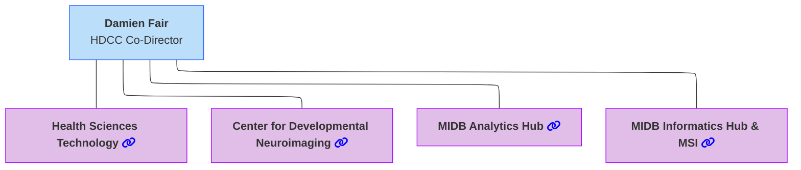

#### Center for Developmental NeuroImaging
   
The Center for Developmental NeuroImaging ([CDNI](https://cdni.umn.edu/)) at UMN is responsible for: *Processing*, *Software Development*, and *Deployment* of imaging data. 

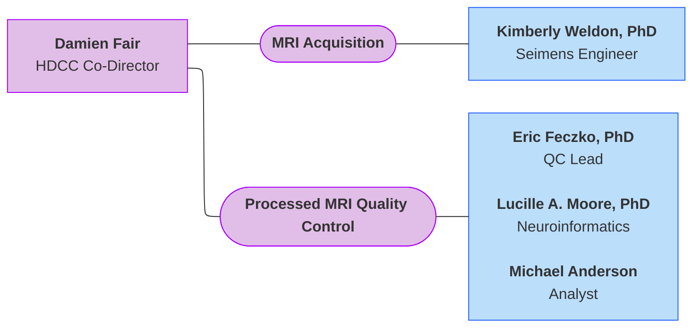

#### Health Sciences Technology
  
[HST](https://hst.umn.edu/) at UMN is responsible for: *Data shelter*, *PHI*, *Electronic Health Records (EHR)*, *Ripple Interface*, *Overall Data Management*, *QC Dashboards*, *Ancillary Studies*, and *Third Party Integration*.

  
  HBCD and Secure Computing Environment Governance 
  <a class="anchor-link" href="#HST-governance" title="Copy link">
    <i class="fa-solid fa-link"></i>
  </a>
  
  ▸

Version 1.0      
2.1.2023  
Author: Reed McEwan, University of Minnesota, Health Sciences Technology, HDCC Lead

The Data Coordinating Center (DCC) team leading data integration needs for the HEALthy Brain and Child Development (HBCD) Study is leveraging the UMN SCE (University of <a href="https://confluence.ahc.umn.edu/display/CE/Overview">Minnesota Secure Computing Environment</a>) for ingestion, transformation, and storage of protected participant information (names, addresses, dates of birth, identifying pictures and videos, abstracted health records, etc.). The SCE has been established by the University of Minnesota (“University”) through its Clinical Translational Sciences Institute to provide a secure environment that can consume, aggregate, transform and enrich clinical and protected data for research and operational analysis. SCE resources reside behind a network firewall that is separate from the rest of the University of Minnesota (UMN) networks and follows strict UMN technical security requirements for receiving, storing and analyzing clinical data.

The SCE architecture provides robust, secure, and validated capabilities that bring together data from disparate sources (including, but not limited to, electronic medical records, patient and participant registries, REDCap, standalone datasets, and regular data feeds) to create cohesive datasets for research and operational analysis. The architecture’s core consists of a data warehouse design and is managed following recommendations by the Healthcare Information and Management Systems Society (HIMSS), Health Insurance Portability and Accountability Act (HIPAA) regulations. It adopts leading practices and perspectives on building integrated data repositories from leading national centers. The architecture is also regularly reviewed by the Center of Excellence for HIPAA Data at the University of Minnesota to ensure its compliance with HIPAA regulations.

The key components/modules of the system are: data integration, data security model, data enrichment (patient/participant matching, terminology and ontology management, data de-identification), and data extraction. The clinical architecture as well as all data governance policies and procedures for all of the UMN secure computing environments are reviewed on a regular basis by a governance committee. This committee is led by the University’s CRIO and Hospital’s CIO and has broad, high-level representation from the Academic Health Center and Hospital administration. This committee structure and governance model accommodates both changing legal requirements and the evolving needs of researchers working with protected data.
 

<b>Data Security Model</b> 
The Data security model ensures data security by focusing on two key components: culture and technology. Our culture has a deep focus on HIPAA compliance with mandatory, rigorous HIPAA training for new employees, regular refresher trainings, monthly newsletters with a focus on security, and ongoing dialogue about best practices. Building a data security awareness culture is proven in the literature to reduce data breaches. The data security model also utilizes advanced and validated secure data transfer, storage, management, and reporting technology to ensure that data security best practices, safe harbor, and HIPAA regulations are being implemented. For example, data ingested by the SCE is transmitted using secure File Transfer Protocol (sFTP) over the Secure Shell Network protocol or SSL (Secure Socket Layer)-encrypted HTTP (Hypertext Transfer Protocol) API (Application Programming Interface) endpoints. HBCD source applications and servers transmit their protected data to a landing zone in which data is validated and then integrated into the HBCD data repository and warehouse. Identifying data elements (date of birth) is obfuscated (date-shifted) before it is shared with the HBCD consortium’s downstream systems, LORIS hosted and managed by MSI (Minnesota Supercomputing Institute), and REDCap hosted and managed by the team at the University of California at San Diego.

All SCE data servers are hosted by the University Office of Information Technology (OIT) and certified to be HIPAA Compliant by the Center of Excellence for HIPAA Data at the University of Minnesota. The Health Sciences Technology (HST) office is responsible for server operations, data backups, disaster recovery, and ETL (Extract Transformation Load), application development services related to the SCE program. Several safeguards and practices, such as SANs Data Center Physical Security checklist, are implemented to ensure the security of the servers including restricted physical access which requires a valid UMN Ucard, fingerprint identification, sign-in with the data center staff, and a photo identification produced by data center staff at time of access. Also, all activities in the datacenter are recorded via video cameras and stored for auditing purposes.
 

Secure, role-based data access is provided to systems administrators, developers, and users through the integration of Microsoft’s Active Directory identification and authorization database. The advantage of using Active Directory is that it provides very fine-grained control over who can and cannot access a system’s data. SCE supplies a number of pre-defined Active Directory roles with varying levels of rights to access different types of information. Some key roles include: 1) Advanced Access Role: this role is granted to system and ETL developers and data analysts trough through a secure VPN pool and a secure remote desktop server to perform various system development tasks, map and integrate data, and extract data for clinicians and researchers; 2) High Risk Role: users in this subnet, who are usually researchers and clinicians with approved IRB and trainings, can access PHI/PII data but do not have the ability to extract data out of the SCE environment except by a self-service logged and audited extraction system; 3) Low Risk Role: users in this subnet, who are usually in their initial feasibility analysis phase, do not have access to PHI/PII data and users can use tools such as i2b2 to query a limited set of data elements. Changes to the firewalls for role-based access must be approved by the HST. Firewall exceptions are documented and reviewed periodically to determine their risk and need.

Researchers granted access to the SCE for the purpose of working with identified, protected data collected for use in the HBCD study must conform to the security and governance policies of the SCE. This includes appropriately scoping access to HBCD data through membership in Active Directory groups, validating that the researcher/clinicians have completed HIPAA training, signing the annual SCE Attestation Form, that the study itself has appropriate IRB approvals. Access to the SCE requires the user initiate their connection from a University of Minnesota IP address by being connected to the University’s network physically, wirelessly, or through a VPN protected by two factor authentication (2FA). An additional 2FA step is required to sign into the Citrix portal through which secure desktops are made available for accessing data within the SCE. Within the SCE, researchers have full access to data for which they are authorized. This data is stored on file servers and/or relational database data marts. A robust suite of statistical analysis tools and programs and programming languages are available within the environment for researchers to perform their research.

SCE secure virtual desktops do not have general internet access thus preventing untracked exfiltration of protected HBCD data. The secure environment enables approved extraction of data out of the SCE environment only via an audited and logged, self-service transfer tool for authorized users.

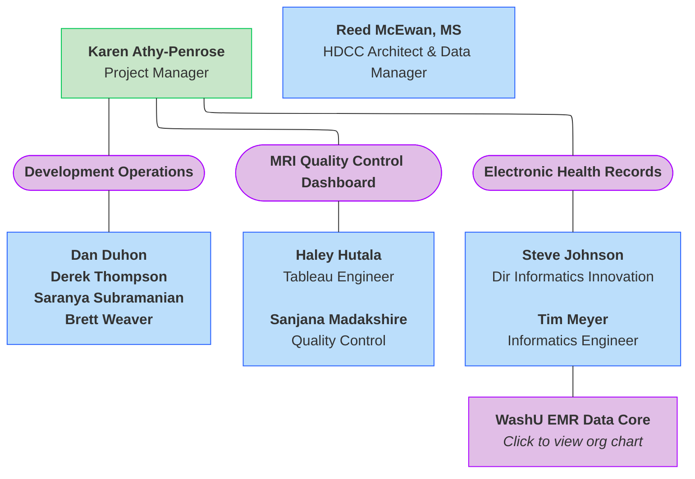

#### MIDB Analytics Hub
The [MIDB Analytics Hub](https://midb.umn.edu/research/analytics) works in coordination with the Biospecimens Workgroup to provide support for genomic data processing and analysis as part of the **HBCD Genomics Supplement**. 

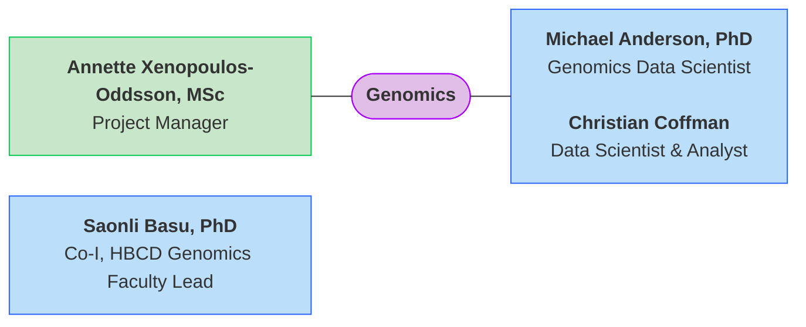

 

  Roles & Responsibilities
  ▸

<table style="width: 100%; border-collapse: collapse; table-layout: fixed; font-size: 14px;">
    <thead>
      <tr>
        <th style="width: 25%;">Name</th>
        <th style="width: 30%;">Title</th>
        <th style="width: 45%;">Role on HDCC</th>
      </tr>
    </thead>
    <tbody>
    <tr>
        <td style="word-wrap: break-word; white-space: normal;">Saonli Basu, PhD</td>
        <td style="word-wrap: break-word; white-space: normal;">Co-I, HBCD Genomics Supplement Lead Faculty</td>
        <td style="word-wrap: break-word; white-space: normal;">Oversight on the HBCD Genomics supplement, working with the Data Scientists, project management, and HBCD Leadership</td>
    </tr>
    <tr>
        <td style="word-wrap: break-word; white-space: normal;">Annette Xenopoulos-Oddsson, MSc</td>
        <td style="word-wrap: break-word; white-space: normal;">HBCD Genomics Supplement Project Manager</td>
        <td style="word-wrap: break-word; white-space: normal;">Project manager for project task management, meetings, etc.</td>
    </tr>
    <tr>
        <td style="word-wrap: break-word; white-space: normal;">Michael Anderson, PhD</td>
        <td style="word-wrap: break-word; white-space: normal;">HBCD Genomics Data Scientist</td>
        <td style="word-wrap: break-word; white-space: normal;">Developing the genomics pipelines, documentation, running the genomic data analysis</td>
    </tr>
    <tr>
        <td style="word-wrap: break-word; white-space: normal;">Christian Coffman</td>
        <td style="word-wrap: break-word; white-space: normal;">Data Scientist & Analyst</td>
        <td style="word-wrap: break-word; white-space: normal;">Support for pipeline development, documentation, and genomic data analysis</td>
    </tr>
</tbody>
</table>

#### MIDB Informatics Hub & MSI
   
The [Masonic Institute for the Developing Brain (MIDB) Informatics Hub](https://midb.umn.edu/research/informatics) and [Minnesota Supercomputing Institute (MSI)](https://msi.umn.edu/) at UMN provide the following services to the HBCD study: *System Administration*, *Loris Hosting*, *Computing*, *Processing*, and *Data Sharing*.

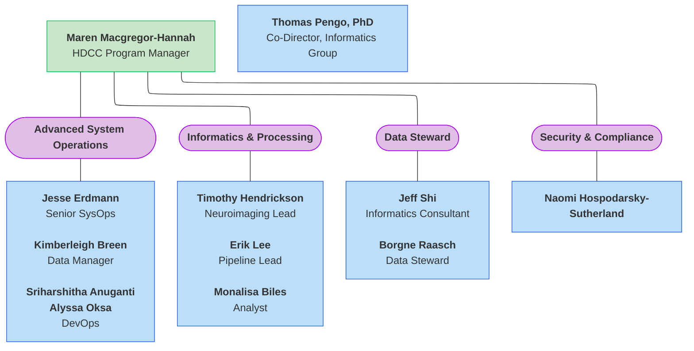
 

  Roles & Responsibilities
  ▸

<table style="width: 100%; border-collapse: collapse; table-layout: fixed; font-size: 14px;">
    <thead>
      <tr>
        <th style="width: 10%;">Name</th>
        <th style="width: 20%;">Title</th>
        <th style="width: 70%;">Role on HDCC</th>
      </tr>
    </thead>
    <tbody>
    <tr>
        <td style="word-wrap: break-word; white-space: normal;">Thomas Pengo, PhD</td>
        <td style="word-wrap: break-word; white-space: normal;">Co-Director, MIDB Informatics Group</td>
        <td style="word-wrap: break-word; white-space: normal;">IG Lead: Oversees all personnel for the platform used as the primary housing for HBCD data, processing, and preparation</td>
    </tr>
    <tr>
        <td style="word-wrap: break-word; white-space: normal;">Maren Macgregor-Hannah</td>
        <td style="word-wrap: break-word; white-space: normal;">Program Manager</td>
        <td style="word-wrap: break-word; white-space: normal;">HDCC Program Manager: Responsible for primary HDCC WG meetings, managing timelines and deliverables, and facilitating communication among technical, scientific, and administrative HCAC teams.</td>
    </tr>
    <tr>
    <td>Jesse Erdmann</td>
    <td>Systems Operations</td>
    <td style="word-wrap: break-word; white-space: normal;">dvanced System Operations (ASO) oversight: Oversees the performance, reliability, and security of the MSI computational systems and infrastructure, for integration and support for Loris, large-scale data processing, and analysis workflows.</td>
    </tr>
    <tr>
    <td>Devin Willis</td>
    <td>DevOps Engineer</td>
    <td style="word-wrap: break-word; white-space: normal;">Continuous integration and deployment (CI/CD), infrastructure automation, system monitoring, and incident response.</td>
    </tr>
    <tr>
    <td>Jesus Garcia</td>
    <td>DevOps Engineer</td>
    <td style="word-wrap: break-word; white-space: normal;">Continuous integration and deployment (CI/CD), infrastructure automation, system monitoring, and incident response.</td>
    </tr>
    <tr>
    <td>Timothy Hendrickson</td>
    <td style="word-wrap: break-word; white-space: normal;">MIDB-IG Neuroimaging Informatics Manager</td>
    <td style="word-wrap: break-word; white-space: normal;">Neuroimaging lead: Lead design and oversight of neuroimaging processing implementation.</td>
    </tr>
    <tr>
    <td>Erik Lee</td>
    <td>Neuroimaging Analyst</td>
    <td style="word-wrap: break-word; white-space: normal;">Pipeline lead: Lead software developer and processing for HBCD.</td>
    </tr>
    <tr>
    <td>Monalisa Biles</td>
    <td>&nbsp;</td>
    <td style="word-wrap: break-word; white-space: normal;">Analyst: Assistant to Pipeline lead for high throughput processing and incident response.</td>
    </tr>
    <tr>
    <td>Kimberleigh Breen</td>
    <td>Data Manager</td>
    <td style="word-wrap: break-word; white-space: normal;">Data Manager: Responsible for designing and implementing data management plans with IG lead, storage, version control using DataLad.</td>
    </tr>
    <tr>
  <td>Borgne Raasch</td>
  <td>Data Steward</td>
  <td style="word-wrap: break-word; white-space: normal;">Data Steward: Managing data lineage and documentation, and supporting data users in access and&nbsp; applying best practices for responsible data use and sharing.</td>
  </tr>
  <tr>
  <td style="word-wrap: break-word; white-space: normal;">Naomi Hospodarsky-Sutherland</td>
  <td style="word-wrap: break-word; white-space: normal;">Research Security and Compliance Analyst</td>
  <td style="word-wrap: break-word; white-space: normal;">Security/Compliance: Responsible for developing, implementing, and monitoring policies and controls to ensure data security, privacy, and regulatory compliance for MSI. Works with lead at secure data warehouse to ensure&nbsp; HIPAA, FISMA, and institutional standards across all stages of data handling and system operations are met.</td>
  </tr>
</tbody>
</table>

### WashU    
Washington University in St. Louis (WashU) has oversight of: *Electronic Medical Records (EMR)*, *[Ambra](#ambra)*, *[AirTable](#airtable)*, *[Ripple](#ripple)*,  and *HBCD Study Administrative Core (HCAC) coordination*.

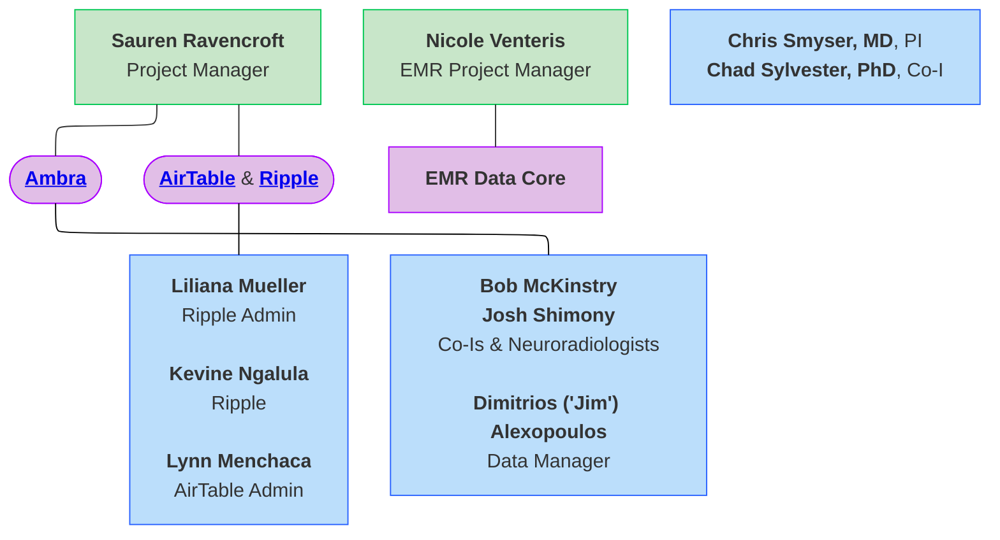

#### Subcontractor Details

##### AirTable 

AirTable is a cloud-based collaborative platform and database service that combines the features of a database and a spreadsheet. It allows users to organize, track, and collaborate on structured data using customizable tables, forms, views, and automation. In the HBCD Study, Airtable is widely used as a centralized project management and tracking tool, including study coordination and oversight, neuroimaging workflow tracking, cross-team communication, and quality control and reporting.

##### Ambra 

Ambra is a cloud-based gateway that allows the direct transmission of medical images between participating institutions. Ambra supports secure data transfer, DICOM standard compliance, de-identification tools, and access control, making it suitable for large-scale, multi-site research studies. For the HBCD Study, Ambra is used as the centralized platform for uploading, storing, and sharing neuroimaging data from participating research sites.
 
##### Ripple

Ripple is a data-driven innovative web-based technology that allows groups to collect data while solving complex patient recruitment and retention challenges. In the HBCD Study, it serves as the data center for all PII in the study and is used as both a recruitment tool and a data collection center ([see details](https://www.ripplescience.com/ripple-science-supports-nih-funded-healthy-brain-and-child-development-study/)).

### J. Craig Venter Institute 
The [J. Craig Venter Institute](https://www.jcvi.org/) (JCVI) is responsible for MRI quality control, REDCap, FIONA, and the QC Dashboard.

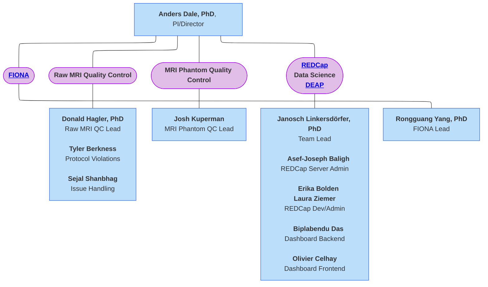

#### Subcontractor Details

🚧 **UPDATE FOLLOWING DESCRIPTIONS - these are first drafts and need to be reviewed/corrected by SMEs** 🚧

##### DEAP

Originally designed for the Adolescent Brain Cognitive Development ([ABCD](https://abcdstudy.org/)) Study, Data Exploration and Analysis Portal (DEAP) is an application offered by the NBDC Data Hub to allow users to explore, query, and download data for HBCD. See details on their website [here](https://docs.deapscience.com/). 

##### FIONA 

FIONA (Flash-memory based Input/Output Network Appliances) is a high-performance data transfer node (DTN) designed to move large scientific datasets quickly and securely across research networks. For the HBCD Study, it is used to transfer data from the HBCD Study sites to the HDCC following well-established procedures for quality control and processing.

##### REDCap 

[REDCap](https://projectredcap.org/) (Research Electronic Data Capture) is a secure, widely used web-based application designed to support data capture for research studies, particularly in academic and clinical environments. In the HBCD Study, REDCap serves as a central tool for managing behavioral, clinical, and demographic data across the multiple participating sites. While neuroimaging and biosensor data flow through pipelines involving systems like FIONA, REDCap is used for more structured, form-based data collected during assessments and visits.

### Lasso

[Lasso](https://www.lassoinformatics.com/) DataShare is a secure data management platform for multi-modal data, streamlining secure data access, searching, filtering, merging, sharing and downloading. Lasso Data Share and Lasso Professional Services serve several core functions in HDCC, including developing dashboards for ongoing workgroup data QC, supporting pre-release data QC,  developing QC workflows, and being the data release platform where the scientific community can access all publicly available HBCD Study data (file-based and tabulated data). Lasso Data Share is fully compliant with (NIST) 800-53 and FISMA-low security standards.

### McGill University

#### LORIS
 
[LORIS](https://mcin.ca/technology/loris/) (Longitudinal Online Research and Imaging System), developed and maintained by research teams within the McGill Centre for Integrative Neuroscience ([MCIN](https://mcin.ca/)), is the core data management system for the HBCD Study. It is a web-based data management system designed for large-scale, multi-site neuroscience research. It supports the collection, curation, and sharing of diverse data types, including neuroimaging, behavioral, and clinical data. LORIS emphasizes data standardization, quality control, and longitudinal tracking across participants and timepoints.

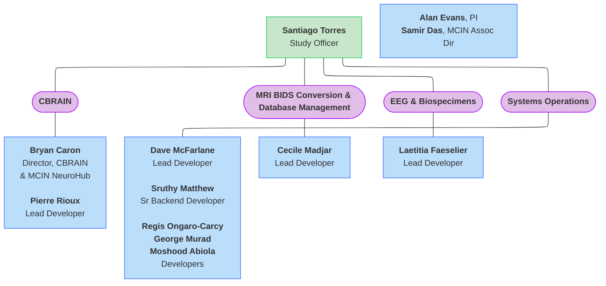

  Roles & Responsibilities
  ▸

<table style="width: 100%; border-collapse: collapse; table-layout: fixed; font-size: 14px;">
    <thead>
      <tr>
        <th style="width: 25%;">Name</th>
        <th style="width: 30%;">Title</th>
        <th style="width: 50%;">Role on HDCC</th>
      </tr>
    </thead>
    <tbody>
    <tr>
        <td style="word-wrap: break-word; white-space: normal;">Alan Evans</td>
        <td style="word-wrap: break-word; white-space: normal;">Principal Investigator</td>
        <td style="word-wrap: break-word; white-space: normal;">Oversight and management of <a href="https://mcin.ca/about-mcin/" target="_blank">MCIN</a> and LORIS operations</td>
    </tr>
    <tr>
        <td style="word-wrap: break-word; white-space: normal;">Samir Das</td>
        <td style="word-wrap: break-word; white-space: normal;">Associate Director of Software Development</td>
        <td style="word-wrap: break-word; white-space: normal;">Administration and oversight of LORIS operations for the HBCD Study</td>
    </tr>
    <tr>
        <td style="word-wrap: break-word; white-space: normal;">Pierre Rioux</td>
        <td style="word-wrap: break-word; white-space: normal;">Senior CBRAIN Developer</td>
        <td style="word-wrap: break-word; white-space: normal;">CBRAIN configuration, tool containerization, design computing and analysis workflows, system interoperability</td>
    </tr>
    <tr>
        <td style="word-wrap: break-word; white-space: normal;">Santiago Torres</td>
        <td style="word-wrap: break-word; white-space: normal;">Study Officer (Research Admin)</td>
        <td style="word-wrap: break-word; white-space: normal;">Project coordinator and liaison, ensuring timely implementation of study tasks and alignment with Workgroup requirements through oversight, testing, and data validation activities</td>
    </tr>
    <tr>
        <td style="word-wrap: break-word; white-space: normal;">Cecile Madjar</td>
        <td style="word-wrap: break-word; white-space: normal;">Lead MRI developer</td>
        <td style="word-wrap: break-word; white-space: normal;">Development and deployment of LORIS MRI features, including ingestion and error handling</td>
    </tr>
    <tr>
        <td style="word-wrap: break-word; white-space: normal;">Laetitia Faeselier</td>
        <td style="word-wrap: break-word; white-space: normal;">Lead Biospecimens & EEG Developer</td>
        <td style="word-wrap: break-word; white-space: normal;">Development and implementation of LORIS Biospecimens & EEG features, including data ingestion, quality control, tracking systems, and Dashboard innovations</td>
    </tr>
    <tr>
        <td style="word-wrap: break-word; white-space: normal;">Regis Ongaro-Carcy</td>
        <td style="word-wrap: break-word; white-space: normal;">Lead Developer</td>
        <td style="word-wrap: break-word; white-space: normal;">Development of LORIS features for behavior (questionnaire/survey responses), including integration with external platforms (e.g. REDCap, Ripple, MSI), streamlining data collection, and enhancing system interoperability and workflows</td>
    </tr>
    <tr>
        <td style="word-wrap: break-word; white-space: normal;">Sruthy Matthew</td>
        <td style="word-wrap: break-word; white-space: normal;">Senior Backend Developer</td>
        <td style="word-wrap: break-word; white-space: normal;">Development of LORIS LaunchPad and Backend features</td>
    </tr>
    <tr>
        <td style="word-wrap: break-word; white-space: normal;">George Murad</td>
        <td style="word-wrap: break-word; white-space: normal;">Junior Developer</td>
        <td style="word-wrap: break-word; white-space: normal;">Development of LORIS features for behavior (questionnaire/survey responses), including instrument coding, automated QC queries, and API/Endpoint implementation</td>
    </tr>
</tbody>
</table>

### LIBR

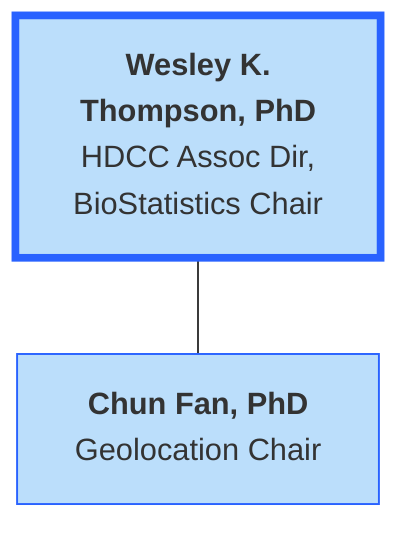

### University of Maryland

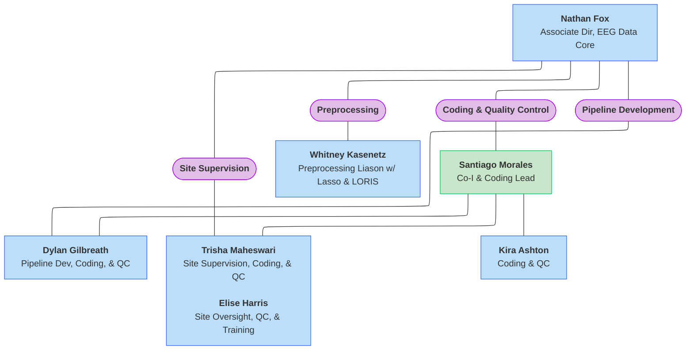

## HBCD Workgroups

HBCD Workgroups that interface heavily with HDCC include the following (the full list of Workgroups can be found on the HBCD Study site [here](https://hbcdstudy.org/workgroups-and-committees/)). While co-chairs at listed below, subject matter experts (SMEs) are also critically involved as liaisons with HDCC - a full list of SMEs and additional Workgroup information can be found on AirTable [here](https://airtable.com/appn4aOIu0MgKDF5I/shrE5KLPOKWinGcWH/tblGJaQwPti6T61J1).

<table class="compact-table">
  <tr>
    <th>Behavior and Caregiver-Child Interaction</th>
    <td>
      Renee Edwards (Co-chair) – renee.edwards@northwestern.edu 
      Beth Planalp (Co-chair) – bplanalp@medicine.wisc.edu
    </td>
  </tr>
  <tr>
    <th>Biospecimens and Omics</th>
    <td>
      Julie Croff (Co-chair) – julie.croff@okstate.edu 
      Elinor Sullivan (Co-chair) – sullivel@ohsu.edu
    </td>
  </tr>
  <tr>
    <th>Biostatistics</th>
    <td>
      Wesley Thompson (Co-chair) – wes.stat@gmail.com 
      Yajuan Si (Co-chair) – yajuan@umich.edu
    </td>
  </tr>
  <tr>
    <th>Electroencephalogram (EEG)</th>
    <td>
      Nathan Fox (Co-chair) – fox@umd.edu 
      Koraly Perez-Edgar (Co-chair) – kxp24@psu.edu
    </td>
  </tr>
  <tr>
    <th>Geocoding and Linking External Data</th>
    <td>
      Chun Fan (Chair) – chunchiehfan@gmail.com
    </td>
  </tr>
  <tr>
    <th>Magnetic Resonance Imaging (MRI)</th>
    <td>
      Chris Smyser (HDCC) – smyserc@neuro.wustl.edu 
      Anders Dale (Co-chair) – andersmdale@gmail.com 
      Damien Fair (Co-chair) – faird@umn.edu
    </td>
  </tr>
  <tr>
    <th>Neurocognition and Language</th>
    <td>
      Julie Kable (Co-chair) – jkabl01@emory.edu 
      Alexi Potter (Co-chair) – Alexandra.Potter@uvm.edu
    </td>
  </tr>
  <tr>
    <th>Novel Technologies and Wearables</th>
    <td>
      Bill Fifer (Co-chair) – wpf1@columbia.edu, wpf1@cumc.columbia.edu 
      Beth Smith (Co-chair) – bsmith@chla.usc.edu
    </td>
  </tr>
  <tr>
    <th>Physical Health</th>
    <td>
      Leigh-Anne Cioffredi (Co-chair) – leigh-anne.cioffredi@uvm.edu 
      Sara DeMauro (Co-chair) – demauro@chop.edu
    </td>
  </tr>
  <tr>
    <th>Pregnancy and Exposure</th>
    <td>
      Gretchen Bandoli (Co-chair) – gbandoli@health.ucsd.edu 
      Claire Coles (Co-chair) – ccoles@emory.edu 
      Lynne Smith (Co-chair) – Smith@lundquist.org
    </td>
  </tr>
  <tr>
    <th>Social and Environmental Determinants</th>
    <td>
      Ashley Acheson (Co-chair) – awacheson@uams.edu 
      Lea Yerby (Co-chair) – yerby002@ua.edu
    </td>
  </tr>
</table>
