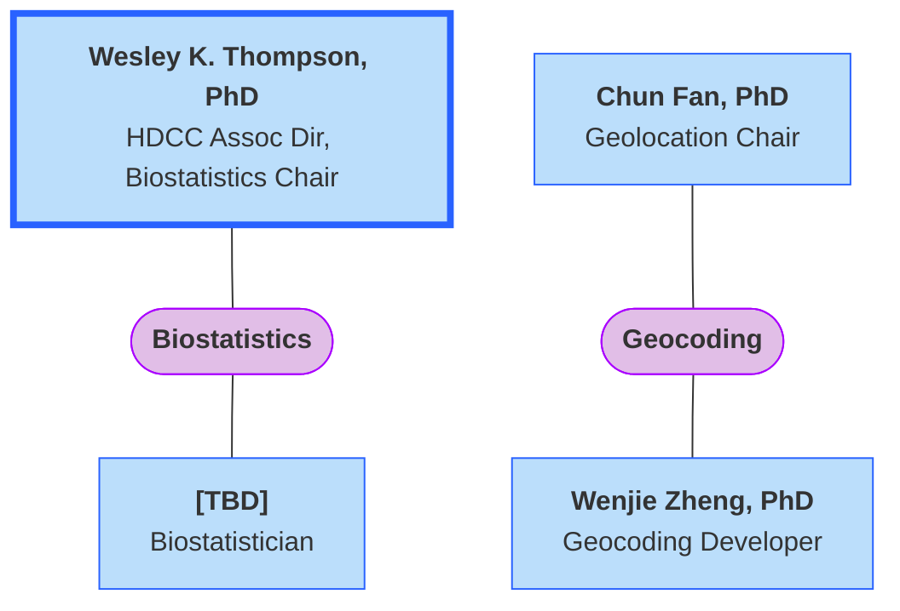
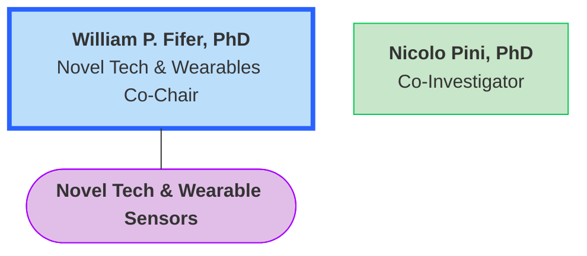

  
Warning

  
SVG images may not display correctly in Safari. It is recommended to view this page in Chrome or Firefox.

#  HDCC Structure & Organizational Charts

  <a href="../#project-management" target="_blank" class="pill-link-wrapper">
    
      
        <i class="fa-solid fa-diagram-project" style="color: #6300d3;"></i>
        Project Management <i>Click to learn more</i>
      
    
  </a>

## HDCC Functional Structure

### Overview

The larger organizational structure of the HBCD Data Coordinating Center (HDCC) is as follows, with the HDCC Co-Directors listed at the top and the institutions/organizations listed below- ***click on individual teams to be directed to their organizational charts***. Please visit the [HDCC page](https://hbcdstudy.org/hbcd-data-coordinating-center/) of the HBCD Study website for a full list of all HDCC members. 

  <i class="fa-regular fa-lightbulb"></i>
    <b>NOTE:</b> These org charts emphasize functional structure within the context of HDCC, not reporting line details or roles within individual organizations.

 

```mermaid
---
config:
  layout: elk
---
flowchart TB
    n2["<b>Anders Dale, PhD<br></b>HDCC Co-Director<br>JCVI"] --- jcvi["<a href="#j-craig-venter-institute" target="_top"><b>JCVI</b></a>"]
    E["<b>Damien Fair, PA-C, PhD</b><br>HDCC Co-Director<br>University of Minnesota"] --- lasso["<a href="#lasso" target="_top"><b>Lasso</b></a>"] & umn["<a href="#university-of-minnesota" target="_top"><b>UMN</b></a>"] & n7["<a href="#loris" target="_top"><b>LORIS</b></a>"] & n8["<a href="#university-of-maryland" target="_top"><b>UMD EEG Core</b></a>"] & n11["<a href="#columbia-university" target="_top"><b>Columbia</b></a>"]
    lasso --- lasso1["<b>Leigh MacIntyre</b><br>Lasso CEO"]
    n36["<span style="display: inline-block; border-top: 4px dashed #FF52F4; width: 40px; vertical-align: middle; margin-right: 8px;"></span><span><b>Tabulated Data</b></span><br><span style="display: inline-block; border-top: 4px solid #FF52F4; width: 45px; vertical-align: middle; margin-right: 8px;"></span><span><b>File-Based Data</b></span>"]
    n1["<b>Christopher Smyser, MD<br></b>HDCC Co-Director<br>WashU"] --- n10["<a href="#washu" target="_top"><b>WashU</b></a>"] & n12["<a href="#libr" target="_top"><b>LIBR</b></a>"] & lasso
    n16["<b>Wesley K.<br>Thompson, PhD</b><br>HDCC Assoc Dir,<br>BioStatistics Chair"] --- n17["<b>Chun Fan, PhD</b><br>Geolocation Chair"]
    n12 --- n16
    n8 --- n19["<b>Nathan Fox, PhD<br></b>HDCC Assoc Dir"]
    n7 --- n20["<b>Alan Evans</b>, PI<br><b>Samir Das</b><br><a href="https://mcin.ca/about-mcin/" target="_blank">MCIN</a> Assoc Dir"]
    umn --- reed["<b>Reed McEwan, MS</b><br>Sr Research Dev"]
    n10 --- n22["<b>Chad Sylvester, PhD</b><br>Co-Investigator"]
    n11 --- n18["<b>William P. Fifer, PhD</b><br>Novel Tech &<br>Wearables Co-Chair"]
    n18 --- n34["<b>Nicolo Pini</b><br>Co-Investigator"]
    reed --- n30["<b>Maren Macgregor-Hannah</b><br>Program Manager"]
    n30 --- n25["<a href="#midb-informatics-hub-msi" target="_top"><b>MIDB Informatics</b></a>"]
    n30 --- n27["<a href="#health-sciences-technology" target="_top"><b>HST</b></a>"]
    n30 --- n28["<a href="#center-for-developmental-neuroimaging" target="_top"><b>CDNI</b></a>"]
    n30 --- n29["<a href="#midb-analytics-hub" target="_top"><b>MIDB Analytics</b></a>"]
    n27 --- n31["<b>Tim Meyer</b>"]
    n22 --- n32["<b>Sauren Ravencroft<br>Nicole Venteris</b><br>Project Managers"]
    n20 --- n33["<b>Santiago Torres</b><br>Study Officer"]
    style n36 fill:#FFFFFF,stroke:#FFFFFF
    style n2 fill:#BBDEFB,stroke:#2962FF,stroke-width:4px
    style jcvi fill:#E1BEE7,stroke:#AA00FF
    style E fill:#BBDEFB,stroke:#2962FF,stroke-width:4px
    style lasso fill:#E1BEE7,stroke:#FF52F4,stroke-width:3px,stroke-dasharray: 5
    style umn fill:#E1BEE7,stroke:#FF52F4,stroke-width:3px,stroke-dasharray: 0
    style n7 fill:#E1BEE7,stroke:#FF52F4,stroke-width:3px,stroke-dasharray: 5
    style n8 fill:#E1BEE7,stroke:#FF52F4,stroke-width:3px,stroke-dasharray: 0
    style n11 fill:#E1BEE7,stroke:#FF52F4,stroke-width:3px,stroke-dasharray: 0
    style lasso1 fill:#BBDEFB,stroke:#2962FF
    style n1 fill:#BBDEFB,stroke:#2962FF,stroke-width:4px
    style n10 fill:#E1BEE7,stroke:#AA00FF
    style n12 fill:#E1BEE7,stroke:#AA00FF
    style n16 fill:#BBDEFB,stroke:#2962FF,stroke-width:4px
    style n17 fill:#BBDEFB,stroke:#2962FF
    style n19 fill:#BBDEFB,stroke:#2962FF,stroke-width:4px
    style n20 fill:#BBDEFB,stroke:#2962FF
    style reed fill:#BBDEFB,stroke:#2962FF
    style n22 fill:#BBDEFB,stroke:#2962FF
    style n18 fill:#BBDEFB,stroke:#2962FF
    style n25 fill:#E1BEE7,stroke:#AA00FF
    style n27 fill:#E1BEE7,stroke:#AA00FF
    style n28 fill:#E1BEE7,stroke:#AA00FF
    style n29 fill:#E1BEE7,stroke:#AA00FF
    style n30 fill:#C8E6C9,stroke:#00C853
    style n31 fill:#C8E6C9,stroke:#00C853
    style n32 fill:#C8E6C9,stroke:#00C853
    style n33 fill:#C8E6C9,stroke:#00C853
    style n34 fill:#C8E6C9,stroke:#00C853
    click jcvi "#j-craig-venter-institute"
    click lasso "#lasso"
    click umn "#university-of-minnesota"
    click n7 "#loris"
    click n8 "#university-of-maryland"
    click n10 "#washu"
    click n25 "#midb-informatics-hub-msi"
    click n29 "#midb-analytics-hub"
    click n27 "#health-sciences-technology"
    click n28 "#center-for-developmental-neuroimaging"
    click n12 "#libr"
    click n11 "#columbia-university"
```

### University of Minnesota

The University of Minnesota (UMN) houses several core HDCC teams. Please click on each organization below to view their details.

<object type="image/svg+xml" data="umn-OC.svg" width="90%"></object>

#### Center for Developmental NeuroImaging
   
The Center for Developmental NeuroImaging ([CDNI](https://cdni.umn.edu/)) at UMN is responsible for: development of MRI acquisition procedures; quality control for processed MRI data; coordination of [processing pipeline standardization](https://docs.hbcdstudy.org/latest/instruments/processing/standards/); and development and maintenance of HDCC release documentation (including the [HBCD Data Release Docs](https://docs.hbcdstudy.org/latest/)). CDNI members additionally work with the Informatics & Processing team at [MIDB Informatics Hub and MSI](#midb-informatics-hub-msi) to provide support and/or consultation for MRI data processing and MRI pipeline development as needed.

  
  <i class="fas fa-users" style="margin-right: 6px; color: blue;"></i> Roles & Responsibilities
  <a class="anchor-link" href="#cdni-rr" title="Copy link">
  <i class="fa-solid fa-link"></i>
  </a>
  
  ▸

<table style="width: 100%; border-collapse: collapse; table-layout: fixed; font-size: 14px;">
    <thead>
      <tr>
        <th style="width: 5%;">Name</th>
        <th style="width: 5%;">Title</th>
        <th style="width: 60%;">Role on HDCC</th>
      </tr>
    </thead>
    <tbody>
      <tr>
      <td>Damien Fair, PA-C, PhD</td>
      <td>HDCC Co-Director</td>
      <td style="word-wrap: break-word; white-space: normal;">Provides scientific and operational leadership for the HBCD Data Coordinating Center, with direct oversight of MRI acquisition strategy, processing pipeline development, and quality control infrastructure at CDNI.</td>
      </tr>
      <tr>
      <td>Kimberly Weldon, PhD</td>
      <td>MR Specialist (Siemens)</td>
      <td style="word-wrap: break-word; white-space: normal;">Supports MRI acquisition through scanner calibration, sequence optimization, and technical troubleshooting, ensuring harmonized imaging protocols across Siemens scanners and sites.</td>
      </tr>
      <tr>
      <td>Eric Feczko, PhD</td>
      <td>MRI Quality Control Lead</td>
      <td style="word-wrap: break-word; white-space: normal;">Leads the design and implementation of post-processing MRI quality control procedures, developing automated and manual QC metrics to assess data reliability and identify artifacts across modalities.</td>
      </tr>
      <tr>
      <td>Michael Anderson, PhD</td>
      <td>MRI QC Analyst</td>
      <td style="word-wrap: break-word; white-space: normal;">Conducts data analysis and curation of processed MRI datasets, supports QC review and scoring workflows, and ensures alignment between data outputs and release standards.</td>
      </tr>
      <tr>
      <td>Lucille A. Moore, PhD</td>
      <td style="word-wrap: break-word; white-space: normal;">HDCC Release Docs Lead & Neuroinformatics</td>
      <td style="word-wrap: break-word; white-space: normal;">Develops and maintains software tools for organizing, processing, and visualizing neuroimaging data, integrating processed outputs with metadata and quality metrics for centralized review and downstream analysis. Lead documentation across all HDCC release docs and works with director and HCAC to coordinate processes throughout HBCD.</td>
      </tr>
</tbody>
</table>

 

#### Health Sciences Technology
  
[HST](https://hst.umn.edu/) at UMN is responsible for: *Data shelter*, *PHI*, *Electronic Health Records (EHR)*, *Ripple Interface*, *Overall Data Management*, *QC Dashboards*, *Ancillary Studies*, and *Third Party Integration*.

<object type="image/svg+xml" data="hst.svg" width="80%"></object>

  
  <i class="fas fa-users" style="margin-right: 6px; color: blue;"></i> Roles & Responsibilities
  <a class="anchor-link" href="#hst-rr" title="Copy link">
  <i class="fa-solid fa-link"></i>
  </a>
  
  ▸

<table style="width: 100%; border-collapse: collapse; table-layout: fixed; font-size: 14px;">
    <thead>
      <tr>
        <th style="width: 5%;">Name</th>
        <th style="width: 5%;">Title</th>
        <th style="width: 50%;">Role on HDCC</th>
      </tr>
    </thead>
    <tbody>
    <tr>
    <td>Reed McEwan</td>
    <td>HDCC Architect &amp; Data Manager</td>
    <td style="word-wrap: break-word; white-space: normal;">Oversees the design and implementation of secure data infrastructure for the HBCD Data Core, including data shelter, PHI protection, system architecture, and integration across platforms.</td>
    </tr>
    <tr>
    <td>Tim Meyers</td>
    <td>Informatics Engineer</td>
    <td style="word-wrap: break-word; white-space: normal;">Maintains the design and implementation of secure data infrastructure for the HBCD Data Core, including data shelter, PHI protection, system architecture, and integration across platforms.</td>
    </tr>
    <tr>
    <td>Haley Hutala</td>
    <td>Tableau Engineer, Data Analyst</td>
    <td style="word-wrap: break-word; white-space: normal;">Designs and maintains interactive data visualizations in Tableau to monitor MRI quality metrics, enabling real-time insights and reporting for QC stakeholders.</td>
    </tr>
    <tr>
    <td>Sanjana Madakshire</td>
    <td>QC, Data Analyst</td>
    <td style="word-wrap: break-word; white-space: normal;">Performs data validation and quality assurance tasks for MRI datasets, collaborating with dashboard and data teams to ensure accuracy in visualized metrics.</td>
    </tr>
    <tr>
    <td>Dan Duhon</td>
    <td>Developer</td>
    <td style="word-wrap: break-word; white-space: normal;">Maintain the infrastructure, APIs, and backend services supporting HST platforms, including data ingestion, automation pipelines, authentication systems, and secure data exchange between HBCD components. Lead ETL developer</td>
    </tr>
    <tr>
    <td>Derek Thompson</td>
    <td>Developer</td>
    <td style="word-wrap: break-word; white-space: normal;">Maintain the infrastructure, APIs, and backend services supporting HST platforms, including data ingestion, automation pipelines, authentication systems, and secure data exchange between HBCD components.</td>
    </tr>
    <tr>
    <td>Brett Weaver</td>
    <td>Developer</td>
    <td style="word-wrap: break-word; white-space: normal;">Maintain the infrastructure, APIs, and backend services supporting HST platforms, including data ingestion, automation pipelines, authentication systems, and secure data exchange between HBCD components.</td>
    </tr>
</tbody>
</table>

  <i class="fa-solid fa-circle-info"></i>
  
    Additional Resources: <a href="../../resources/hst-sce-governance" target="_blank">HBCD and Secure Computing Environment Governance</a>
  

 

#### MIDB Analytics Hub
The [MIDB Analytics Hub](https://midb.umn.edu/research/analytics) works in coordination with the Biospecimens Workgroup to provide support for genomic data processing and analysis as part of the **HBCD Genomics Supplement**. 

  
  <i class="fas fa-users" style="margin-right: 6px; color: blue;"></i> Roles & Responsibilities
  <a class="anchor-link" href="#midb-analytics-rr" title="Copy link">
  <i class="fa-solid fa-link"></i>
  </a>
  
  ▸

<table style="width: 100%; border-collapse: collapse; table-layout: fixed; font-size: 14px;">
    <thead>
      <tr>
        <th style="width: 25%;">Name</th>
        <th style="width: 30%;">Title</th>
        <th style="width: 45%;">Role on HDCC</th>
      </tr>
    </thead>
    <tbody>
    <tr>
        <td style="word-wrap: break-word; white-space: normal;">Saonli Basu, PhD</td>
        <td style="word-wrap: break-word; white-space: normal;">Co-I, HBCD Genomics Supplement Lead Faculty</td>
        <td style="word-wrap: break-word; white-space: normal;">Oversight on the HBCD Genomics supplement, working with the Data Scientists, project management, and HBCD Leadership</td>
    </tr>
    <tr>
        <td style="word-wrap: break-word; white-space: normal;">Annette Xenopoulos-Oddsson, MSc</td>
        <td style="word-wrap: break-word; white-space: normal;">HBCD Genomics Supplement Project Manager</td>
        <td style="word-wrap: break-word; white-space: normal;">Project manager for project task management, meetings, etc.</td>
    </tr>
    <tr>
        <td style="word-wrap: break-word; white-space: normal;">Michael Anderson, PhD</td>
        <td style="word-wrap: break-word; white-space: normal;">HBCD Genomics Data Scientist</td>
        <td style="word-wrap: break-word; white-space: normal;">Developing the genomics pipelines, documentation, running the genomic data analysis</td>
    </tr>
    <tr>
        <td style="word-wrap: break-word; white-space: normal;">Christian Coffman, PhD</td>
        <td style="word-wrap: break-word; white-space: normal;">Data Scientist & Analyst</td>
        <td style="word-wrap: break-word; white-space: normal;">Support for pipeline development, documentation, and genomic data analysis</td>
    </tr>
    <tr>
        <td style="word-wrap: break-word; white-space: normal;">Kody DeGolie, MS</td>
        <td style="word-wrap: break-word; white-space: normal;">Research Associate</td>
        <td style="word-wrap: break-word; white-space: normal;">Support for development, documentation, and analysis</td>
    </tr>
</tbody>
</table>

 

#### MIDB Informatics Hub & MSI
   
The [Masonic Institute for the Developing Brain (MIDB) Informatics Hub](https://midb.umn.edu/research/informatics) and [Minnesota Supercomputing Institute (MSI)](https://msi.umn.edu/) at UMN provide the following services to the HBCD study: *System Administration*, *Loris Hosting*, *Computing*, *Processing*, and *Data Sharing*.

<object type="image/svg+xml" data="midb-informatics.svg" width="80%"></object>

  
  <i class="fas fa-users" style="margin-right: 6px; color: blue;"></i> Roles & Responsibilities
  <a class="anchor-link" href="#midb-msi-rr" title="Copy link">
  <i class="fa-solid fa-link"></i>
  </a>
  
  ▸

<table style="width: 100%; border-collapse: collapse; table-layout: fixed; font-size: 14px;">
    <thead>
      <tr>
        <th style="width: 10%;">Name</th>
        <th style="width: 20%;">Title</th>
        <th style="width: 70%;">Role on HDCC</th>
      </tr>
    </thead>
    <tbody>
    <tr>
        <td style="word-wrap: break-word; white-space: normal;">Thomas Pengo, PhD</td>
        <td style="word-wrap: break-word; white-space: normal;">Co-Director, MIDB Informatics Group</td>
        <td style="word-wrap: break-word; white-space: normal;">IG Lead: Oversees all personnel for the platform used as the primary housing for HBCD data, processing, and preparation</td>
    </tr>
    <tr>
        <td style="word-wrap: break-word; white-space: normal;">Maren Macgregor-Hannah</td>
        <td style="word-wrap: break-word; white-space: normal;">Program Manager</td>
        <td style="word-wrap: break-word; white-space: normal;">HDCC Program Manager: Responsible for primary HDCC WG meetings, managing timelines and deliverables, and facilitating communication among technical, scientific, and administrative HCAC teams.</td>
    </tr>
    <tr>
    <td>Jesse Erdmann</td>
    <td>DevOps Manager & Architect</td>
    <td style="word-wrap: break-word; white-space: normal;">Advanced System Operations (ASO) oversight: Oversees the performance, reliability, and security of the MSI computational systems and infrastructure, for integration and support for Loris, large-scale data processing, and analysis workflows.</td>
    </tr>
    <tr>
      <td>Kimberleigh Breen</td>
      <td>DevOps Engineer</td>
      <td style="word-wrap: break-word; white-space: normal;">Data engineering, continuous integration and deployment (CI/CD), infrastructure automation, system monitoring, and incident response.</td>
    </tr>
    <tr>
    <td>Sriharshitha Anuganti</td>
    <td>DevOps Engineer</td>
    <td style="word-wrap: break-word; white-space: normal;">Data engineering, continuous integration and deployment (CI/CD), infrastructure automation, system monitoring, and incident response.</td>
    </tr>
        <tr>
    <td>Alyssa Oksa</td>
    <td>DevOps Engineer</td>
    <td style="word-wrap: break-word; white-space: normal;">Data engineering, continuous integration and deployment (CI/CD), infrastructure automation, system monitoring, and incident response.</td>
    </tr>
    <tr>
    <td>Anders Skaar</td>
    <td>DevOps Engineer</td>
    <td style="word-wrap: break-word; white-space: normal;">Data engineering, continuous integration and deployment (CI/CD), infrastructure automation, system monitoring, and incident response.</td>
    </tr>
    <tr>
    <td>Timothy Hendrickson</td>
    <td style="word-wrap: break-word; white-space: normal;">MIDB-IG Neuroimaging Informatics Manager</td>
    <td style="word-wrap: break-word; white-space: normal;">Neuroimaging lead: Lead design and oversight of neuroimaging processing implementation.</td>
    </tr>
    <tr>
    <td>Erik Lee</td>
    <td>Neuroimaging Analyst</td>
    <td style="word-wrap: break-word; white-space: normal;">Pipeline lead: Lead software developer and processing for HBCD.</td>
    </tr>
    <tr>
    <td>Monalisa Biles</td>
    <td>Analyst</td>
    <td style="word-wrap: break-word; white-space: normal;">Analyst: Assistant to Pipeline lead for high throughput processing and incident response.</td>
    </tr>
    <tr>
  <td>Borgne Raasch</td>
  <td>Data Steward</td>
  <td style="word-wrap: break-word; white-space: normal;">Data Steward: Managing data lineage and documentation, and supporting data users in access and&nbsp; applying best practices for responsible data use and sharing.</td>
  </tr>
  <tr>
  <td style="word-wrap: break-word; white-space: normal;">Naomi Hospodarsky-Sutherland</td>
  <td style="word-wrap: break-word; white-space: normal;">Research Security and Compliance Analyst</td>
  <td style="word-wrap: break-word; white-space: normal;">Security/Compliance: Responsible for developing, implementing, and monitoring policies and controls to ensure data security, privacy, and regulatory compliance for MSI. Works with lead at secure data warehouse to ensure&nbsp; HIPAA, FISMA, and institutional standards across all stages of data handling and system operations are met.</td>
  </tr>
</tbody>
</table>

 

### WashU    
Washington University in St. Louis (WashU) has oversight of: *Electronic Medical Records (EMR)*, *[Ambra](#ambra)*, *[AirTable](#airtable)*, *[Ripple](#ripple)*,  and *HBCD Study Administrative Core (HCAC) coordination*.

<object type="image/svg+xml" data="washu.svg" width="100%"></object>

  
  <i class="fas fa-users" style="margin-right: 6px; color: blue;"></i> Roles & Responsibilities
  <a class="anchor-link" href="#washu-rr" title="Copy link">
  <i class="fa-solid fa-link"></i>
  </a>
  
  ▸

<table style="width: 100%; border-collapse: collapse; table-layout: fixed; font-size: 14px;">
    <thead>
      <tr>
        <th style="width: 10%;">Name</th>
        <th style="width: 10%;">Title</th>
        <th style="width: 50%;">Role on HDCC</th>
      </tr>
    </thead>
    <tbody>
    <tr>
    <td>Chris Smyser</td>
    <td>PI</td>
    <td style="word-wrap: break-word; white-space: normal;">Provide scientific and administrative leadership for WashU's contributions to HBCD, including oversight of EMR integration, imaging infrastructure (Ambra), participant tracking tools (AirTable, Ripple), and coordination with the Study Administrative Core (HCAC)</td>
    </tr>
    <tr>
    <td>Sauren Ravencroft</td>
    <td>Project Manager</td>
    <td style="word-wrap: break-word; white-space: normal;">Coordinates implementation, integration, development, and maintenance of the AirTable and Ripple platforms</td>
    </tr>
    <tr>
    <td>Lynne Menchaca</td>
    <td>AirTable Admin</td>
    <td style="word-wrap: break-word; white-space: normal;">Manages and configures AirTable databases to manage access controls and personnel across the study</td>
    </tr>
    <tr>
    <td>Kevine Ngalula</td>
    <td>Developer</td>
    <td style="word-wrap: break-word; white-space: normal;">Supports customization and maintenance of Ripple and AirTable</td>
    </tr>
    <tr>
    <td>Lilliana Mueller</td>
    <td>Ripple Admin</td>
    <td style="word-wrap: break-word; white-space: normal;">Administers Ripple platform operations and coordinates communication on MRI feedback to sites</td>
    </tr>
    <tr>
    <td>Bob McKinstry</td>
    <td>Co-I &amp; Neuroadiologist</td>
    <td style="word-wrap: break-word; white-space: normal;">Provide clinical reads of brain imaging</td>
    </tr>
    <tr>
    <td>Josh Shimony</td>
    <td>Co-I &amp; Neuroadiologist</td>
    <td  style="word-wrap: break-word; white-space: normal;">Provide clinical reads of brain imaging</td>
    </tr>
    <tr>
    <td>Jim Alexopoulos</td>
    <td>Data Manager</td>
    <td style="word-wrap: break-word; white-space: normal;">Manages Ambra workflows and consults on all MRI QC and processing workflows</td>
    </tr>
    <tr>
      <td>Nicole Venteris</td>
      <td>EMR Project Manager</td>
      <td style="word-wrap: break-word; white-space: normal;">Oversees development and implementation of workflows for integrating and managing structured EMR data across study sites</td>
    </tr>
    <tr>
      <td>Albert Lai, PhD</td>
      <td>Co-Investigator</td>
      <td style="word-wrap: break-word; white-space: normal;">EMR Data Core oversight</td>
    </tr>
    <tr>
      <td>Philip Payne, PhD</td>
      <td>Co-Investigator, EMR Data Core</td>
      <td style="word-wrap: break-word; white-space: normal;">EMR Data Core oversight</td>
    </tr>
    <tr>
      <td>Sherry Lassa-Claxton</td>
      <td>EMR Data Core</td>
      <td style="word-wrap: break-word; white-space: normal;">EMR Data Core support</td>
    </tr>
    <tr>
      <td>Steve Austin</td>
      <td>EMR Data Core</td>
      <td style="word-wrap: break-word; white-space: normal;">EMR Data Core support</td>
    </tr>
    <tr>
      <td>Cat Camacho, PhD</td>
      <td>fMRI Piloting Lead</td>
      <td style="word-wrap: break-word; white-space: normal;">fMRI piloting lead</td>
    </tr>
    <tr>
      <td>Shelby Kessler</td>
      <td>Study Coordinator</td>
      <td style="word-wrap: break-word; white-space: normal;">fMRI piloting study coordinator</td>
    </tr>
    <tr>
      <td>Alyssa Weinrich</td>
      <td>Data Collection</td>
      <td style="word-wrap: break-word; white-space: normal;">fMRI piloting data collection</td>
    </tr>
    <tr>
      <td>Mia Sawicki</td>
      <td>Data Collection</td>
      <td style="word-wrap: break-word; white-space: normal;">fMRI piloting data collection</td>
    </tr>
</tbody>
</table>

#### Subcontractor Details

##### AirTable 

AirTable is a cloud-based collaborative platform and database service that combines the features of a database and a spreadsheet. It allows users to organize, track, and collaborate on structured data using customizable tables, forms, views, and automation. In the HBCD Study, AirTable is widely used as a centralized project management and tracking tool, including protocol tracking, IRB approvals, staff member access levels, and data access paperwork.

##### Ambra 

Ambra is a cloud-based gateway that allows the direct transmission of medical images between participating institutions. Ambra supports secure data transfer, DICOM standard compliance, de-identification tools, and access control, making it suitable for large-scale, multi-site research studies. For the HBCD Study, Ambra is used as the centralized platform for uploading, storing, and sharing neuroimaging data from participating research sites.
 
##### Ripple

Ripple is a data-driven innovative web-based technology that allows groups to collect data while solving complex patient recruitment and retention challenges. In the HBCD Study, it serves as the data center for all PII in the study and is used as both a recruitment tool and a data collection center ([see details](https://www.ripplescience.com/ripple-science-supports-nih-funded-healthy-brain-and-child-development-study/)).

### J. Craig Venter Institute 
The [J. Craig Venter Institute](https://www.jcvi.org/) (JCVI) is responsible for [raw MRI data quality control](https://docs.hbcdstudy.org/latest/instruments/mri/qc/#raw-mr-data-qc) and acquisition QC via MRI phantom data. In addition, JCVI oversees [FIONA](#fiona) deployment as well as [REDCap](#redcap), [DEAP](#deap), and the RBAresults-based accountability Dashboards.

<object type="image/svg+xml" data="jcvi.svg" width="90%"></object>

  
  <i class="fas fa-users" style="margin-right: 6px; color: blue;"></i> Roles & Responsibilities
  <a class="anchor-link" href="#jcvi-rr" title="Copy link">
  <i class="fa-solid fa-link"></i>
  </a>
  
  ▸

<table style="width: 100%; border-collapse: collapse; table-layout: fixed; font-size: 14px;">
    <thead>
      <tr>
        <th style="width: 5%;">Name</th>
        <th style="width: 5%;">Title</th>
        <th style="width: 50%;">Role on HDCC</th>
      </tr>
    </thead>
    <tbody>
    <tr>
      <td>Anders Dale, PhD</td>
      <td>HDCC Co-Director</td>
      <td style="word-wrap: break-word; white-space: normal;">Provides scientific and operational leadership for the HBCD Data Coordinating Center, with direct oversight of quality control and data systems at JCVI.</td>
    </tr>
    <tr>
      <td>Janosch Linkersdoerfer, PhD</td>
      <td>Team Lead, Data Systems</td>
      <td style="word-wrap: break-word; white-space: normal;">Lead manager who assists with the overall architecture planning of the HDCC. Oversees development and integration of REDCap, DEAP, and dashboard systems.</td>
    </tr>
    <tr>
      <td>Donald Hagler, PhD</td>
      <td>Raw MRI QC Lead</td>
      <td style="word-wrap: break-word; white-space: normal;">Directs the pipeline for raw MRI data quality assurance, including protocol compliance, artifact detection</td>
      </tr>
    <tr>
    <tr>
      <td>Tyler Berkness</td>
      <td>Protocol Violation QC</td>
      <td style="word-wrap: break-word; white-space: normal;">Monitors and flags protocol deviations in incoming MRI datasets</td>
    </tr>
    <tr>
      <td>Sejal Shanbhag</td>
      <td>Issue Handling</td>
      <td style="word-wrap: break-word; white-space: normal;">Manages the triage and resolution of quality control issues related to raw MRI data</td>
    </tr>
    <tr>
      <td>Josh Kuperman, PhD</td>
      <td>MRI Phantom QC Lead</td>
      <td style="word-wrap: break-word; white-space: normal;">Manages the acquisition, monitoring, and analysis of MRI phantom data across study sites to ensure scanner stability, calibration, and harmonization.</td>
    </tr>
    <tr>
      <td>Rongguang Yang, PhD</td>
      <td>FIONA Lead</td>
      <td style="word-wrap: break-word; white-space: normal;">Leads the deployment and optimization of FIONA for transfer of imaging data from acquisition sites to the central data core.</td>
    </tr>
    <tr>
      <td>Asef-Joseph Baligh</td>
      <td>REDCap Server Admin</td>
      <td style="word-wrap: break-word; white-space: normal;">Maintains and secures the REDCap server infrastructure</td>
    </tr>
    <tr>
      <td>Erika Bolden</td>
      <td>REDCap Form Developer</td>
      <td style="word-wrap: break-word; white-space: normal;">Develop, configure, and support REDCap instruments and workflows for structured data collection</td>
    </tr>
    <tr>
      <td>Laura Ziemer</td>
      <td>REDCap Form Developer</td>
      <td style="word-wrap: break-word; white-space: normal;">Develop, configure, and support REDCap instruments and workflows for structured data collection</td>
    </tr>
    <tr>
      <td>Biplabendu Das</td>
      <td style="word-wrap: break-word; white-space: normal;">RBA Dashboard Backend Developer</td>
      <td style="word-wrap: break-word; white-space: normal;">Designs and maintains the QC and data dashboards, enabling dynamic visualization, reporting, and data access across platforms.</td>
    </tr>
    <tr>
      <td>Olivier Celhay</td>
      <td style="word-wrap: break-word; white-space: normal;">RBA Dashboard Frontend Developer</td>
      <td style="word-wrap: break-word; white-space: normal;">Builds and maintains user-facing interfaces for data dashboards, enhancing usability and responsiveness for QC tracking, metrics visualization</td>
    </tr>
</tbody>
</table>

 

#### Subcontractor Details

##### DEAP

Originally designed for the Adolescent Brain Cognitive Development ([ABCD](https://abcdstudy.org/)) Study, Data Exploration and Analysis Portal (DEAP) is an application offered by the NBDC Data Hub to allow users to explore, query, and download data for HBCD. See details on their website [here](https://docs.deapscience.com/). 

##### FIONA 

FIONA (Flash-memory based Input/Output Network Appliances) is a high-performance data transfer node (DTN) designed to move large scientific datasets quickly and securely across research networks. For the HBCD Study, it is used to transfer data from the HBCD Study sites to the HDCC following well-established procedures for quality control and processing.

##### REDCap 

[REDCap](https://projectredcap.org/) (Research Electronic Data Capture) is a secure, widely used web-based application designed to support data capture for research studies, particularly in academic and clinical environments. In the HBCD Study, REDCap serves as a central tool for managing behavioral, clinical, and demographic data across the multiple participating sites. While neuroimaging and biosensor data flow through pipelines involving systems like FIONA, REDCap is used for more structured, form-based data collected during assessments and visits.

### Lasso

[Lasso](https://www.lassoinformatics.com/) DataShare is a secure data management platform for multi-modal data, streamlining secure data access, searching, filtering, merging, sharing and downloading. Lasso Data Share and Lasso Professional Services serve several core functions in HDCC, including developing dashboards for ongoing workgroup data QC, supporting pre-release data QC,  developing QC workflows, and being the data release platform where the scientific community can access all publicly available HBCD Study data (file-based and tabulated data). Lasso Data Share is fully compliant with (NIST) 800-53 and FISMA-low security standards.

<object type="image/svg+xml" data="lasso.svg" width="100%"></object>

  
  <i class="fas fa-users" style="margin-right: 6px; color: blue;"></i> Roles & Responsibilities
  <a class="anchor-link" href="#lasso-rr" title="Copy link">
  <i class="fa-solid fa-link"></i>
  </a>
  
  ▸

<table style="width: 100%; border-collapse: collapse; table-layout: fixed; font-size: 14px;">
    <thead>
      <tr>
        <th style="width: 10%;">Name</th>
        <th style="width: 20%;">Title</th>
        <th style="width: 60%;">Role on HDCC</th>
      </tr>
    </thead>
    <tbody>
      <tr>
      <td>Leigh MacIntyre</td>
      <td>CEO</td>
      <td style="word-wrap: break-word; white-space: normal;">Provides strategic oversight and institutional accountability for HDCC/Lasso engagements.</td>
      </tr>
      <tr>
      <td>Fraser Glen</td>
      <td>CTO</td>
      <td style="word-wrap: break-word; white-space: normal;">Oversees technical architecture, scalability, and security of Lasso’s infrastructure in support of HDCC.</td>
      </tr>
      <tr>
      <td>Jen Zink</td>
      <td style="word-wrap: break-word; white-space: normal;">Director, Partnerships & Grants</td>
      <td style="word-wrap: break-word; white-space: normal;">Serves as the primary liaison between HBCD Working Groups (WGs) and the HDCC team, coordinating feedback, priorities, and cross-consortium communication. Plays a central role in developing standard operating procedures (SOPs) for QC workflows to ensure consistency, traceability, and transparency across releases. Primary SME for inbound HBCD tabulated data tickets from the user community.</td>
      </tr>
      <tr>
      <td>Jordan Stirling</td>
      <td>Lead Developer</td>
      <td style="word-wrap: break-word; white-space: normal;">Oversees the development of the Lasso platform, ensuring technical alignment between product capabilities and HDCC requirements.</td>
      </tr>
      <tr>
      <td>Aarushi Chaudhry</td>
      <td style="word-wrap: break-word; white-space: normal;">Director, Customer Success</td>
      <td style="word-wrap: break-word; white-space: normal;">Supports user enablement for the Lasso product suite within HDCC, providing clear documentation and training sessions for new features in Lasso Data Share, Lasso QC, and Lasso SAFE. Ensures users understand platform changes, offers tailored onboarding materials, and channels feedback from support interactions back to product teams.</td> 
      </tr>
      <tr>
      <td>Marion Fechino</td>
      <td>Data Analyst</td>
      <td style="word-wrap: break-word; white-space: normal;">Provides Tableau Dashboard updates for Workgroups.</td>
      </tr>
      <tr>
      <td>Laetitia Fesselier</td>
      <td style="word-wrap: break-word; white-space: normal;">Senior Lasso Developer</td>
      <td style="word-wrap: break-word; white-space: normal;">Data Loading Lead: Oversees the full data ingestion lifecycle from ETL setup through schema validation. Leads the design and implementation of automated pipelines to ensure structural and semantic integrity of incoming datasets. Reviews and signs off on Lasso Data Loading Report Cards and Data Validation Report Cards prior to release. Coordinates across product and QC teams to integrate feedback into ETL improvements.</td>
      </tr>
      <tr>
      <td>Mateus Andre</td>
      <td>Lasso Developer</td>
      <td style="word-wrap: break-word; white-space: normal;">Data Loading Team: Implements and maintains ETL scripts that transform raw data into formats compliant with Lasso’s ingestion schema. Performs initial data integrity checks and flags issues upstream to source systems or partner teams. Contributes to the creation of Data Loading Report Cards by compiling success/failure summaries and transformation logs.</td>
      </tr>
      <tr>
      <td>Edson Silva</td>
      <td>Lasso Developer</td>
      <td style="word-wrap: break-word; white-space: normal;">Data Loading Team: Supports parallel ingestion efforts by validating dataset structure, types, and field completeness against expected specifications. Automates metrics collection for Data Validation Report Cards, including missingness, formatting errors, and derived field consistency. Participates in retrospective analysis to improve ETL resiliency and error handling in future releases.</td>
      </tr>
      <tr>
      <td>Vandana Sriram</td>
      <td>Lasso QC Engineer</td>
      <td style="word-wrap: break-word; white-space: normal;">QA/QC: Verifies that all new features, pipelines, and infrastructure changes function as intended across the Lasso ecosystem used by HDCC. Their focus is both proactive (validating new features prior to release) and reactive (sanity checks after data is ingested or pipelines updated).</td>
      </tr>
      <tr>
      <td>Anjali Raj Katuri</td>
      <td>Lasso QC Engineer</td>
      <td style="word-wrap: break-word; white-space: normal;">QQA/QC: Verifies that all new features, pipelines, and infrastructure changes function as intended across the Lasso ecosystem used by HDCC. Their focus is both proactive (validating new features prior to release) and reactive (sanity checks after data is ingested or pipelines updated).</td>
      </tr>
      <tr>
      <td>Andrew Sawaya</td>
      <td>UX/UI Lead Designer</td>
      <td style="word-wrap: break-word; white-space: normal;">Leads the design of user interfaces and experiences across the Lasso platform as used by HDCC, ensuring tools like Lasso Data Share, Lasso QC, and Lasso SAFE are intuitive, accessible, and aligned with researcher workflows.</td>
      </tr>
      <tr>
      <td>Mehrafarin Ekhlaspour</td>
      <td>UX/UI Designer</td>
      <td style="word-wrap: break-word; white-space: normal;">Supports the design and refinement of user interfaces across the Lasso ecosystem, contributing to wireframes, interaction flows, and visual components.</td>
      </tr>
</table>

 

### McGill University

#### LORIS
 
[LORIS](https://mcin.ca/technology/loris/) (Longitudinal Online Research and Imaging System), developed and maintained by research teams within the McGill Centre for Integrative Neuroscience ([MCIN](https://mcin.ca/)), is the core data management system for the HBCD Study. It is a web-based data management system designed for large-scale, multi-site neuroscience research. It supports the collection, curation, and sharing of diverse data types, including neuroimaging, behavioral, and clinical data. LORIS emphasizes data standardization, quality control, and longitudinal tracking across participants and timepoints.

  
  <i class="fas fa-users" style="margin-right: 6px; color: blue;"></i> Roles & Responsibilities
  <a class="anchor-link" href="#loris-rr" title="Copy link">
  <i class="fa-solid fa-link"></i>
  </a>
  
  ▸

<table style="width: 100%; border-collapse: collapse; table-layout: fixed; font-size: 14px;">
    <thead>
      <tr>
        <th style="width: 25%;">Name</th>
        <th style="width: 30%;">Title</th>
        <th style="width: 50%;">Role on HDCC</th>
      </tr>
    </thead>
    <tbody>
    <tr>
        <td style="word-wrap: break-word; white-space: normal;">Samir Das</td>
        <td style="word-wrap: break-word; white-space: normal;">Director, LORIS</td>
        <td style="word-wrap: break-word; white-space: normal;">Leads the strategic development, deployment, and oversight of the LORIS data management and capture system, ensuring it supports scalable, secure, and interoperable workflows for data acquisition, curation, quality control, and multi-site collaboration across HBCD.</td>
    </tr>
    <tr>
        <td style="word-wrap: break-word; white-space: normal;">Santiago Torres</td>
        <td style="word-wrap: break-word; white-space: normal;">Study Officer/Project Manager</td>
        <td style="word-wrap: break-word; white-space: normal;">Coordinates cross-functional teams, timelines, and deliverables to support the LORIS in implementing system enhancements, managing user requirements, facilitating stakeholder communication, and ensuring the successful integration of LORIS across research sites and the HDCC.</td>
    </tr>
    <tr>
        <td style="word-wrap: break-word; white-space: normal;">Cecile Madjar</td>
        <td style="word-wrap: break-word; white-space: normal;">Lead MRI developer</td>
        <td style="word-wrap: break-word; white-space: normal;">Designs and implements pipelines to integrate raw and processed MRI data, quality control metrics, and imaging metadata into the LORIS platform, ensuring robust, automated, and reproducible data flow from acquisition through curation within a scalable research infrastructure.</td>
    </tr>
    <tr>
        <td style="word-wrap: break-word; white-space: normal;">Pierre Rioux</td>
        <td style="word-wrap: break-word; white-space: normal;">Senior CBRAIN Developer</td>
        <td style="word-wrap: break-word; white-space: normal;">CBRAIN configuration, tool containerization, design computing and analysis workflows, system interoperability</td>
    </tr>
    <tr>
        <td style="word-wrap: break-word; white-space: normal;">Laetitia Faeselier</td>
        <td style="word-wrap: break-word; white-space: normal;">Lead Biospecimens & EEG Developer</td>
        <td style="word-wrap: break-word; white-space: normal;">Development and implementation of LORIS Biospecimens & EEG features, including data ingestion, quality control, tracking systems, and Dashboard innovations</td>
    </tr>
    <tr>
        <td style="word-wrap: break-word; white-space: normal;">Regis Ongaro-Carcy</td>
        <td style="word-wrap: break-word; white-space: normal;">Senior LORIS Developer</td>
        <td style="word-wrap: break-word; white-space: normal;">Leads the architectural design and implementation of advanced features within the LORIS platform, oversees integration with acquisition, processing, QC, and metadata workflows, mentors junior developers, and designs robust pipelines to support secure, reproducible, public data releases for large-scale.</td>
    </tr>
    <tr>
        <td style="word-wrap: break-word; white-space: normal;">Sruthy Matthew</td>
        <td style="word-wrap: break-word; white-space: normal;">LORIS Developer</td>
        <td style="word-wrap: break-word; white-space: normal;">Develops, maintains, and extends the LORIS data management platform by implementing new features, fixing bugs, and supporting integrations.</td>
    </tr>
    <tr>
        <td style="word-wrap: break-word; white-space: normal;">George Murad</td>
        <td style="word-wrap: break-word; white-space: normal;">LORIS Developer</td>
        <td style="word-wrap: break-word; white-space: normal;">Develops, maintains, and extends the LORIS data management platform by implementing new features, fixing bugs, and supporting integrations.</td>
    </tr>
</tbody>
</table>

### University of Maryland

  
  <i class="fas fa-users" style="margin-right: 6px; color: blue;"></i> Roles & Responsibilities
  <a class="anchor-link" href="#umd-rr" title="Copy link">
  <i class="fa-solid fa-link"></i>
  </a>
  
  ▸

<table style="width: 100%; border-collapse: collapse; table-layout: fixed; font-size: 14px;">
    <thead>
      <tr>
        <th style="width: 10%;">Name</th>
        <th style="width: 10%;">Title</th>
        <th style="width: 50%;">Role on HDCC</th>
      </tr>
    </thead>
    <tbody>
    <tr>
    <td>Nathan Fox, PhD</td>
    <td style="word-wrap: break-word; white-space: normal;">HDCC Associate Director & EEG Core Director</td>
    <td style="word-wrap: break-word; white-space: normal;">Provides strategic and scientific oversight for EEG data collection, preprocessing, and integration efforts across sites.</td>
    </tr>
    <tr>
    <td>Santiago Morales, PhD</td>
    <td>Co-I &amp; Coding Lead</td>
    <td style="word-wrap: break-word; white-space: normal;">Leads EEG behavioral coding initiatives and quality assurance protocols, overseeing the alignment of coded variables with experimental design and coordinating validation efforts to maintain data integrity across cohorts.</td>
    </tr>
    <tr>
    <td>Whitney Kasenetz</td>
    <td style="word-wrap: break-word; white-space: normal;">Preprocessing Liason w/ Lasso & LORIS</td>
    <td style="word-wrap: break-word; white-space: normal;">Coordinates preprocessing workflows and serves as the primary liaison between the EEG team and the Lasso and LORIS development groups.</td>
    </tr>
    <tr>
    <td>Kira Ashton, PhD</td>
    <td>Coding & QC Developer</td>
    <td style="word-wrap: break-word; white-space: normal;">Conducts EEG data annotation, behavioral coding, and quality control checks, ensuring consistent and accurate coding practices across participants and sessions.</td>
    </tr>
    <tr>
    <td>Dylan Gilbreath, PhD</td>
    <td>Pipeline Developer</td>
    <td style="word-wrap: break-word; white-space: normal;">Designs and implements automated EEG preprocessing and analysis pipelines, develops code for signal processing and feature extraction, and performs quality control checks to ensure accurate, standardized output across sites.</td>
    </tr>
    <tr>
    <td>Trisha Maheswari</td>
    <td>Site Oversight</td>
    <td style="word-wrap: break-word; white-space: normal;">Manages site-level EEG data collection processes, supervises staff and students involved in EEG acquisition and coding, and conducts local QC to maintain protocol compliance.</td>
    </tr>
    <tr>
    <td>Elise Harris</td>
    <td>Site Oversight</td>
    <td style="word-wrap: break-word; white-space: normal;">Oversees EEG protocol adherence at the site level, provides training for new staff, and supports ongoing quality control reviews to ensure consistent data collection across the study timeline.</td>
    </tr>
    </tbody>
    </table>

 

### LIBR

The Laureate Institute for Brain Research (LIBR) houses the **Biostatistics** and **Geocoding & Linking External Data** [HBCD Workgroups](#hbcd-workgroups), providing support for the HDCC in the areas of biostatistics, geolocation, and data analysis.

  
  <i class="fas fa-users" style="margin-right: 6px; color: blue;"></i> Roles & Responsibilities
  <a class="anchor-link" href="#libr-rr" title="Copy link">
  <i class="fa-solid fa-link"></i>
  </a>
  
  ▸

<table style="width: 100%; border-collapse: collapse; table-layout: fixed; font-size: 14px;">
    <thead>
      <tr>
        <th style="width: 10%;">Name</th>
        <th style="width: 20%;">Title</th>
        <th style="width: 60%;">Role on HDCC</th>
      </tr>
    </thead>
    <tbody>
      <tr>
      <td>Wesley K. Thompson, PhD</td>
      <td style="word-wrap: break-word; white-space: normal;">HDCC Assoc Dir, Biostatistics WG Chair</td>
      <td style="word-wrap: break-word; white-space: normal;">Provides statistical guidance on study design, analysis, and methods development for HBCD. Co-leads statistical design and maintenance of DEAP 2.0the Data Exploration and Analysis Portal 2.0. Supports geolocation of participant residences and linkage to external data sources.</td>
      </tr>
      <tr>
        <td>TBD</td>
        <td style="word-wrap: break-word; white-space: normal;">Biostatistician</td>
        <td style="word-wrap: break-word; white-space: normal;">Supports the HBCD Biostatistics Workgroup.</td>
      </tr>
      <tr>
        <td>Chun Fan, PhD</td>
        <td style="word-wrap: break-word; white-space: normal;">Gecoding & Linking External Data WG Chair</td>
        <td style="word-wrap: break-word; white-space: normal;">Co-leads HDCC efforts in curating and analyzing imaging, genomic, and geolocation exposure data. Supports expansion of DEAP 2.0the Data Exploration and Analysis Portal 2.0 for high-dimensional genomic, imaging, and exposure data analysis and harmonization with external studies, including development of a probabilistic ontology for cross-study comparisons.</td>
      </tr>
      <tr>
        <td>Wenjie Zheng, PhD</td>
        <td style="word-wrap: break-word; white-space: normal;">Geocoding Developer</td>
        <td style="word-wrap: break-word; white-space: normal;">Development/programming of the PII computation in place (i.e., geocoding).</td>
      </tr>
</table>

### Columbia University

Columbia houses the **Novel Technologies & Wearable Sensors** [HBCD Workgroup](#hbcd-workgroups) and provides support for the HDCC in the areas of novel technologies, wearables, and data analysis.

  
  <i class="fas fa-users" style="margin-right: 6px; color: blue;"></i> Roles & Responsibilities
  <a class="anchor-link" href="#columbia-rr" title="Copy link">
  <i class="fa-solid fa-link"></i>
  </a>
  
  ▸

<table style="width: 100%; border-collapse: collapse; table-layout: fixed; font-size: 14px;">
    <thead>
      <tr>
        <th style="width: 10%;">Name</th>
        <th style="width: 20%;">Title</th>
        <th style="width: 70%;">Role on HDCC</th>
      </tr>
    </thead>
    <tbody>
      <tr>
      <td>William P. Fifer, PhD</td>
      <td style="word-wrap: break-word; white-space: normal;">Novel Tech & Wearables Co-Chair</td>
      <td style="word-wrap: break-word; white-space: normal;">Responsible for overall management of activities carried out by the subaward, including: serving as co-chair, supervision of automated sleep stage scoring and data analysis, and contributions to data analytics, writing, and review of manuscripts.</td>
      </tr>
      <tr>
      <td>Nicolo Pini, PhD</td>
      <td style="word-wrap: break-word; white-space: normal;">Co-Investigator</td>
      <td style="word-wrap: break-word; white-space: normal;">Leading member of NT Workgroup. Develops pipelines necessary for extraction of derivatives, data upload, storage, and maintenance of the EKG data collected during EEG and the heart rate wearable sensor data. Coordinate recurring training at the HBCD sites in these two modalities. Supervise the quality control work performed by the Research Technician.
</td>
      </tr>
</table>

## HBCD Workgroups

HBCD Workgroups (WG) that interface heavily with HDCC include the following (the full list of Workgroups can be found on the HBCD Study site [here](https://hbcdstudy.org/workgroups-and-committees/)). In addition to WG chairs (listed below), subject matter experts (**SMEs**) are also critically involved with interfacing with the HDCC - a full list of SMEs and additional Workgroup information can be found on AirTable [here](https://airtable.com/appn4aOIu0MgKDF5I/shrE5KLPOKWinGcWH/tblGJaQwPti6T61J1).

#### WG Chairs & Primary HDCC Liaisons

<table class="compact-table-no-vertical-lines">
<thead>
  <tr style="border-bottom: 1.5px solid black; border-top: 1.5px solid black;">
    <th style="width: 40%; text-align: center">HBCD Workgroup</th>
    <th style="width: 60%; text-align: center">Workgroup Chair(s)</th>
    <th style="width: 10%; text-align: center">Primary HDCC Liaison</th>
  </tr>
</thead>
<tbody>
  <!-- Jen Zink (Lasso) -->
  <tr>
    <th>Behavior and Caregiver-Child Interaction</th>
    <td>Renee Edwards – renee.edwards@northwestern.edu 
        Beth Planalp – bplanalp@medicine.wisc.edu</td>
    <td style="word-wrap: break-word; white-space: normal; text-align: center" rowspan="9"><b>Jen Zink</b> <i>Faciliates discussion of QC/release during first 10 min of <a href="../workflows/release-wf/#data-management-release-meetings" target="_blank">WG calls</a></i> 
      
        <i class="fas fa-home" style="margin-right: 2px; color: blue;"></i>
        <a href="../../orgcharts/#lasso" target="_blank">Lasso</a>
      
    </td>
  </tr>
  <tr>
    <th>Biostatistics</th>
    <td>Wesley Thompson – wes.stat@gmail.com 
        Yajuan Si – yajuan@umich.edu</td>
  </tr>
  <tr>
    <th>Demographics</th>
    <td>Natalie Slopen - nslopen@hsph.harvard.edu  
        Heather Burris - burrish@email.chop.edu  
        Kathy Cole - katherine.cole@nih.gov 
        Stephanie Engel - stephanie.engel@unc.edu</td>
  </tr>
  <tr>
    <th>Neurocognition & Language</th>
    <td>Julie Kable – jkabl01@emory.edu 
        Alexi Potter – Alexandra.Potter@uvm.edu</td>
  </tr>
  <tr>
    <th>Novel Technologies & Wearables</th>
    <td>Bill Fifer – wpf1@columbia.edu 
        Beth Smith – bsmith@chla.usc.edu</td>
  </tr>
  <tr>
    <th>Physical Health</th>
    <td>Leigh-Anne Cioffredi – leigh-anne.cioffredi@uvm.edu 
        Sara DeMauro – demauro@chop.edu</td>
  </tr>
  <tr>
    <th>Pregnancy & Exposure</th>
    <td>Gretchen Bandoli – gbandoli@health.ucsd.edu 
        Claire Coles – ccoles@emory.edu 
        Lynne Smith - Smith@lundquist.org</td>
  </tr>
  <tr>
    <th>Social & Environmental Determinants</th>
    <td>Ashley Acheson – awacheson@uams.edu 
        Lea Yerby – yerby002@ua.edu</td>
  </tr>
  <tr style="border-bottom: 1.5px solid black;">
    <th>Transitions in Care</th>
    <td>Julie Poehlmann-Tynan - julie.poehlmanntynan@wisc.edu 
        Rebecca Shlafer - shlaf002@umn.edu</td>
  </tr>

  <!-- Karen Athy-Penrose (HST) -->
  <tr>
    <th>Biospecimens & Omics</th>
    <td>Julie Croff – julie.croff@okstate.edu 
        Elinor Sullivan – sullivel@ohsu.edu</td>
    <td rowspan="2" style="text-align: center"><b>Karen Athy-Penrose</b> 
      
        <i class="fas fa-home" style="margin-right: 2px; color: blue;"></i>
        <a href="../../orgcharts/#health-sciences-technology" target="_blank">HST</a>
      
    </td>
  </tr>
  <tr style="border-bottom: 1.3px solid black;">
    <th>Geocoding & Linking External Data</th>
    <td>Chun Fan – chunchiehfan@gmail.com</td>
  </tr>

  <!-- Maren Macgregor-Hannah (UMN) -->
  <tr>
    <th>Electroencephalogram (EEG)</th>
    <td>Nathan Fox – fox@umd.edu 
        Koraly Perez-Edgar – kxp24@psu.edu</td>
    <td rowspan="2" style="text-align: center"><b>Maren Macgregor-Hannah</b> 
      
        <i class="fas fa-home" style="margin-right: 2px; color: blue;"></i>
        <a href="../../orgcharts/#university-of-minnesota" target="_blank">UMN</a>
      
    </td>
  </tr>
  <tr style="border-bottom: 1.3px solid black;">
    <th>Magnetic Resonance Imaging (MRI)</th>
    <td>Chris Smyser – smyserc@neuro.wustl.edu 
        Anders Dale – andersmdale@gmail.com 
        Damien Fair – faird@umn.edu</td>
  </tr>
</tbody>
</table>

#### MRI Subgroups

<table class="compact-table">
  <caption>Modality Leads and Vendor Subject Matter Experts (SMEs)</caption>
  <thead>
    <tr>
      <th rowspan="2" style="text-align: center;">Modality</th>
      <th rowspan="2" style="text-align: center;">Leads</th>
      <th colspan="3" style="text-align: center;">Vendor SMEs</th>
    </tr>
    <tr>
      <th style="text-align: center;">Siemens</th>
      <th style="text-align: center;">Philips</th>
      <th style="text-align: center;">GE</th>
    </tr>
  </thead>
  <tbody>
    <tr>
      <th scope="row">Structural</th>
      <td>Dylan Tisdall, Jed Elison</td>
      <td>Dylan Tisdall</td>
      <td>Allen Newton</td>
      <td>Doug Dean</td>
    </tr>
    <tr>
      <th scope="row">Functional</th>
      <td>Jennifer Vannest, Chad Sylvester</td>
      <td>Michael Harms</td>
      <td>Allen Newton</td>
      <td>Doug Dean</td>
    </tr>
    <tr>
      <th scope="row">Diffusion</th>
      <td>Andy Alexander, Hao Huang</td>
      <td>Hao Huang</td>
      <td>Peter van Zilj, Jessica Wisnowski</td>
      <td>Andy Alexander</td>
    </tr>
    <tr>
      <th scope="row">Quantitative</th>
      <td>Borjan Gagoski, Doug Dean</td>
      <td>Borjan Gagoski</td>
      <td>Mary-Kate Manhard</td>
      <td>Doug Dean</td>
    </tr>
    <tr>
      <th scope="row">Spectroscopy</th>
      <td>Jessica Wisnowski, Richard Edden</td>
      <td>Richard Edden, Pavi Manohar</td>
      <td>Richard Edden, Steve Hui</td>
      <td>Ralph Noeske</td>
    </tr>
    <tr>
      <th scope="row">Scanning Young Populations</th>
      <td>Doug Dean, Brittany Howell</td>
      <td colspan="3">—</td>
    </tr>
  </tbody>
</table>

