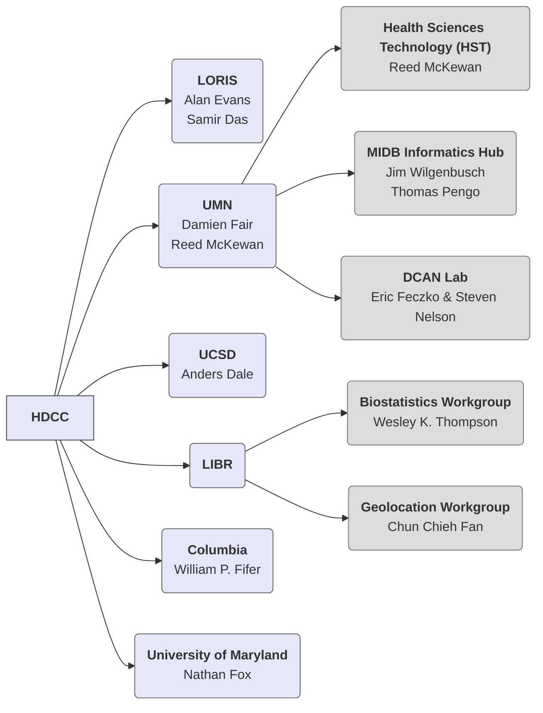
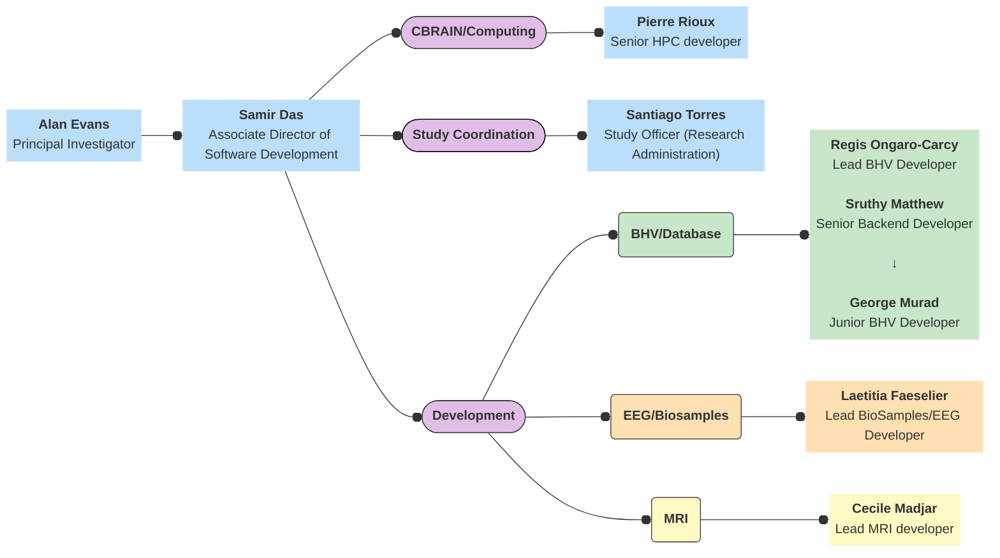

# HBCD Data Coordinating Center (HDCC) Organizational Charts

## Overview
The larger organizational structure of the HDCC is as follows - ***click on individual groups to be directed to their asssociated organizational charts***.

## LORIS

 

### Roles & Responsibilities

##### Alan Evans, Principal Investigator

<i>Oversight and management of MCIN and LORIS operations:</i>

- Ensure regulatory compliance between LORIS, McGill and affiliated institutions.
- Engage with stakeholders to ensure the study's relevance and applicability.
- Secure funding and resources for the study.

##### Samir Das, Associate Director of Software Development

<i>General planning and oversight of LORIS operations for the HBCD study including:</i>

- Administration of LORIS operations.
- Overseeing and managing allocated study budget.
- Provide guidance, and mentorship to the research and development team.
- Conceptualization, establishment and planning of standardized workflow procedures and experimental protocols with the aim of maintaining data consistency and integrity across study.
- Establish project plans, outlining tasks, timelines, and dependencies for the development of the HBCD project.
- Attend workgroup meetings with SMEs and workgroup leads to gather requirements and periodic feedback crucial for aligning project outcomes with expectations throughout the project duration.
- General oversight of structural functionality and new features and tools in LORIS.

## University of Minnesota (UMN)
(ADD ORG CHART DIAGRAM HERE)

### Roles and Responsibilities
***Alternative format - list info in table:***

  Responsibilities
  ▸

<table style="width: 100%; border-collapse: collapse; table-layout: fixed; font-size: 13px;">
    <thead>
      <tr>
        <th style="width: 15%; border: 1px solid #ddd; padding: 5px; text-align: center;">Name</th>
        <th style="width: 70%; border: 1px solid #ddd; padding: 5px; text-align: center;">Responsibilities</th>
    </thead>
    <tbody>
</tbody>
</table>

## UCSD
(ADD ORG CHART DIAGRAM HERE)

### Roles and Responsibilities

## LIBR
(ADD ORG CHART DIAGRAM HERE)

### Roles and Responsibilities

## Columbia
(ADD ORG CHART DIAGRAM HERE)

### Roles and Responsibilities

## University of Maryland
(ADD ORG CHART DIAGRAM HERE)

### Roles and Responsibilities
