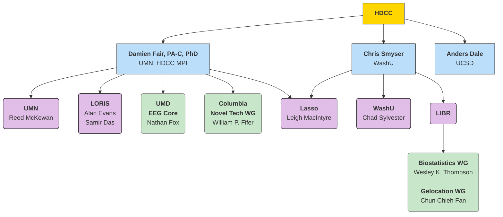
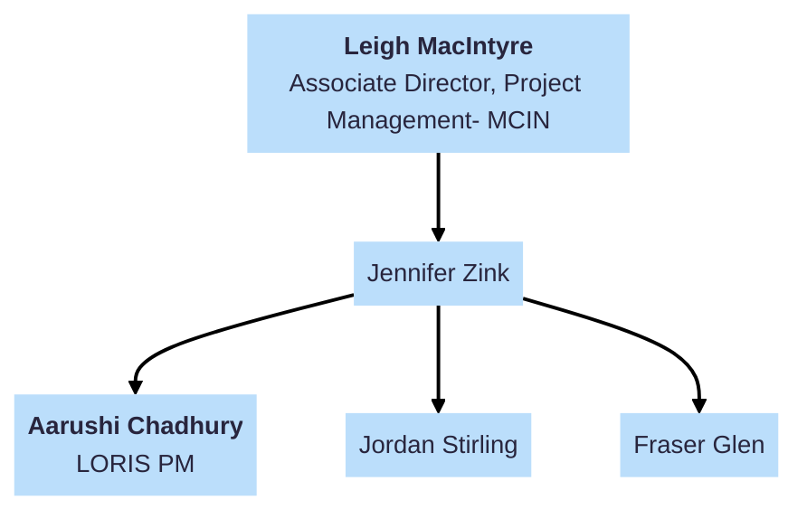
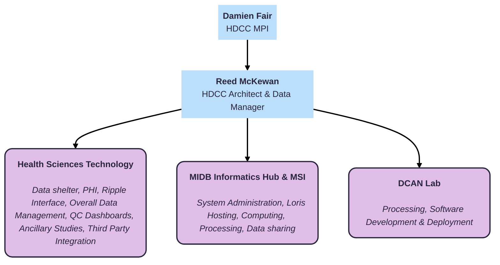
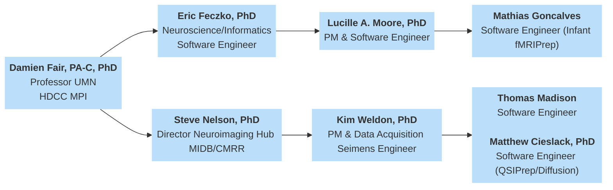
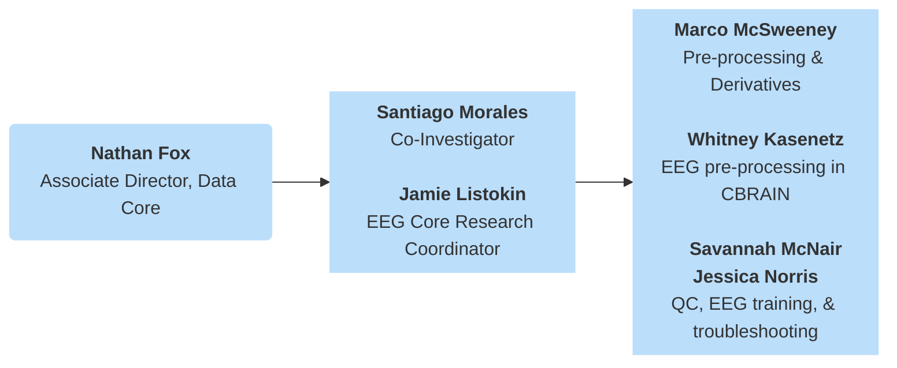

#  HDCC Organizational Charts   🚧 UNDER CONSTRUCTION 🚧

## Overview
The larger organizational structure of the HBCD Data Coordinating Center (HDCC) is as follows - ***click on individual groups to be directed to their asssociated organizational charts***. Please visit the [HDCC page](https://hbcdstudy.org/hbcd-data-coordinating-center/) of the HBCD Study website for a full list of all HDCC members.

  
  Columbia Novel Technologies & Wearables Workgroup
  <a class="anchor-link" href="#columbia-university" title="Copy link">
  <i class="fa-solid fa-link"></i>
  </a>
  
  ▸

 
<b>William P. Fifer, Co-chair</b>
<ul>
<li>Overall management.</li>
<li>Supervise automation of sleep stage scoring and data analysis.</li>
<li>Data analytics, writing, and review of manuscripts.</li>
</ul>

<b>Dimo Amso, Co-Investigator</b> 
<ul>
<li>Lead development of best practices, particularly the adapted Family Culture Matters (FCM) task.</li>
<li>Ensure coding is minimally evaluative to support unbiased measurement and minimize errors of inference.</li>
</ul>

<b>Nicolo Pini, Co-Investigator</b> 
<ul>
<li>Serve as a leading member of the Novel Technologies/Wearables Workgroup.</li>
<li>Develop pipelines necessary for extraction of derivatives, data upload, storage, and maintenance of EKG data collected during EEG and the heart rate wearable sensor data.</li>
<li>Coordinate recurring training at the HBCD sites.</li>
<li>Supervise quality control performed by Research Technician.</li>
</ul>

<b>Liana Eisler, Technician Research Assistant</b>: Perform quality control of pipeline outputs.

  
  LIBR
  <a class="anchor-link" href="#libr" title="Copy link">
  <i class="fa-solid fa-link"></i>
  </a>
  
  ▸

 
<b>Wesley K. Thompson, HDCC Associate Director & BioStatistics Work Group Chair</b>

Provides guidance on statistical analysis, study design, novel methods development, for large, longitudinal, multi-site studies, including:

<ul>
<li>Direction of statistical analyses for HBCD design and assessments.</li>
<li>Co-supervise and lead the development and maintenance of the statistical aspects of the Data Exploration and Analysis Portal 2.0 (DEAP 2.0).</li>
<li>Assist in the geolocation of residences of HBCD participants, and linking these geolocated addresses with external databases.</li>
</ul>
<b>Chun Chieh Fan, Co-Investigator & Geolocation Work Group Chair</b>
<ul>
<li>Guide curation and analysis of imaging, genomic, and geolocation exposure data.</li>
<li>Co-supervise expanding DEAP 2.0 to include exploration and analysis of high-dimensional genomic, imaging, and exposure data, and to develop DEAP 2.0 tools to harmonize HBCD data and analyses with external studies, including the creation of a probabilistic ontology to compare measures across studies.</li>
</ul>

## LORIS

 

### Roles & Responsibilities

  
  Alan Evans, Principal Investigator
  <a class="anchor-link" href="#evans" title="Copy link">
  <i class="fa-solid fa-link"></i>
  </a>
  
  ▸

Oversight and management of MCIN and LORIS operations:

<ul>
<li>Ensure regulatory compliance between LORIS, McGill and affiliated institutions.</li>
<li>Engage with stakeholders to ensure the study's relevance and applicability.</li>
<li>Secure funding and resources for the study.</li>
</ul>

  
  Samir Das, Associate Director of Software Development
  <a class="anchor-link" href="#das" title="Copy link">
  <i class="fa-solid fa-link"></i>
  </a>
  
  ▸

General planning and oversight of LORIS operations for the HBCD study:

<ul>
<li>Administration of LORIS operations.</li>
<li>Overseeing and managing allocated study budget.</li>
<li>Provide guidance, and mentorship to the research and development team.</li>
<li>Conceptualization, establishment and planning of standardized workflow procedures and experimental protocols with the aim of maintaining data consistency and integrity across study.</li>
<li>Establish project plans, outlining tasks, timelines, and dependencies for the development of the HBCD project.</li>
<li>Attend workgroup meetings with SMEs and workgroup leads to gather requirements and periodic feedback crucial for aligning project outcomes with expectations throughout the project duration.</li>
<li>General oversight of structural functionality and new features and tools in LORIS.</li>
</ul>

  
  Pierre Rioux, Senior CBRAIN Developer
  <a class="anchor-link" href="#rioux" title="Copy link">
  <i class="fa-solid fa-link"></i>
  </a>
  
  ▸

CBRAIN:

<ul>
<li>Configure clusters to handle all tools and pipelines for HBCD</li>
<li>Help containerize tools</li>
<li>Design efficient workflows for computing and analysis</li>
<li>Configure CBRAIN to handle all workflows and tools in HBCD</li>
<li>Interoperability with each system linking to HPCs</li>
<li>Data release design aspects as it pertains to HPCs</li>
</ul>

  
  Santiago Torres, Study Officer (Research Administration)
  <a class="anchor-link" href="#torres" title="Copy link">
  <i class="fa-solid fa-link"></i>
  </a>
  
  ▸

Review the completeness and accuracy of project tasks, including:

<ul>
<li>Attend workgroup meetings with SMEs and workgroup leads to gather requirements and periodic feedback crucial for aligning project outcomes with expectations throughout the project duration.</li>
<li>Acting as an initial liaison for sites to aid in troubleshooting, bug resolutions and provide assistance related to LORIS functionality.</li>
<li>Identify and assign roles and responsibilities for completion of established tasks.</li>
<li>Oversight of tasks for on time implementation and delivery of requested instruments, instrument edits, bug fixes and other study requests, including the creation, coordination, testing and follow-up of task </li>
<li>Check collection of relevant data through the various data collection streams such as surveys, questionnaires, BioSamples or 3rd party sources.</li>
<li>Conduct interoperability testing via data exchange simulations with external systems or platforms to ensure seamless integration and compatibility.</li>
</ul>

  
  Regis Ongaro-Carcy, Lead BHV Developer
  <a class="anchor-link" href="#ongaro-carcy" title="Copy link">
  <i class="fa-solid fa-link"></i>
  </a>
  
  ▸

<ul>
<i>Development of LORIS BHV features for HBCD:</i>
<li>Integrate data exchange protocols to enable interoperability between LORIS software and collaborating external platforms (e.g. REDCap, Ripple, MSI).</li>
<li>Establishment and overview of the various data collection streams such as surveys, questionnaires or 3rd party sources.</li>
<li>Conduct interoperability testing via data exchange simulations with external systems or platforms to ensure seamless integration and compatibility.</li>
<li>Implementation of CRF alert and escalation procedures and notification system.</li>
<li>Conception and design of alternative processing pathways to optimize current code functionalities in LORIS and improve system functionality and user satisfaction.</li>
<li>Implementation of new features and functionalities to maintain database integrity across LORIS.</li>
</ul>

  
  Sruthy Matthew, Senior Backend Developer
  <a class="anchor-link" href="#matthew" title="Copy link">
  <i class="fa-solid fa-link"></i>
  </a>
  
  ▸

<ul>
<i>Development of LORIS LaunchPad and Backend features for HBCD:</i>
<li>Set up and oversight of deployment procedures for execution and implementation of LORIS updates.</li>
<li>Formulation and execution of database upkeep and maintenance requests.</li>
<li>Design and implement new LaunchPad features to enhance user experience.</li>
<li>Monitor the quality and integrity of data collected, ensuring adherence to the study protocol.</li>
<li>Ensure proper data storage, confidentiality, and security measures are in place across the database.</li>
<li>Implementation of new features and functionalities to maintain database integrity across LORIS.</li>
</ul>

  
  George Murad, Junior BHV Developer
  <a class="anchor-link" href="#murad" title="Copy link">
  <i class="fa-solid fa-link"></i>
  </a>
  
  ▸

<ul>
<i>Development of LORIS BHV features specific to HBCD:</i>
<li>Coding of new instruments and their corresponding scoring algorithms.</li>
<li>Creation of automated queries for study progression and quality control monitoring..</li>
<li>Development and implementation of new Endpoint and APIs for HBCD.</li>
</ul>

  
  Cecile Madjar, Lead MRI developer
  <a class="anchor-link" href="#madjar" title="Copy link">
  <i class="fa-solid fa-link"></i>
  </a>
  
  ▸

Development of LORIS MRI features specific to HBCD:

<ul>
<li>Ingestion of raw data (DICOMs, conversion to BIDS, import of MRS data)</li>
<li>Ingestion of MRI QC data</li>
<li>Ingestion of derivatives (OSPREY, NiBabies, XCP-D, QSIPrep, etc…)</li>
<li>Notification system for missing MRI data; incorrect scan log entries or pipeline ingestion errors</li>
<li>MRI data fixes (Deletion of data, correction of incorrect conversion, recreation of the BIDS data post-DICOM updates…)</li>
<li>Responsible for the deployment process on the MRI side of HBCD</li>
</ul>

  
  Laetitia Faeselier, Lead BioSamples/EEG Developer
  <a class="anchor-link" href="#faeselier" title="Copy link">
  <i class="fa-solid fa-link"></i>
  </a>
  
  ▸

Development of LORIS BioSample/EEG features specific to HBCD: 

<ul>
<li>Ingestion of EEG data (Import of raw EEG files, Conversion to EEG BIDS) and EEG derivative data.</li>
<li>Ingestion of EKG data.</li>
<li>Creation of EEG QC and EEG QC equipment reports and output values</li>
<li>Establish data tracking protocols for EEG and BioSample data.</li>
<li>Implementation of processing requests for EEG and BioSample Data.</li>
<li>Establishment of BioSamples dashboard for display and navigation of BioSample processing and stage progression tracking.</li>
<li>Implementation of new features and innovations for BioSample Dashboard, shipping manifests and tracking systems.</li>
<li>Review of EEG and BioSample data, including conversion outputs, code tracking, kits registrations and other related data fixes.</li>
<li>Monitoring of radiological reports.</li>
</ul>

## Lasso

## University of Minnesota

### Health Sciences Technology
[HST](https://hst.umn.edu/) at UMN is responsible for: *Data shelter*, *PHI*, *Ripple Interface*, *Overall Data Management*, *QC Dashboards*, *Ancillary Studies*, and *Third Party Integration*.

### MIDB Informatics Hub & MSI
The [Masonic Institute for the Developing Brain (MIDB) Informatics Hub](https://midb.umn.edu/research/informatics) and [Minnesota Supercomputing Institute (MSI)](https://msi.umn.edu/) at UMN provide the following services to the HBCD study: *System Administration*, *Loris Hosting*, *Computing*, *Processing*, and *Data Sharing*.

### DCAN Lab
The Developmental Cognition and Neuroimaging Lab ([DCAN](https://innovation.umn.edu/developmental-cognition-and-neuroimaging-lab)) at UMN is responsible for: *Processing*, *Software Development*, and *Deployment* of imaging data. 

## UCSD

## UMD EEG Core

## WashU

The Washington University in St. Louis (WashU) group has oversight of: *Neurology*, *Electronic Health Records (EHR)*, *Ripple*, *Ambra*, *AirTable*, and *HCAC coordination*.

