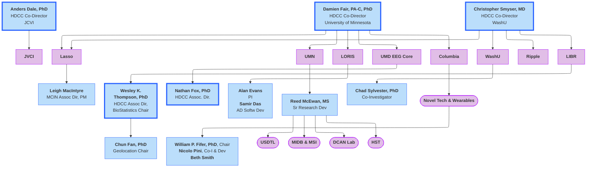
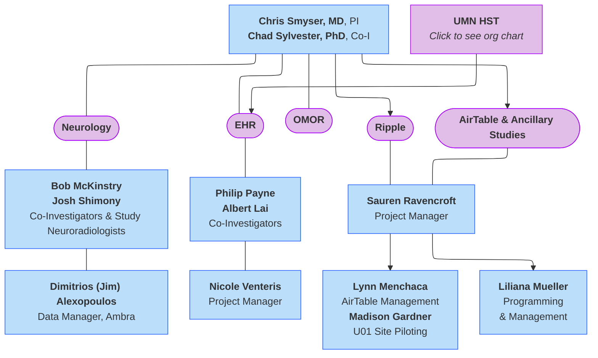

#  🚧 HDCC Organizational Charts 🚧

## Overview
The larger organizational structure of the HBCD Data Coordinating Center (HDCC) is as follows, with the HDCC Co-Directors listed at the top and the institutions/organizations listed below- ***click on individual institutions to be directed to their organizational charts***. Please visit the [HDCC page](https://hbcdstudy.org/hbcd-data-coordinating-center/) of the HBCD Study website for a full list of all HDCC members. 

  <i class="fa-regular fa-lightbulb"></i>
    <b>NOTE:</b> These org charts emphasize functional structure within the context of HDCC, not reporting line details of individual organizations.

 

## LORIS

 

  Roles & Responsibilities
  ▸

<table style="width: 100%; border-collapse: collapse; table-layout: fixed; font-size: 14px;">
    <thead>
      <tr>
        <th style="width: 20%;">Name</th>
        <th style="width: 30%;">Title</th>
        <th style="width: 50%;">Role on HDCC</th>
      </tr>
    </thead>
    <tbody>
    <tr>
        <td style="word-wrap: break-word; white-space: normal;">Alan Evans</td>
        <td style="word-wrap: break-word; white-space: normal;">Principal Investigator</td>
        <td style="word-wrap: break-word; white-space: normal;">Oversight and management of MCIN and LORIS operations</td>
    </tr>
    <tr>
        <td style="word-wrap: break-word; white-space: normal;">Samir Das</td>
        <td style="word-wrap: break-word; white-space: normal;">Associate Director of Software Development</td>
        <td style="word-wrap: break-word; white-space: normal;">Administration and oversight of LORIS operations for the HBCD Study</td>
    </tr>
    <tr>
        <td style="word-wrap: break-word; white-space: normal;">Pierre Rioux</td>
        <td style="word-wrap: break-word; white-space: normal;">Senior CBRAIN Developer</td>
        <td style="word-wrap: break-word; white-space: normal;">CBRAIN configuration, tool containerization, design computing and analysis workflows, system interoperability</td>
    </tr>
    <tr>
        <td style="word-wrap: break-word; white-space: normal;">Santiago Torres</td>
        <td style="word-wrap: break-word; white-space: normal;">Study Officer (Research Admin)</td>
        <td style="word-wrap: break-word; white-space: normal;">Project coordinator and liaison, ensuring timely implementation of study tasks and alignment with Workgroup requirements through oversight, testing, and data validation activities</td>
    </tr>
    <tr>
        <td style="word-wrap: break-word; white-space: normal;">Cecile Madjar</td>
        <td style="word-wrap: break-word; white-space: normal;">Lead MRI developer</td>
        <td style="word-wrap: break-word; white-space: normal;">Development and deployment of LORIS MRI features, including ingestion and error handling</td>
    </tr>
    <tr>
        <td style="word-wrap: break-word; white-space: normal;">Laetitia Faeselier</td>
        <td style="word-wrap: break-word; white-space: normal;">Lead BioSamples/EEG Developer</td>
        <td style="word-wrap: break-word; white-space: normal;">Development and implementation of LORIS BioSample/EEG features, including data ingestion, quality control, tracking systems, and Dashboard innovations</td>
    </tr>
    <tr>
        <td style="word-wrap: break-word; white-space: normal;">Regis Ongaro-Carcy</td>
        <td style="word-wrap: break-word; white-space: normal;">Lead Behavior (BHV) Developer</td>
        <td style="word-wrap: break-word; white-space: normal;">Development of LORIS BHV features, including integration with external platforms (e.g. REDCap, Ripple, MSI), streamlining data collection, and enhancing system functionality through interoperability and workflow improvements</td>
    </tr>
    <tr>
        <td style="word-wrap: break-word; white-space: normal;">Sruthy Matthew</td>
        <td style="word-wrap: break-word; white-space: normal;">Senior Backend Developer</td>
        <td style="word-wrap: break-word; white-space: normal;">Development of LORIS LaunchPad and Backend features</td>
    </tr>
    <tr>
        <td style="word-wrap: break-word; white-space: normal;">George Murad</td>
        <td style="word-wrap: break-word; white-space: normal;">Junior Behavior (BHV) Developer</td>
        <td style="word-wrap: break-word; white-space: normal;">Development of LORIS BHV features, including instrument coding, automated QC queries, and API/Endpoint implementation</td>
    </tr>
</tbody>
</table>

## Lasso

## University of Minnesota
There are several groups that fall under the oversight of UMN. The US Drug Testing Laboratories ([USDTL](https://www.usdtl.com/)) handles toxicology. The Developmental Cognition and Neuroimaging Lab ([DCAN](https://innovation.umn.edu/developmental-cognition-and-neuroimaging-lab)) led by Damien Fair at UMN is responsible for: *Processing*, *Software Development*, and *Deployment* of imaging data. The remaining groups are described in greater detail below.  

### Health Sciences Technology
[HST](https://hst.umn.edu/) at UMN is responsible for: *Data shelter*, *PHI*, *Ripple Interface*, *Overall Data Management*, *QC Dashboards*, *Ancillary Studies*, and *Third Party Integration*.

### MIDB Informatics Hub & MSI
The [Masonic Institute for the Developing Brain (MIDB) Informatics Hub](https://midb.umn.edu/research/informatics) and [Minnesota Supercomputing Institute (MSI)](https://msi.umn.edu/) at UMN provide the following services to the HBCD study: *System Administration*, *Loris Hosting*, *Computing*, *Processing*, and *Data Sharing*.

 

  Roles & Responsibilities
  ▸

<table style="width: 100%; border-collapse: collapse; table-layout: fixed; font-size: 14px;">
    <thead>
      <tr>
        <th style="width: 25%;">Name</th>
        <th style="width: 25%;">Role on HDCC</th>
        <th style="width: 50%;">Title</th>
      </tr>
    </thead>
    <tbody>
    <tr>
        <td style="word-wrap: break-word; white-space: normal;">Jim Wilgenbusch</td>
        <td style="word-wrap: break-word; white-space: normal;">Administration</td>
        <td style="word-wrap: break-word; white-space: normal;">Director of Research Computing in the Research & Innovation Office, UMN</td>
    </tr>
    <tr>
        <td style="word-wrap: break-word; white-space: normal;">Thomas Pengo, PhD</td>
        <td style="word-wrap: break-word; white-space: normal;">IG Lead</td>
        <td style="word-wrap: break-word; white-space: normal;">Co-Director, MIDB Informatics Group</td>
    </tr>
    <tr>
        <td style="word-wrap: break-word; white-space: normal;">Maren Macgregor-Hannah</td>
        <td style="word-wrap: break-word; white-space: normal;">HDCC Project Manager</td>
        <td style="word-wrap: break-word; white-space: normal;">Project Manager</td>
    </tr>
    <tr>
    <td>Jesse Erdmann</td>
    <td>ASO oversight</td>
    <td>Systems Operations</td>
    </tr>
    <tr>
    <td>Devin Willis</td>
    <td>Dev Ops</td>
    <td>DevOps Engineer</td>
    </tr>
    <tr>
    <td>Jesus Garcia</td>
    <td>Dev Ops</td>
    <td>DevOps Engineer</td>
    </tr>
    <tr>
    <td>Timothy Hendrickson</td>
    <td>Neuroimaging lead</td>
    <td>MIDB-IG Neuroimaging Informatics Manager</td>
    </tr>
    <tr>
    <td>Erik Lee</td>
    <td>Pipeline lead</td>
    <td>Neuroimaging Analyst</td>
    </tr>
    <tr>
    <td>Monalisa Biles</td>
    <td>Analyst</td>
    <td>&nbsp;</td>
    </tr>
    <tr>
    <td>Kimberleigh Breen</td>
    <td>Data Manager</td>
    <td>Data Manager</td>
    </tr>
    <tr>
  <td>Borgne Raasch</td>
  <td>Data Steward</td>
  <td>Data Steward</td>
  </tr>
  <tr>
  <td>Naomi Hospodarsky-Sutherland</td>
  <td>Security/Compliance</td>
  <td>Research Security and Compliance Analyst</td>
  </tr>
</tbody>
</table>

## J. Craig Venter Institute

The [J. Craig Venter Institute](https://www.jcvi.org/) (JCVI) is responsible for MRI quality control, REDCap, Fiona, and the QC Dashboard.

```mermaid
---
config:
  layout: elk
---
flowchart TB
    A["<b>Anders Dale, PhD</b><br>PI/Director"] --- n1(["<b>Fiona</b>"]) & n2(["<b>MRI QC</b>"]) & n3(["<b>MRI</b>"]) & n6(["<b>REDCap</b>"]) & n15(["<b>Dashboard</b>"])
    n1 --- n8["<b>Rongguang Yang, PhD</b><br>Fiona Lead"]
    n2 --- n9["<b>Donald Hagler, PhD</b><br>MRI QC Lead<br>"]
    n3 --- n10["<b>Josh Kuperman</b><br>MRI Lead"]
    n6 --- n4["<b>Janosch Linkersdörfer, PhD</b><br>REDCap/Data Science Lead"]
    n9 --- n13["<b>Tyler Berkness</b><br>Protocol Violations<br><b>Sejal Shanbhag</b><br>Issue Handling"]
    n15 --- n4
    n4 --- n12["<b>Joseph Baligh</b><br>Server Admin<br><b>Erika Bolden</b> &amp; <b>Laura Ziemer</b><br>Dev/Admin"] & n17["<b>Biplabendu Das</b><br>Backend Dev<br><b>Olivier Celhay</b><br>Frontend Dev"]
    n15 --> n17
    n6 --> n12
    style A fill:#BBDEFB,stroke:#2962FF
    style n1 fill:#E1BEE7,stroke:#AA00FF
    style n2 fill:#E1BEE7,stroke:#AA00FF
    style n3 fill:#E1BEE7,stroke:#AA00FF
    style n6 fill:#E1BEE7,stroke:#AA00FF
    style n15 fill:#E1BEE7,stroke:#AA00FF
    style n8 fill:#BBDEFB,stroke:#2962FF
    style n9 fill:#BBDEFB,stroke:#2962FF
    style n10 fill:#BBDEFB,stroke:#2962FF
    style n4 fill:#BBDEFB,stroke:#2962FF
    style n13 fill:#BBDEFB,stroke:#2962FF
    style n12 fill:#BBDEFB,stroke:#2962FF
    style n17 fill:#BBDEFB,stroke:#2962FF
```

## WashU
The Washington University in St. Louis (WashU) group has oversight of: *Neurology*, *Electronic Health Records (EHR)*, *Ripple*, *Ambra*, *AirTable*, and *HCAC coordination*.

## University of Maryland EEG Core

