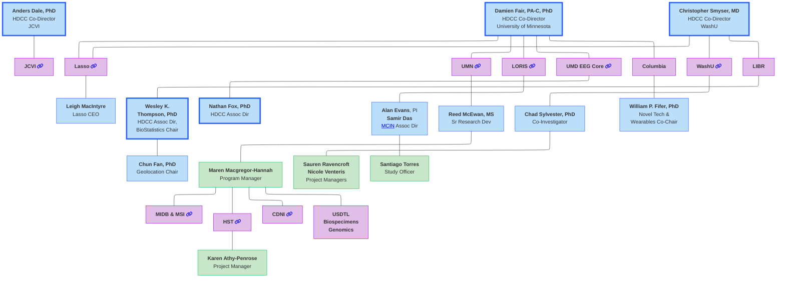
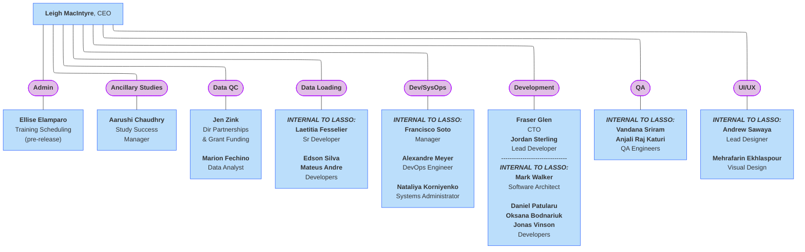
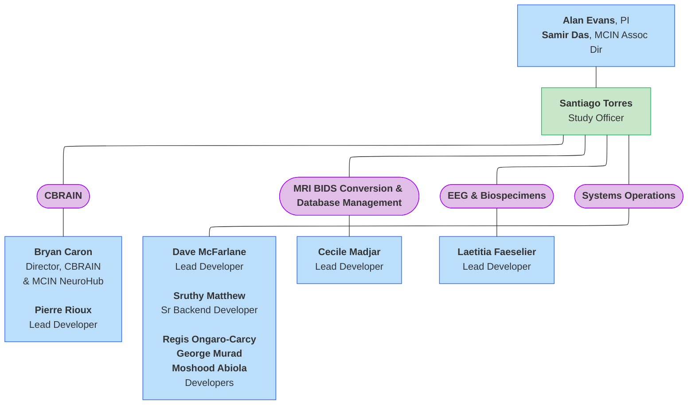
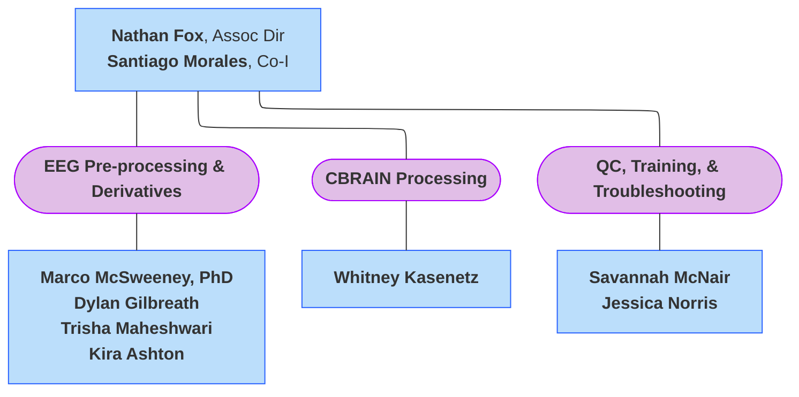
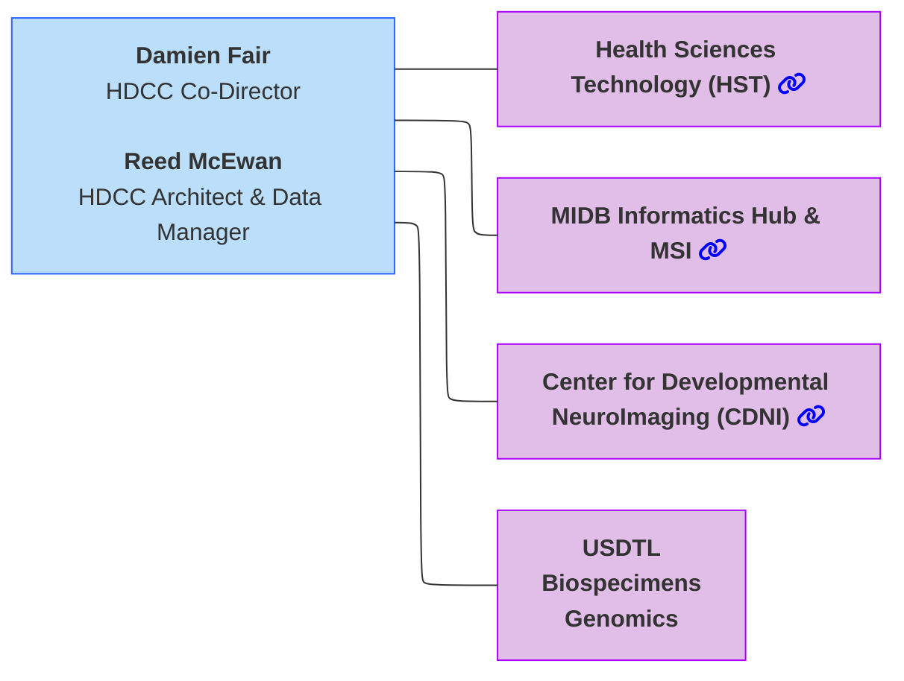
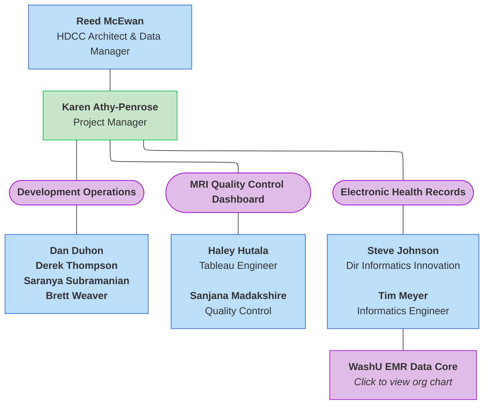
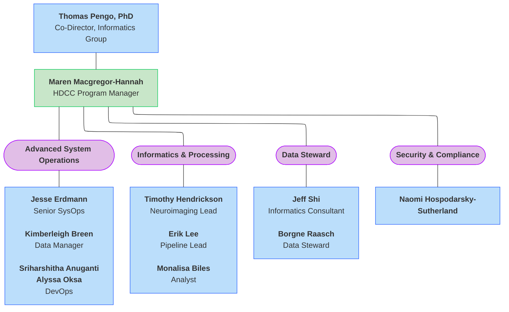
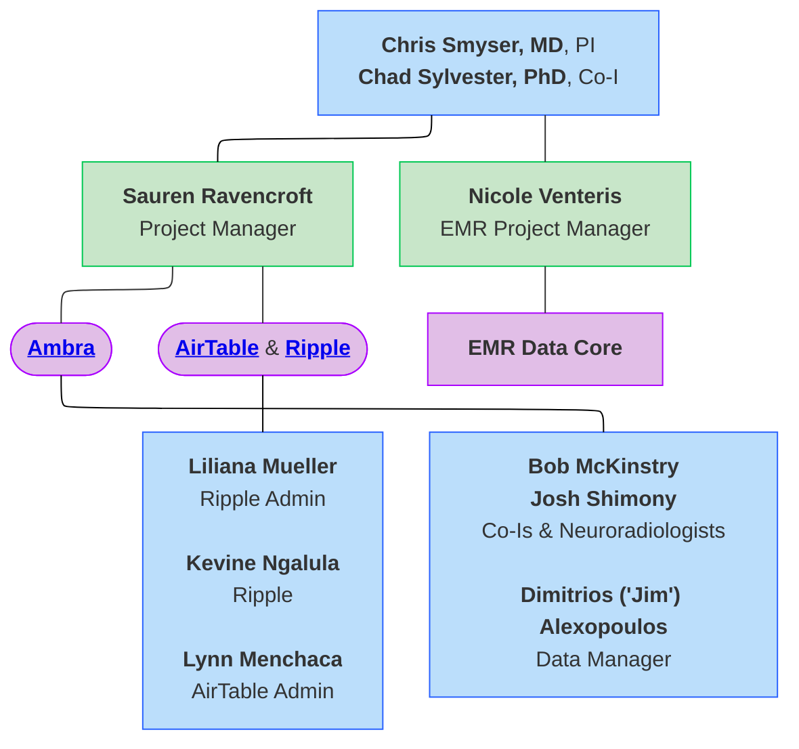

#  🚧 HDCC Organizational Charts 🚧

## Overview
The larger organizational structure of the HBCD Data Coordinating Center (HDCC) is as follows, with the HDCC Co-Directors listed at the top and the institutions/organizations listed below- ***click on individual teams to be directed to their organizational charts***. Please visit the [HDCC page](https://hbcdstudy.org/hbcd-data-coordinating-center/) of the HBCD Study website for a full list of all HDCC members. 

  <i class="fa-regular fa-lightbulb"></i>
    <b>NOTE:</b> These org charts emphasize functional structure within the context of HDCC, not reporting line details of individual organizations.

 

```mermaid
---
config:
  layout: elk
---
flowchart TB
    n2["<b>Anders Dale, PhD<br></b>HDCC Co-Director<br>JCVI"] --- jcvi["<b>JCVI</b> <i class="fa-solid fa-link" style="color: blue;"></i>"]
    E["<b>Damien Fair, PA-C, PhD</b><br>HDCC Co-Director<br>University of Minnesota"] --- lasso["<b>Lasso</b> <i class="fa-solid fa-link" style="color: blue;"></i>"] & umn["<b>UMN</b> <i class="fa-solid fa-link" style="color: blue;"></i>"] & n7["<b>LORIS</b> <i class="fa-solid fa-link" style="color: blue;"></i>"] & n8["<b>UMD EEG Core</b> <i class="fa-solid fa-link" style="color: blue;"></i>"] & n11["<b>Columbia</b>"]
    lasso --- lasso1["<b>Leigh MacIntyre</b><br>Lasso CEO"]
    n1["<b>Christopher Smyser, MD<br></b>HDCC Co-Director<br>WashU"] --- n10["<b>WashU</b> <i class="fa-solid fa-link" style="color: blue;"></i>"] & n12["<b>LIBR</b>"] & lasso
    n16["<b>Wesley K.<br>Thompson, PhD</b><br>HDCC Assoc Dir,<br>BioStatistics Chair"] --- n17["<b>Chun Fan, PhD</b><br>Geolocation Chair"]
    n12 --- n16
    n8 --- n19["<b>Nathan Fox, PhD<br></b>HDCC Assoc Dir"]
    n7 --- n20["<b>Alan Evans</b>, PI<br><b>Samir Das</b><br><a href="https://mcin.ca/about-mcin/" target="_blank">MCIN</a> Assoc Dir"]
    umn --- reed["<b>Reed McEwan, MS</b><br>Sr Research Dev"]
    n10 --- n22["<b>Chad Sylvester, PhD</b><br>Co-Investigator"]
    n11 --- n18["<b>William P. Fifer, PhD</b><br>Novel Tech &<br>Wearables Co-Chair"]
    reed --- n25["<b>MIDB &amp; MSI</b> <i class="fa-solid fa-link" style="color: blue;"></i>"] & n27["<b>HST</b> <i class="fa-solid fa-link" style="color: blue;"></i>"] & n28["<b>CDNI</b> <i class="fa-solid fa-link" style="color: blue;"></i>"] & n29["<b>USDTL<br>Biospecimens<br>Genomics</b>"]
    n25 --- n30["<b>Maren Macgregor-Hannah</b><br>Program Manager"]
    n27 --- n31["<b>Karen Athy-Penrose</b><br>Project Manager"]
    n22 --- n32["<b>Sauren Ravencroft<br>Nicole Venteris</b><br>Project Managers"]
    n20 --- n33["<b>Santiago Torres</b><br>Study Officer"]
    style n2 fill:#BBDEFB,stroke:#2962FF,stroke-width:4px
    style jcvi fill:#E1BEE7,stroke:#AA00FF
    style E fill:#BBDEFB,stroke:#2962FF,stroke-width:4px
    style lasso fill:#E1BEE7,stroke:#AA00FF
    style umn fill:#E1BEE7,stroke:#AA00FF
    style n7 fill:#E1BEE7,stroke:#AA00FF
    style n8 fill:#E1BEE7,stroke:#AA00FF
    style n11 fill:#E1BEE7,stroke:#AA00FF
    style lasso1 fill:#BBDEFB,stroke:#2962FF
    style n1 fill:#BBDEFB,stroke:#2962FF,stroke-width:4px
    style n10 fill:#E1BEE7,stroke:#AA00FF
    style n12 fill:#E1BEE7,stroke:#AA00FF
    style n16 fill:#BBDEFB,stroke:#2962FF,stroke-width:4px
    style n17 fill:#BBDEFB,stroke:#2962FF
    style n19 fill:#BBDEFB,stroke:#2962FF,stroke-width:4px
    style n20 fill:#BBDEFB,stroke:#2962FF
    style reed fill:#BBDEFB,stroke:#2962FF
    style n22 fill:#BBDEFB,stroke:#2962FF
    style n18 fill:#BBDEFB,stroke:#2962FF
    style n25 fill:#E1BEE7,stroke:#AA00FF
    style n27 fill:#E1BEE7,stroke:#AA00FF
    style n28 fill:#E1BEE7,stroke:#AA00FF
    style n29 fill:#E1BEE7,stroke:#AA00FF
    style n30 fill:#C8E6C9,stroke:#00C853
    style n31 fill:#C8E6C9,stroke:#00C853
    style n32 fill:#C8E6C9,stroke:#00C853
    style n33 fill:#C8E6C9,stroke:#00C853
    click jcvi "#j-craig-venter-institute"
    click lasso "#lasso"
    click umn "#university-of-minnesota"
    click n7 "#loris"
    click n8 "#university-of-maryland-eeg-core"
    click n10 "#washu"
    click n25 "#midb-informatics-hub-msi"
    click n27 "#health-sciences-technology"
    click n28 "#center-for-developmental-neuroimaging"
```

## Overview - Alternate 

## J. Craig Venter Institute 
The [J. Craig Venter Institute](https://www.jcvi.org/) (JCVI) is responsible for MRI quality control, REDCap, FIONA, and the QC Dashboard.

### Subcontractor Details

#### DEAP 🚧 **UPDATE FOLLOWING DESCRIPTION** 🚧
The Data Exploration and Analysis Portal (DEAP) is a cloud-based platform developed to facilitate secure, efficient, and user-friendly access to large-scale, multimodal research datasets. Originally designed for the Adolescent Brain Cognitive Development (ABCD) Study, DEAP supports visual exploration of NBDC data dictionaries as well as data download.

#### FIONA 🚧 **UPDATE FOLLOWING DESCRIPTION** 🚧
FIONA (Flexible Image Open Network Appliance) is a high-performance data transfer node (DTN) developed by the Energy Sciences Network (ESnet), designed to move large scientific datasets quickly and securely across research networks. It's typically used in research settings to support efficient, reliable, and high-throughput data transfers between institutions, especially for projects that generate or share large volumes of data. For the HBCD Study, FIONA plays a critical role in the infrastructure that supports data management and secure sharing, specifically for neuroimaging and other high-throughput data types collected across the many study sites.

#### REDCap 🚧 **UPDATE FOLLOWING DESCRIPTION** 🚧
[REDCap](https://projectredcap.org/) (Research Electronic Data Capture) is a secure, widely used web-based application designed to support data capture for research studies, particularly in academic and clinical environments. In the HBCD Study, REDCap serves as a central tool for managing behavioral, clinical, and demographic data across the multiple participating sites. While neuroimaging and biosensor data flow through pipelines involving systems like FIONA, REDCap is used for more structured, form-based data collected during assessments and visits.

## Lasso
[Lasso](https://www.lassoinformatics.com/) is a lightweight RESTful API framework developed to integrate external tools and pipelines with LORIS. Lasso offers a user-friendly, (NIST) 800-171-compliant data management platform particularly suited for large-scale multi-modal data. Lasso serves several core functions in HDCC, including developing dashboards for ongoing workgroup data QC and being the official public data release platform for the HBCD Study.

## LORIS
🚧 **UPDATE FOLLOWING DESCRIPTION** 🚧      
[LORIS](https://mcin.ca/technology/loris/) (Longitudinal Online Research and Imaging System), developed and maintained by research teams within the McGill Centre for Integrative Neuroscience ([MCIN](https://mcin.ca/)), is the core data management system for the HBCD Study. It is a web-based data management system designed for large-scale, multi-site neuroscience research. It supports the collection, curation, and sharing of diverse data types, including neuroimaging, behavioral, and clinical data. LORIS emphasizes data standardization, quality control, and longitudinal tracking across participants and timepoints.

  Roles & Responsibilities
  ▸

<table style="width: 100%; border-collapse: collapse; table-layout: fixed; font-size: 14px;">
    <thead>
      <tr>
        <th style="width: 25%;">Name</th>
        <th style="width: 30%;">Title</th>
        <th style="width: 50%;">Role on HDCC</th>
      </tr>
    </thead>
    <tbody>
    <tr>
        <td style="word-wrap: break-word; white-space: normal;">Alan Evans</td>
        <td style="word-wrap: break-word; white-space: normal;">Principal Investigator</td>
        <td style="word-wrap: break-word; white-space: normal;">Oversight and management of <a href="https://mcin.ca/about-mcin/" target="_blank">MCIN</a> and LORIS operations</td>
    </tr>
    <tr>
        <td style="word-wrap: break-word; white-space: normal;">Samir Das</td>
        <td style="word-wrap: break-word; white-space: normal;">Associate Director of Software Development</td>
        <td style="word-wrap: break-word; white-space: normal;">Administration and oversight of LORIS operations for the HBCD Study</td>
    </tr>
    <tr>
        <td style="word-wrap: break-word; white-space: normal;">Pierre Rioux</td>
        <td style="word-wrap: break-word; white-space: normal;">Senior CBRAIN Developer</td>
        <td style="word-wrap: break-word; white-space: normal;">CBRAIN configuration, tool containerization, design computing and analysis workflows, system interoperability</td>
    </tr>
    <tr>
        <td style="word-wrap: break-word; white-space: normal;">Santiago Torres</td>
        <td style="word-wrap: break-word; white-space: normal;">Study Officer (Research Admin)</td>
        <td style="word-wrap: break-word; white-space: normal;">Project coordinator and liaison, ensuring timely implementation of study tasks and alignment with Workgroup requirements through oversight, testing, and data validation activities</td>
    </tr>
    <tr>
        <td style="word-wrap: break-word; white-space: normal;">Cecile Madjar</td>
        <td style="word-wrap: break-word; white-space: normal;">Lead MRI developer</td>
        <td style="word-wrap: break-word; white-space: normal;">Development and deployment of LORIS MRI features, including ingestion and error handling</td>
    </tr>
    <tr>
        <td style="word-wrap: break-word; white-space: normal;">Laetitia Faeselier</td>
        <td style="word-wrap: break-word; white-space: normal;">Lead Biospecimens & EEG Developer</td>
        <td style="word-wrap: break-word; white-space: normal;">Development and implementation of LORIS Biospecimens & EEG features, including data ingestion, quality control, tracking systems, and Dashboard innovations</td>
    </tr>
    <tr>
        <td style="word-wrap: break-word; white-space: normal;">Regis Ongaro-Carcy</td>
        <td style="word-wrap: break-word; white-space: normal;">Lead Developer</td>
        <td style="word-wrap: break-word; white-space: normal;">Development of LORIS features for behavior (questionnaire/survey responses), including integration with external platforms (e.g. REDCap, Ripple, MSI), streamlining data collection, and enhancing system interoperability and workflows</td>
    </tr>
    <tr>
        <td style="word-wrap: break-word; white-space: normal;">Sruthy Matthew</td>
        <td style="word-wrap: break-word; white-space: normal;">Senior Backend Developer</td>
        <td style="word-wrap: break-word; white-space: normal;">Development of LORIS LaunchPad and Backend features</td>
    </tr>
    <tr>
        <td style="word-wrap: break-word; white-space: normal;">George Murad</td>
        <td style="word-wrap: break-word; white-space: normal;">Junior Developer</td>
        <td style="word-wrap: break-word; white-space: normal;">Development of LORIS features for behavior (questionnaire/survey responses), including instrument coding, automated QC queries, and API/Endpoint implementation</td>
    </tr>
</tbody>
</table>

## University of Maryland EEG Core

## University of Minnesota
🚧 **UPDATE FOLLOWING DESCRIPTION** 🚧      
There are several groups that fall under the oversight of UMN. The US Drug Testing Laboratories ([USDTL](https://www.usdtl.com/)) handles toxicology. The remaining groups are described in greater detail below.  

### Center for Developmental NeuroImaging
🚧 **UPDATE FOLLOWING DESCRIPTION** 🚧      
The Center for Developmental NeuroImaging ([CDNI](https://cdni.umn.edu/)) at UMN is responsible for: *Processing*, *Software Development*, and *Deployment* of imaging data. 

### Health Sciences Technology
🚧 **UPDATE FOLLOWING DESCRIPTION** 🚧      
[HST](https://hst.umn.edu/) at UMN is responsible for: *Data shelter*, *PHI*, *Electronic Health Records (EHR)*, *Ripple Interface*, *Overall Data Management*, *QC Dashboards*, *Ancillary Studies*, and *Third Party Integration*.

### MIDB Informatics Hub & MSI
🚧 **UPDATE FOLLOWING DESCRIPTION** 🚧      
The [Masonic Institute for the Developing Brain (MIDB) Informatics Hub](https://midb.umn.edu/research/informatics) and [Minnesota Supercomputing Institute (MSI)](https://msi.umn.edu/) at UMN provide the following services to the HBCD study: *System Administration*, *Loris Hosting*, *Computing*, *Processing*, and *Data Sharing*.

 

  Roles & Responsibilities
  ▸

<table style="width: 100%; border-collapse: collapse; table-layout: fixed; font-size: 14px;">
    <thead>
      <tr>
        <th style="width: 25%;">Name</th>
        <th style="width: 30%;">Title</th>
        <th style="width: 45%;">Role on HDCC</th>
      </tr>
    </thead>
    <tbody>
    <tr>
        <td style="word-wrap: break-word; white-space: normal;">Thomas Pengo, PhD</td>
        <td style="word-wrap: break-word; white-space: normal;">Co-Director, MIDB Informatics Group</td>
        <td style="word-wrap: break-word; white-space: normal;">IG Lead</td>
    </tr>
    <tr>
        <td style="word-wrap: break-word; white-space: normal;">Maren Macgregor-Hannah</td>
        <td style="word-wrap: break-word; white-space: normal;">Program Manager</td>
        <td style="word-wrap: break-word; white-space: normal;">HDCC Program Manager</td>
    </tr>
    <tr>
    <td>Jesse Erdmann</td>
    <td>Systems Operations</td>
    <td style="word-wrap: break-word; white-space: normal;">Advanced System Operations (ASO) oversight</td>
    </tr>
    <tr>
    <td>Devin Willis</td>
    <td>DevOps Engineer</td>
    <td>Dev Ops</td>
    </tr>
    <tr>
    <td>Jesus Garcia</td>
    <td>DevOps Engineer</td>
    <td>Dev Ops</td>
    </tr>
    <tr>
    <td>Timothy Hendrickson</td>
    <td style="word-wrap: break-word; white-space: normal;">MIDB-IG Neuroimaging Informatics Manager</td>
    <td>Neuroimaging lead</td>
    </tr>
    <tr>
    <td>Erik Lee</td>
    <td>Neuroimaging Analyst</td>
    <td>Pipeline lead</td>
    </tr>
    <tr>
    <td>Monalisa Biles</td>
    <td>&nbsp;</td>
    <td>Analyst</td>
    </tr>
    <tr>
    <td>Kimberleigh Breen</td>
    <td>Data Manager</td>
    <td>Data Manager</td>
    </tr>
    <tr>
  <td>Borgne Raasch</td>
  <td>Data Steward</td>
  <td>Data Steward</td>
  </tr>
  <tr>
  <td>Naomi Hospodarsky-Sutherland</td>
  <td>Research Security and Compliance Analyst</td>
  <td>Security/Compliance</td>
  </tr>
</tbody>
</table>

## WashU
🚧 **UPDATE FOLLOWING DESCRIPTION** 🚧      
The Washington University in St. Louis (WashU) group has oversight of: *Electronic Medical Records (EMR)*, *Ripple*, *Ambra*, *AirTable*, and *HBCD Study Administrative Core (HCAC) coordination*.

### Subcontractor Details

#### AirTable 🚧 **UPDATE FOLLOWING DESCRIPTION** 🚧
AirTable is a cloud-based collaborative platform and database service that combines the features of a database and a spreadsheet. It allows users to organize, track, and collaborate on structured data using customizable tables, forms, views, and automation. In the HBCD Study, Airtable is widely used as a centralized project management and tracking tool, including study coordination and oversight, neuroimaging workflow tracking, cross-team communication, and quality control and reporting.

#### Ambra 🚧 **UPDATE FOLLOWING DESCRIPTION** 🚧
Ambra is a cloud-based gateway that allows the direct transmission of medical images between participating institutions. Ambra supports secure data transfer, DICOM standard compliance, de-identification tools, and access control, making it suitable for large-scale, multi-site research studies. For the HBCD Study, Ambra is used as the centralized platform for uploading, storing, and sharing neuroimaging data from participating research sites.
 
#### Ripple 🚧 **UPDATE FOLLOWING DESCRIPTION** 🚧
[Ripple Science](https://www.ripplescience.com/) is a digital clinical trial software deployed at all HBCD Study sites for participant recruitment and retention. See details of Ripple's role in the study [here](https://www.ripplescience.com/ripple-science-supports-nih-funded-healthy-brain-and-child-development-study/).

