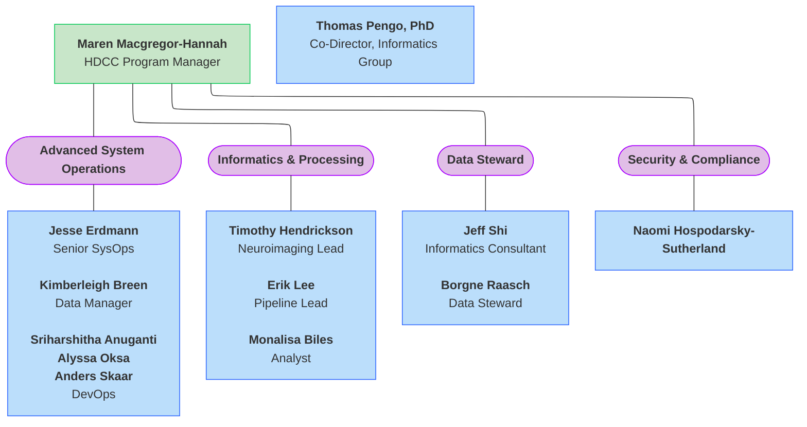
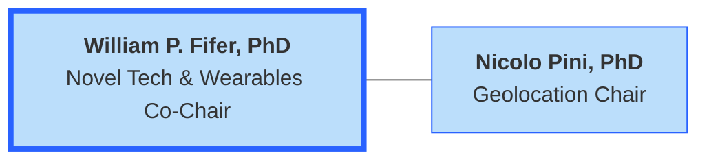

#  HDCC Organizational Charts

🚧 <i>UNDER CONSTRUCTION</i> 🚧 

## HDCC Functional Structure

### Overview

The larger organizational structure of the HBCD Data Coordinating Center (HDCC) is as follows, with the HDCC Co-Directors listed at the top and the institutions/organizations listed below- ***click on individual teams to be directed to their organizational charts***. Please visit the [HDCC page](https://hbcdstudy.org/hbcd-data-coordinating-center/) of the HBCD Study website for a full list of all HDCC members. 

  <i class="fa-regular fa-lightbulb"></i>
    <b>NOTE:</b> These org charts emphasize functional structure within the context of HDCC, not reporting line details of individual organizations.

 

### University of Minnesota

#### Center for Developmental NeuroImaging
   
The Center for Developmental NeuroImaging ([CDNI](https://cdni.umn.edu/)) at UMN is responsible for: *Processing*, *Software Development*, and *Deployment* of imaging data. 

  
  Roles & Responsibilities
  <a class="anchor-link" href="#cdni-rr" title="Copy link">
  <i class="fa-solid fa-link"></i>
  </a>
  
  ▸

<table style="width: 100%; border-collapse: collapse; table-layout: fixed; font-size: 14px;">
    <thead>
      <tr>
        <th style="width: 5%;">Name</th>
        <th style="width: 5%;">Title</th>
        <th style="width: 60%;">Role on HDCC</th>
      </tr>
    </thead>
    <tbody>
      <tr>
      <td>Damien Fair</td>
      <td>PI</td>
      <td style="word-wrap: break-word; white-space: normal;">Provides scientific and operational leadership for the HBCD Data Coordinating Center, with direct oversight of MRI acquisition strategy, processing pipeline development, and quality control infrastructure at CDNI.</td>
      </tr>
      <tr>
      <td>Kimberly Weldon</td>
      <td>Siemens Engineer</td>
      <td style="word-wrap: break-word; white-space: normal;">Supports MRI acquisition through scanner calibration, sequence optimization, and technical troubleshooting, ensuring harmonized imaging protocols across Siemens scanners and sites.</td>
      </tr>
      <tr>
      <td>Eric Feczko</td>
      <td>QC Lead</td>
      <td style="word-wrap: break-word; white-space: normal;">Leads the design and implementation of post-processing MRI quality control procedures, developing automated and manual QC metrics to assess data reliability and identify artifacts across modalities.</td>
      </tr>
      <tr>
      <td>Lucille A. Moore</td>
      <td>Neuroinformatics</td>
      <td style="word-wrap: break-word; white-space: normal;">Develops and maintains software tools for organizing, processing, and visualizing neuroimaging data, integrating processed outputs with metadata and quality metrics for centralized review and downstream analysis. Lead documentation across all HDCC release docs and works with director and HCAC to coordinate processes throughout HBCD. Developer and/or project manager for select HBCD processing pipelines.</td>
      </tr>
      <tr>
      <td>Michael Anderson</td>
      <td>Analyst</td>
      <td style="word-wrap: break-word; white-space: normal;">Conducts data analysis and curation of processed MRI datasets, supports QC review and scoring workflows, and ensures alignment between data outputs and release standards.</td>
      </tr>
</tbody>
</table>

 

#### Health Sciences Technology
  
[HST](https://hst.umn.edu/) at UMN is responsible for: *Data shelter*, *PHI*, *Electronic Health Records (EHR)*, *Ripple Interface*, *Overall Data Management*, *QC Dashboards*, *Ancillary Studies*, and *Third Party Integration*.

  
  HBCD and Secure Computing Environment Governance 
  <a class="anchor-link" href="#HST-governance" title="Copy link">
    <i class="fa-solid fa-link"></i>
  </a>
  
  ▸

Version 1.0      
2.1.2023  
Author: Reed McEwan, University of Minnesota, Health Sciences Technology, HDCC Lead

The Data Coordinating Center (DCC) team leading data integration needs for the HEALthy Brain and Child Development (HBCD) Study is leveraging the UMN SCE (University of <a href="https://confluence.ahc.umn.edu/display/CE/Overview">Minnesota Secure Computing Environment</a>) for ingestion, transformation, and storage of protected participant information (names, addresses, dates of birth, identifying pictures and videos, abstracted health records, etc.). The SCE has been established by the University of Minnesota (“University”) through its Clinical Translational Sciences Institute to provide a secure environment that can consume, aggregate, transform and enrich clinical and protected data for research and operational analysis. SCE resources reside behind a network firewall that is separate from the rest of the University of Minnesota (UMN) networks and follows strict UMN technical security requirements for receiving, storing and analyzing clinical data.

The SCE architecture provides robust, secure, and validated capabilities that bring together data from disparate sources (including, but not limited to, electronic medical records, patient and participant registries, REDCap, standalone datasets, and regular data feeds) to create cohesive datasets for research and operational analysis. The architecture’s core consists of a data warehouse design and is managed following recommendations by the Healthcare Information and Management Systems Society (HIMSS), Health Insurance Portability and Accountability Act (HIPAA) regulations. It adopts leading practices and perspectives on building integrated data repositories from leading national centers. The architecture is also regularly reviewed by the Center of Excellence for HIPAA Data at the University of Minnesota to ensure its compliance with HIPAA regulations.

The key components/modules of the system are: data integration, data security model, data enrichment (patient/participant matching, terminology and ontology management, data de-identification), and data extraction. The clinical architecture as well as all data governance policies and procedures for all of the UMN secure computing environments are reviewed on a regular basis by a governance committee. This committee is led by the University’s CRIO and Hospital’s CIO and has broad, high-level representation from the Academic Health Center and Hospital administration. This committee structure and governance model accommodates both changing legal requirements and the evolving needs of researchers working with protected data.
 

<b>Data Security Model</b> 
The Data security model ensures data security by focusing on two key components: culture and technology. Our culture has a deep focus on HIPAA compliance with mandatory, rigorous HIPAA training for new employees, regular refresher trainings, monthly newsletters with a focus on security, and ongoing dialogue about best practices. Building a data security awareness culture is proven in the literature to reduce data breaches. The data security model also utilizes advanced and validated secure data transfer, storage, management, and reporting technology to ensure that data security best practices, safe harbor, and HIPAA regulations are being implemented. For example, data ingested by the SCE is transmitted using secure File Transfer Protocol (sFTP) over the Secure Shell Network protocol or SSL (Secure Socket Layer)-encrypted HTTP (Hypertext Transfer Protocol) API (Application Programming Interface) endpoints. HBCD source applications and servers transmit their protected data to a landing zone in which data is validated and then integrated into the HBCD data repository and warehouse. Identifying data elements (date of birth) is obfuscated (date-shifted) before it is shared with the HBCD consortium’s downstream systems, LORIS hosted and managed by MSI (Minnesota Supercomputing Institute), and REDCap hosted and managed by the team at the University of California at San Diego.

All SCE data servers are hosted by the University Office of Information Technology (OIT) and certified to be HIPAA Compliant by the Center of Excellence for HIPAA Data at the University of Minnesota. The Health Sciences Technology (HST) office is responsible for server operations, data backups, disaster recovery, and ETL (Extract Transformation Load), application development services related to the SCE program. Several safeguards and practices, such as SANs Data Center Physical Security checklist, are implemented to ensure the security of the servers including restricted physical access which requires a valid UMN Ucard, fingerprint identification, sign-in with the data center staff, and a photo identification produced by data center staff at time of access. Also, all activities in the datacenter are recorded via video cameras and stored for auditing purposes.
 

Secure, role-based data access is provided to systems administrators, developers, and users through the integration of Microsoft’s Active Directory identification and authorization database. The advantage of using Active Directory is that it provides very fine-grained control over who can and cannot access a system’s data. SCE supplies a number of pre-defined Active Directory roles with varying levels of rights to access different types of information. Some key roles include: 1) Advanced Access Role: this role is granted to system and ETL developers and data analysts trough through a secure VPN pool and a secure remote desktop server to perform various system development tasks, map and integrate data, and extract data for clinicians and researchers; 2) High Risk Role: users in this subnet, who are usually researchers and clinicians with approved IRB and trainings, can access PHI/PII data but do not have the ability to extract data out of the SCE environment except by a self-service logged and audited extraction system; 3) Low Risk Role: users in this subnet, who are usually in their initial feasibility analysis phase, do not have access to PHI/PII data and users can use tools such as i2b2 to query a limited set of data elements. Changes to the firewalls for role-based access must be approved by the HST. Firewall exceptions are documented and reviewed periodically to determine their risk and need.

Researchers granted access to the SCE for the purpose of working with identified, protected data collected for use in the HBCD study must conform to the security and governance policies of the SCE. This includes appropriately scoping access to HBCD data through membership in Active Directory groups, validating that the researcher/clinicians have completed HIPAA training, signing the annual SCE Attestation Form, that the study itself has appropriate IRB approvals. Access to the SCE requires the user initiate their connection from a University of Minnesota IP address by being connected to the University’s network physically, wirelessly, or through a VPN protected by two factor authentication (2FA). An additional 2FA step is required to sign into the Citrix portal through which secure desktops are made available for accessing data within the SCE. Within the SCE, researchers have full access to data for which they are authorized. This data is stored on file servers and/or relational database data marts. A robust suite of statistical analysis tools and programs and programming languages are available within the environment for researchers to perform their research.

SCE secure virtual desktops do not have general internet access thus preventing untracked exfiltration of protected HBCD data. The secure environment enables approved extraction of data out of the SCE environment only via an audited and logged, self-service transfer tool for authorized users.

  
  Roles & Responsibilities
  <a class="anchor-link" href="#hst-rr" title="Copy link">
  <i class="fa-solid fa-link"></i>
  </a>
  
  ▸

<table style="width: 100%; border-collapse: collapse; table-layout: fixed; font-size: 14px;">
    <thead>
      <tr>
        <th style="width: 5%;">Name</th>
        <th style="width: 5%;">Title</th>
        <th style="width: 50%;">Role on HDCC</th>
      </tr>
    </thead>
    <tbody>
    <tr>
    <td>Reed McEwan</td>
    <td>HDCC Architect &amp; Data Manager</td>
    <td style="word-wrap: break-word; white-space: normal;">Oversees the design and implementation of secure data infrastructure for the HBCD Data Core, including data shelter, PHI protection, system architecture, and integration across platforms.</td>
    </tr>
    <tr>
    <td>Karen Athy-Penrose</td>
    <td>Project Manger</td>
    <td style="word-wrap: break-word; white-space: normal;">Coordinates cross-functional efforts across HST teams, ensuring timely progress on dashboard development, EHR integration, and data governance activities related to PHI and third-party tools.</td>
    </tr>
    <tr>
    <td>Haley Hutala</td>
    <td>Tableau Engineer</td>
    <td style="word-wrap: break-word; white-space: normal;">Designs and maintains interactive data visualizations in Tableau to monitor MRI quality metrics, enabling real-time insights and reporting for QC stakeholders.</td>
    </tr>
    <tr>
    <td>Sanjana Madakshire</td>
    <td>QC</td>
    <td style="word-wrap: break-word; white-space: normal;">Performs data validation and quality assurance tasks for MRI datasets, collaborating with dashboard and data teams to ensure accuracy in visualized metrics.</td>
    </tr>
    <tr>
    <td>Dan Duhon,</td>
    <td>Developer</td>
    <td style="word-wrap: break-word; white-space: normal;">Maintain the infrastructure, APIs, and backend services supporting HST platforms, including data ingestion, automation pipelines, authentication systems, and secure data exchange between HBCD components. Lead ETL developer</td>
    </tr>
    <tr>
    <td>Derek Thompson,</td>
    <td>Developer</td>
    <td style="word-wrap: break-word; white-space: normal;">Maintain the infrastructure, APIs, and backend services supporting HST platforms, including data ingestion, automation pipelines, authentication systems, and secure data exchange between HBCD components.</td>
    </tr>
    <tr>
    <td>Saranya Subramanian,</td>
    <td>Developer</td>
    <td style="word-wrap: break-word; white-space: normal;">Maintain the infrastructure, APIs, and backend services supporting HST platforms, including data ingestion, automation pipelines, authentication systems, and secure data exchange between HBCD components.</td>
    </tr>
    <tr>
    <td>Brett Weaver</td>
    <td>Developer</td>
    <td style="word-wrap: break-word; white-space: normal;">Maintain the infrastructure, APIs, and backend services supporting HST platforms, including data ingestion, automation pipelines, authentication systems, and secure data exchange between HBCD components.</td>
    </tr>
</tbody>
</table>

 

#### MIDB Analytics Hub
The [MIDB Analytics Hub](https://midb.umn.edu/research/analytics) works in coordination with the Biospecimens Workgroup to provide support for genomic data processing and analysis as part of the **HBCD Genomics Supplement**. 

 

  
  Roles & Responsibilities
  <a class="anchor-link" href="#midb-analytics-rr" title="Copy link">
  <i class="fa-solid fa-link"></i>
  </a>
  
  ▸

<table style="width: 100%; border-collapse: collapse; table-layout: fixed; font-size: 14px;">
    <thead>
      <tr>
        <th style="width: 25%;">Name</th>
        <th style="width: 30%;">Title</th>
        <th style="width: 45%;">Role on HDCC</th>
      </tr>
    </thead>
    <tbody>
    <tr>
        <td style="word-wrap: break-word; white-space: normal;">Saonli Basu, PhD</td>
        <td style="word-wrap: break-word; white-space: normal;">Co-I, HBCD Genomics Supplement Lead Faculty</td>
        <td style="word-wrap: break-word; white-space: normal;">Oversight on the HBCD Genomics supplement, working with the Data Scientists, project management, and HBCD Leadership</td>
    </tr>
    <tr>
        <td style="word-wrap: break-word; white-space: normal;">Annette Xenopoulos-Oddsson, MSc</td>
        <td style="word-wrap: break-word; white-space: normal;">HBCD Genomics Supplement Project Manager</td>
        <td style="word-wrap: break-word; white-space: normal;">Project manager for project task management, meetings, etc.</td>
    </tr>
    <tr>
        <td style="word-wrap: break-word; white-space: normal;">Michael Anderson, PhD</td>
        <td style="word-wrap: break-word; white-space: normal;">HBCD Genomics Data Scientist</td>
        <td style="word-wrap: break-word; white-space: normal;">Developing the genomics pipelines, documentation, running the genomic data analysis</td>
    </tr>
    <tr>
        <td style="word-wrap: break-word; white-space: normal;">Christian Coffman</td>
        <td style="word-wrap: break-word; white-space: normal;">Data Scientist & Analyst</td>
        <td style="word-wrap: break-word; white-space: normal;">Support for pipeline development, documentation, and genomic data analysis</td>
    </tr>
</tbody>
</table>

 

#### MIDB Informatics Hub & MSI
   
The [Masonic Institute for the Developing Brain (MIDB) Informatics Hub](https://midb.umn.edu/research/informatics) and [Minnesota Supercomputing Institute (MSI)](https://msi.umn.edu/) at UMN provide the following services to the HBCD study: *System Administration*, *Loris Hosting*, *Computing*, *Processing*, and *Data Sharing*.

 

  
  Roles & Responsibilities
  <a class="anchor-link" href="#midb-msi-rr" title="Copy link">
  <i class="fa-solid fa-link"></i>
  </a>
  
  ▸

<table style="width: 100%; border-collapse: collapse; table-layout: fixed; font-size: 14px;">
    <thead>
      <tr>
        <th style="width: 10%;">Name</th>
        <th style="width: 20%;">Title</th>
        <th style="width: 70%;">Role on HDCC</th>
      </tr>
    </thead>
    <tbody>
    <tr>
        <td style="word-wrap: break-word; white-space: normal;">Thomas Pengo, PhD</td>
        <td style="word-wrap: break-word; white-space: normal;">Co-Director, MIDB Informatics Group</td>
        <td style="word-wrap: break-word; white-space: normal;">IG Lead: Oversees all personnel for the platform used as the primary housing for HBCD data, processing, and preparation</td>
    </tr>
    <tr>
        <td style="word-wrap: break-word; white-space: normal;">Maren Macgregor-Hannah</td>
        <td style="word-wrap: break-word; white-space: normal;">Program Manager</td>
        <td style="word-wrap: break-word; white-space: normal;">HDCC Program Manager: Responsible for primary HDCC WG meetings, managing timelines and deliverables, and facilitating communication among technical, scientific, and administrative HCAC teams.</td>
    </tr>
    <tr>
    <td>Jesse Erdmann</td>
    <td>Systems Operations</td>
    <td style="word-wrap: break-word; white-space: normal;">Advanced System Operations (ASO) oversight: Oversees the performance, reliability, and security of the MSI computational systems and infrastructure, for integration and support for Loris, large-scale data processing, and analysis workflows.</td>
    </tr>
    <tr>
    <td>Sriharshitha Anuganti</td>
    <td>DevOps Engineer</td>
    <td style="word-wrap: break-word; white-space: normal;">Continuous integration and deployment (CI/CD), infrastructure automation, system monitoring, and incident response.</td>
    </tr>
        <tr>
    <td>Alyssa Oksa</td>
    <td>DevOps Engineer</td>
    <td style="word-wrap: break-word; white-space: normal;">Continuous integration and deployment (CI/CD), infrastructure automation, system monitoring, and incident response.</td>
    </tr>
    <tr>
    <td>Anders Skaar</td>
    <td>DevOps Engineer</td>
    <td style="word-wrap: break-word; white-space: normal;">Continuous integration and deployment (CI/CD), infrastructure automation, system monitoring, and incident response.</td>
    </tr>
    <tr>
    <td>Timothy Hendrickson</td>
    <td style="word-wrap: break-word; white-space: normal;">MIDB-IG Neuroimaging Informatics Manager</td>
    <td style="word-wrap: break-word; white-space: normal;">Neuroimaging lead: Lead design and oversight of neuroimaging processing implementation.</td>
    </tr>
    <tr>
    <td>Erik Lee</td>
    <td>Neuroimaging Analyst</td>
    <td style="word-wrap: break-word; white-space: normal;">Pipeline lead: Lead software developer and processing for HBCD.</td>
    </tr>
    <tr>
    <td>Monalisa Biles</td>
    <td>&nbsp;</td>
    <td style="word-wrap: break-word; white-space: normal;">Analyst: Assistant to Pipeline lead for high throughput processing and incident response.</td>
    </tr>
    <tr>
    <td>Kimberleigh Breen</td>
    <td>Data Manager</td>
    <td style="word-wrap: break-word; white-space: normal;">Data Manager: Responsible for designing and implementing data management plans with IG lead, storage, version control using DataLad.</td>
    </tr>
    <tr>
  <td>Borgne Raasch</td>
  <td>Data Steward</td>
  <td style="word-wrap: break-word; white-space: normal;">Data Steward: Managing data lineage and documentation, and supporting data users in access and&nbsp; applying best practices for responsible data use and sharing.</td>
  </tr>
  <tr>
  <td style="word-wrap: break-word; white-space: normal;">Naomi Hospodarsky-Sutherland</td>
  <td style="word-wrap: break-word; white-space: normal;">Research Security and Compliance Analyst</td>
  <td style="word-wrap: break-word; white-space: normal;">Security/Compliance: Responsible for developing, implementing, and monitoring policies and controls to ensure data security, privacy, and regulatory compliance for MSI. Works with lead at secure data warehouse to ensure&nbsp; HIPAA, FISMA, and institutional standards across all stages of data handling and system operations are met.</td>
  </tr>
</tbody>
</table>

 

### WashU    
Washington University in St. Louis (WashU) has oversight of: *Electronic Medical Records (EMR)*, *[Ambra](#ambra)*, *[AirTable](#airtable)*, *[Ripple](#ripple)*,  and *HBCD Study Administrative Core (HCAC) coordination*.

  
  Roles & Responsibilities
  <a class="anchor-link" href="#washu-rr" title="Copy link">
  <i class="fa-solid fa-link"></i>
  </a>
  
  ▸

<table style="width: 100%; border-collapse: collapse; table-layout: fixed; font-size: 14px;">
    <thead>
      <tr>
        <th style="width: 10%;">Name</th>
        <th style="width: 10%;">Title</th>
        <th style="width: 50%;">Role on HDCC</th>
      </tr>
    </thead>
    <tbody>
    <tr>
    <td>Chris Smyser</td>
    <td>PI</td>
    <td style="word-wrap: break-word; white-space: normal;">Provide scientific and administrative leadership for WashU's contributions to HBCD, including oversight of EMR integration, imaging infrastructure (Ambra), participant tracking tools (AirTable, Ripple), and coordination with the Study Administrative Core (HCAC)</td>
    </tr>
    <tr>
    <td>Sauren Ravencroft</td>
    <td>Project Manager</td>
    <td style="word-wrap: break-word; white-space: normal;">Coordinates implementation, integration, development, and maintenance of the AirTable and Ripple platforms</td>
    </tr>
    <tr>
    <td>Lilliana Mueller</td>
    <td>Ripple Admin</td>
    <td style="word-wrap: break-word; white-space: normal;">Administers Ripple platform operations and coordinates communication on MRI feedback to sites</td>
    </tr>
    <tr>
    <td>Nicole Venteris</td>
    <td>EMR Project Manager</td>
    <td style="word-wrap: break-word; white-space: normal;">Oversees development and implementation of workflows for integrating and managing structured EMR data across study sites</td>
    </tr>
    <tr>
    <td>Bob McKinstry</td>
    <td>Co-I &amp; Neuroadiologist</td>
    <td style="word-wrap: break-word; white-space: normal;">Provide clinical reads of brain imaging</td>
    </tr>
    <tr>
    <td>Josh Shimony</td>
    <td>Co-I &amp; Neuroadiologist</td>
    <td  style="word-wrap: break-word; white-space: normal;">Provide clinical reads of brain imaging</td>
    </tr>
    <tr>
    <td>Jim Alexopoulos</td>
    <td>Data Manager</td>
    <td style="word-wrap: break-word; white-space: normal;">Manages Ambra workflows and consults on all MRI QC and processing workflows</td>
    </tr>
    <tr>
    <td>Kevine Ngalula</td>
    <td>Ripple Developer</td>
    <td style="word-wrap: break-word; white-space: normal;">Supports customization and maintenance of Ripple</td>
    </tr>
    <tr>
    <td>Lynne Menchaca</td>
    <td>AirTable Admin</td>
    <td style="word-wrap: break-word; white-space: normal;">Manages and configures AirTable databases to manage access controls and personnel across the study</td>
    </tr>
</tbody>
</table>

#### Subcontractor Details

##### AirTable 

AirTable is a cloud-based collaborative platform and database service that combines the features of a database and a spreadsheet. It allows users to organize, track, and collaborate on structured data using customizable tables, forms, views, and automation. In the HBCD Study, Airtable is widely used as a centralized project management and tracking tool, including study coordination and oversight, neuroimaging workflow tracking, cross-team communication, and quality control and reporting.

##### Ambra 

Ambra is a cloud-based gateway that allows the direct transmission of medical images between participating institutions. Ambra supports secure data transfer, DICOM standard compliance, de-identification tools, and access control, making it suitable for large-scale, multi-site research studies. For the HBCD Study, Ambra is used as the centralized platform for uploading, storing, and sharing neuroimaging data from participating research sites.
 
##### Ripple

Ripple is a data-driven innovative web-based technology that allows groups to collect data while solving complex patient recruitment and retention challenges. In the HBCD Study, it serves as the data center for all PII in the study and is used as both a recruitment tool and a data collection center ([see details](https://www.ripplescience.com/ripple-science-supports-nih-funded-healthy-brain-and-child-development-study/)).

### J. Craig Venter Institute 
The [J. Craig Venter Institute](https://www.jcvi.org/) (JCVI) is responsible for MRI quality control, REDCap, FIONA, and the QC Dashboard.

  
  Roles & Responsibilities
  <a class="anchor-link" href="#jcvi-rr" title="Copy link">
  <i class="fa-solid fa-link"></i>
  </a>
  
  ▸

<table style="width: 100%; border-collapse: collapse; table-layout: fixed; font-size: 14px;">
    <thead>
      <tr>
        <th style="width: 5%;">Name</th>
        <th style="width: 5%;">Title</th>
        <th style="width: 50%;">Role on HDCC</th>
      </tr>
    </thead>
    <tbody>
    <tr>
      <td>Janosch Linkersdoerfer</td>
      <td>Team Lead</td>
      <td style="word-wrap: break-word; white-space: normal;">Lead manager at UCSD who assists with the overall architecture planning of the HDCC. Oversees development and integration of REDCap, DEAP, and dashboard systems, for the HDCC.</td>
      </tr>
      <tr>
      <td>Erika Bolden</td>
      <td>Redcap Developer</td>
      <td style="word-wrap: break-word; white-space: normal;">Develop, configure, and support REDCap instruments and workflows for structured data collection</td>
      </tr>
      <tr>
      <td>Biplabendu Das</td>
      <td>RBA Dashboard Developer</td>
      <td style="word-wrap: break-word; white-space: normal;">Designs and maintains the QC and data dashboards, enabling dynamic visualization, reporting, and data access across platforms.</td>
      </tr>
      <tr>
      <td>Josh Kuperman</td>
      <td>MRI Phantom QC Lead</td>
      <td style="word-wrap: break-word; white-space: normal;">Manages the acquisition, monitoring, and analysis of MRI phantom data across study sites to ensure scanner stability, calibration, and harmonization.</td>
      </tr>
      <tr>
      <td>Donald Hagler</td>
      <td>MRI QC</td>
      <td style="word-wrap: break-word; white-space: normal;">Directs the pipeline for raw MRI data quality assurance, including protocol compliance, artifact detection</td>
      </tr>
      <tr>
      <td>Rongguang Yang</td>
      <td>FIONA Lead</td>
      <td style="word-wrap: break-word; white-space: normal;">Leads the deployment and optimization of FIONA for transfer of imaging data from acquisition sites to the central data core.</td>
      </tr>
      <tr>
      <td>Asef-Joseph Baligh</td>
      <td>REDCap Server Admin</td>
      <td style="word-wrap: break-word; white-space: normal;">Maintains and secures the REDCap server infrastructure</td>
      </tr>
      <tr>
      <td>Olivier Celhay</td>
      <td>Dashboard Frontend Developer</td>
      <td style="word-wrap: break-word; white-space: normal;">Builds and maintains user-facing interfaces for data dashboards, enhancing usability and responsiveness for QC tracking, metrics visualization</td>
      </tr>
      <tr>
      <td>Tyler Berkness</td>
      <td>Protocol Violation QC</td>
      <td style="word-wrap: break-word; white-space: normal;">Monitors and flags protocol deviations in incoming MRI datasets</td>
      </tr>
      <tr>
      <td>Sejal Shanbhag</td>
      <td>Issue Handling</td>
      <td style="word-wrap: break-word; white-space: normal;">Manages the triage and resolution of quality control issues related to raw MRI data</td>
      </tr>
</tbody>
</table>

 

#### Subcontractor Details

##### DEAP

Originally designed for the Adolescent Brain Cognitive Development ([ABCD](https://abcdstudy.org/)) Study, Data Exploration and Analysis Portal (DEAP) is an application offered by the NBDC Data Hub to allow users to explore, query, and download data for HBCD. See details on their website [here](https://docs.deapscience.com/). 

##### FIONA 

FIONA (Flash-memory based Input/Output Network Appliances) is a high-performance data transfer node (DTN) designed to move large scientific datasets quickly and securely across research networks. For the HBCD Study, it is used to transfer data from the HBCD Study sites to the HDCC following well-established procedures for quality control and processing.

##### REDCap 

[REDCap](https://projectredcap.org/) (Research Electronic Data Capture) is a secure, widely used web-based application designed to support data capture for research studies, particularly in academic and clinical environments. In the HBCD Study, REDCap serves as a central tool for managing behavioral, clinical, and demographic data across the multiple participating sites. While neuroimaging and biosensor data flow through pipelines involving systems like FIONA, REDCap is used for more structured, form-based data collected during assessments and visits.

### Lasso

[Lasso](https://www.lassoinformatics.com/) DataShare is a secure data management platform for multi-modal data, streamlining secure data access, searching, filtering, merging, sharing and downloading. Lasso Data Share and Lasso Professional Services serve several core functions in HDCC, including developing dashboards for ongoing workgroup data QC, supporting pre-release data QC,  developing QC workflows, and being the data release platform where the scientific community can access all publicly available HBCD Study data (file-based and tabulated data). Lasso Data Share is fully compliant with (NIST) 800-53 and FISMA-low security standards.

  
  Roles & Responsibilities
  <a class="anchor-link" href="#lasso-rr" title="Copy link">
  <i class="fa-solid fa-link"></i>
  </a>
  
  ▸

<table style="width: 100%; border-collapse: collapse; table-layout: fixed; font-size: 14px;">
    <thead>
      <tr>
        <th style="width: 25%;">Name</th>
        <th style="width: 30%;">Title</th>
        <th style="width: 45%;">Role on HDCC</th>
      </tr>
    </thead>
    <tbody>
      <tr>
      <td>Leigh MacIntyre</td>
      <td>CEO</td>
      <td>&nbsp;</td>
      </tr>
      <tr>
      <td>Fraser Glen</td>
      <td>CTO</td>
      <td>&nbsp;</td>
      </tr>
      <tr>
      <td>Jen Zink</td>
      <td>Director, Partnerships &amp; Grants</td>
      <td>&nbsp;</td>
      </tr>
      <tr>
      <td>Jordan Stirling</td>
      <td>Lead Developer</td>
      <td>Oversight of Lasso Development</td>
      </tr>
      <tr>
      <td>Aarushi Chaudhry</td>
      <td>Director, Customer Success</td>
      <td>Answering tickets and providing documentation for release</td>
      </tr>
      <tr>
      <td>Marion Fechino</td>
      <td>Data Analyst</td>
      <td>Tableau Dashboard Updates for WG&rsquo;s</td>
      </tr>
      <tr>
      <td>Laetitia Fesselier</td>
      <td>Senior Lasso Developer</td>
      <td>Data Loading Team Lead</td>
      </tr>
      <tr>
      <td>Mateus Andre</td>
      <td>Lasso Developer</td>
      <td>Data Loading Team</td>
      </tr>
      <tr>
      <td>Edson Silva</td>
      <td>Lasso Developer</td>
      <td>Data Loading Team</td>
      </tr>
      <tr>
      <td>Vandana Sriram</td>
      <td>Lasso QC Engineer</td>
      <td>QA/QC pipelines for new HDCC_QC features, and data loading sanity checks</td>
      </tr>
      <tr>
      <td>Anjali Raj Katuri</td>
      <td>Lasso QC Engineer</td>
      <td>QA/QC pipelines for new HDCC_QC features, and data loading sanity checks</td>
      </tr>
      <tr>
      <td>Andrew Sawaya</td>
      <td>UX/UI Lead Designer</td>
      <td>UX design of new feature requests</td>
      </tr>
      <tr>
      <td>Mehrafarin Ekhlaspour</td>
      <td>UX/UI Designer</td>
      <td>UX design of new feature requests</td>
      </tr>
</table>

 

### McGill University

#### LORIS
 
[LORIS](https://mcin.ca/technology/loris/) (Longitudinal Online Research and Imaging System), developed and maintained by research teams within the McGill Centre for Integrative Neuroscience ([MCIN](https://mcin.ca/)), is the core data management system for the HBCD Study. It is a web-based data management system designed for large-scale, multi-site neuroscience research. It supports the collection, curation, and sharing of diverse data types, including neuroimaging, behavioral, and clinical data. LORIS emphasizes data standardization, quality control, and longitudinal tracking across participants and timepoints.

  
  Roles & Responsibilities
  <a class="anchor-link" href="#loris-rr" title="Copy link">
  <i class="fa-solid fa-link"></i>
  </a>
  
  ▸

<table style="width: 100%; border-collapse: collapse; table-layout: fixed; font-size: 14px;">
    <thead>
      <tr>
        <th style="width: 25%;">Name</th>
        <th style="width: 30%;">Title</th>
        <th style="width: 50%;">Role on HDCC</th>
      </tr>
    </thead>
    <tbody>
    <tr>
        <td style="word-wrap: break-word; white-space: normal;">Samir Das</td>
        <td style="word-wrap: break-word; white-space: normal;">Director, LORIS</td>
        <td style="word-wrap: break-word; white-space: normal;">Leads the strategic development, deployment, and oversight of the LORIS data management and capture system, ensuring it supports scalable, secure, and interoperable workflows for data acquisition, curation, quality control, and multi-site collaboration across HBCD.</td>
    </tr>
    <tr>
        <td style="word-wrap: break-word; white-space: normal;">Santiago Torres</td>
        <td style="word-wrap: break-word; white-space: normal;">Study Officer/Project Manager</td>
        <td style="word-wrap: break-word; white-space: normal;">Coordinates cross-functional teams, timelines, and deliverables to support the LORIS in implementing system enhancements, managing user requirements, facilitating stakeholder communication, and ensuring the successful integration of LORIS across research sites and the HDCC.</td>
    </tr>
    <tr>
        <td style="word-wrap: break-word; white-space: normal;">Cecile Madjar</td>
        <td style="word-wrap: break-word; white-space: normal;">Lead MRI developer</td>
        <td style="word-wrap: break-word; white-space: normal;">Designs and implements pipelines to integrate raw and processed MRI data, quality control metrics, and imaging metadata into the LORIS platform, ensuring robust, automated, and reproducible data flow from acquisition through curation within a scalable research infrastructure.</td>
    </tr>
    <tr>
        <td style="word-wrap: break-word; white-space: normal;">Pierre Rioux</td>
        <td style="word-wrap: break-word; white-space: normal;">Senior CBRAIN Developer</td>
        <td style="word-wrap: break-word; white-space: normal;">CBRAIN configuration, tool containerization, design computing and analysis workflows, system interoperability</td>
    </tr>
    <tr>
        <td style="word-wrap: break-word; white-space: normal;">Laetitia Faeselier</td>
        <td style="word-wrap: break-word; white-space: normal;">Lead Biospecimens & EEG Developer</td>
        <td style="word-wrap: break-word; white-space: normal;">Development and implementation of LORIS Biospecimens & EEG features, including data ingestion, quality control, tracking systems, and Dashboard innovations</td>
    </tr>
    <tr>
        <td style="word-wrap: break-word; white-space: normal;">Regis Ongaro-Carcy</td>
        <td style="word-wrap: break-word; white-space: normal;">Senior LORIS Developer</td>
        <td style="word-wrap: break-word; white-space: normal;">Leads the architectural design and implementation of advanced features within the LORIS platform, oversees integration with acquisition, processing, QC, and metadata workflows, mentors junior developers, and designs robust pipelines to support secure, reproducible, public data releases for large-scale.</td>
    </tr>
    <tr>
        <td style="word-wrap: break-word; white-space: normal;">Sruthy Matthew</td>
        <td style="word-wrap: break-word; white-space: normal;">LORIS Developer</td>
        <td style="word-wrap: break-word; white-space: normal;">Develops, maintains, and extends the LORIS data management platform by implementing new features, fixing bugs, and supporting integrations.</td>
    </tr>
    <tr>
        <td style="word-wrap: break-word; white-space: normal;">George Murad</td>
        <td style="word-wrap: break-word; white-space: normal;">LORIS Developer</td>
        <td style="word-wrap: break-word; white-space: normal;">Develops, maintains, and extends the LORIS data management platform by implementing new features, fixing bugs, and supporting integrations.</td>
    </tr>
</tbody>
</table>

### University of Maryland

  
  Roles & Responsibilities
  <a class="anchor-link" href="#umd-rr" title="Copy link">
  <i class="fa-solid fa-link"></i>
  </a>
  
  ▸

<table style="width: 100%; border-collapse: collapse; table-layout: fixed; font-size: 14px;">
    <thead>
      <tr>
        <th style="width: 10%;">Name</th>
        <th style="width: 10%;">Title</th>
        <th style="width: 50%;">Role on HDCC</th>
      </tr>
    </thead>
    <tbody>
    <tr>
    <td>Nathan Fox</td>
    <td>Associate Director</td>
    <td style="word-wrap: break-word; white-space: normal;">Provides strategic and scientific oversight for EEG data collection, preprocessing, and integration efforts across sites.</td>
    </tr>
    <tr>
    <td>Whitney Kasenetz</td>
    <td style="word-wrap: break-word; white-space: normal;">Preprocessing Liason w/ Lasso &amp; LORIS</td>
    <td style="word-wrap: break-word; white-space: normal;">Coordinates preprocessing workflows and serves as the primary liaison between the EEG team and the Lasso and LORIS development groups.</td>
    </tr>
    <tr>
    <td>Dylan Gilbreath</td>
    <td>Pipeline Developer</td>
    <td style="word-wrap: break-word; white-space: normal;">Designs and implements automated EEG preprocessing and analysis pipelines, develops code for signal processing and feature extraction, and performs quality control checks to ensure accurate, standardized output across sites.</td>
    </tr>
    <tr>
    <td>Santiago Morales</td>
    <td>Co-I &amp; Coding Lead</td>
    <td style="word-wrap: break-word; white-space: normal;">Leads EEG behavioral coding initiatives and quality assurance protocols, overseeing the alignment of coded variables with experimental design and coordinating validation efforts to maintain data integrity across cohorts.</td>
    </tr>
    <tr>
    <td>Kira Ashton</td>
    <td>Developer</td>
    <td style="word-wrap: break-word; white-space: normal;">Conducts EEG data annotation, behavioral coding, and quality control checks, ensuring consistent and accurate coding practices across participants and sessions.</td>
    </tr>
    <tr>
    <td>Trisha Maheswari</td>
    <td>Site Supervisor</td>
    <td style="word-wrap: break-word; white-space: normal;">Manages site-level EEG data collection processes, supervises staff and students involved in EEG acquisition and coding, and conducts local QC to maintain protocol compliance.</td>
    </tr>
    <tr>
    <td>Elise Harris</td>
    <td>Site Oversight</td>
    <td style="word-wrap: break-word; white-space: normal;">Oversees EEG protocol adherence at the site level, provides training for new staff, and supports ongoing quality control reviews to ensure consistent data collection across the study timeline.</td>
    </tr>
    </tbody>
    </table>

 

### LIBR

The Laureate Institute for Brain Research (LIBR) houses the Biostatistics and Geolocation [HBCD Workgroups](#hbcd-workgroups) and provides support for the HDCC in the areas of biostatistics, geolocation, and data analysis.

  
  Roles & Responsibilities
  <a class="anchor-link" href="#libr-rr" title="Copy link">
  <i class="fa-solid fa-link"></i>
  </a>
  
  ▸

<table style="width: 100%; border-collapse: collapse; table-layout: fixed; font-size: 14px;">
    <thead>
      <tr>
        <th style="width: 25%;">Name</th>
        <th style="width: 30%;">Title</th>
        <th style="width: 45%;">Role on HDCC</th>
      </tr>
    </thead>
    <tbody>
      <tr>
      <td>Wesley K. Thompson, PhD</td>
      <td>HDCC Assoc Dir, BioStatistics Chair</td>
      <td>&nbsp;</td>
      </tr>
      <tr>
      <td>Chun Fan, PhD</td>
      <td>Geolocation Chair</td>
      <td>&nbsp;</td>
      </tr>
</table>

### Columbia University

Columbia houses the Novel Technologies & Wearables [HBCD Workgroup](#hbcd-workgroups) and provides support for the HDCC in the areas of novel technologies, wearables, and data analysis.

  
  Roles & Responsibilities
  <a class="anchor-link" href="#libr-rr" title="Copy link">
  <i class="fa-solid fa-link"></i>
  </a>
  
  ▸

<table style="width: 100%; border-collapse: collapse; table-layout: fixed; font-size: 14px;">
    <thead>
      <tr>
        <th style="width: 25%;">Name</th>
        <th style="width: 30%;">Title</th>
        <th style="width: 45%;">Role on HDCC</th>
      </tr>
    </thead>
    <tbody>
      <tr>
      <td>William P. Fifer, PhD</td>
      <td>Novel Tech & Wearables Co-Chair</td>
      <td>&nbsp;</td>
      </tr>
      <tr>
      <td>Nicolo Pini</td>
      <td></td>
      <td>&nbsp;</td>
      </tr>
</table>

## HBCD Workgroups

HBCD Workgroups that interface heavily with HDCC include the following (the full list of Workgroups can be found on the HBCD Study site [here](https://hbcdstudy.org/workgroups-and-committees/)). While co-chairs at listed below, subject matter experts (SMEs) are also critically involved as liaisons with HDCC - a full list of SMEs and additional Workgroup information can be found on AirTable [here](https://airtable.com/appn4aOIu0MgKDF5I/shrE5KLPOKWinGcWH/tblGJaQwPti6T61J1).

<table class="compact-table">
  <tr>
    <th>Behavior and Caregiver-Child Interaction</th>
    <td>
      Renee Edwards (Co-chair) – renee.edwards@northwestern.edu 
      Beth Planalp (Co-chair) – bplanalp@medicine.wisc.edu
    </td>
  </tr>
  <tr>
    <th>Biospecimens & Omics</th>
    <td>
      Julie Croff (Co-chair) – julie.croff@okstate.edu 
      Elinor Sullivan (Co-chair) – sullivel@ohsu.edu
    </td>
  </tr>
  <tr>
    <th>Biostatistics</th>
    <td>
      Wesley Thompson (Co-chair) – wes.stat@gmail.com 
      Yajuan Si (Co-chair) – yajuan@umich.edu
    </td>
  </tr>
  <tr>
    <th>Demographics</th>
    <td>
      Natalie Slopen  
      Heather Burris  
      Kathy Cole 
      Stephanie Engel 
    </td>
  </tr>
  <tr>
    <th>Electroencephalogram (EEG)</th>
    <td>
      Nathan Fox (Co-chair) – fox@umd.edu 
      Koraly Perez-Edgar (Co-chair) – kxp24@psu.edu
    </td>
  </tr>
  <tr>
    <th>Geocoding & Linking External Data</th>
    <td>
      Chun Fan (Chair) – chunchiehfan@gmail.com
    </td>
  </tr>
  <tr>
    <th>Magnetic Resonance Imaging (MRI)</th>
    <td>
      Chris Smyser (HDCC) – smyserc@neuro.wustl.edu 
      Anders Dale (Co-chair) – andersmdale@gmail.com 
      Damien Fair (Co-chair) – faird@umn.edu
    </td>
  </tr>
  <tr>
    <th>Neurocognition & Language</th>
    <td>
      Julie Kable (Co-chair) – jkabl01@emory.edu 
      Alexi Potter (Co-chair) – Alexandra.Potter@uvm.edu
    </td>
  </tr>
  <tr>
    <th>Novel Technologies & Wearables</th>
    <td>
      Bill Fifer (Co-chair) – wpf1@columbia.edu, wpf1@cumc.columbia.edu 
      Beth Smith (Co-chair) – bsmith@chla.usc.edu
    </td>
  </tr>
  <tr>
    <th>Physical Health</th>
    <td>
      Leigh-Anne Cioffredi (Co-chair) – leigh-anne.cioffredi@uvm.edu 
      Sara DeMauro (Co-chair) – demauro@chop.edu
    </td>
  </tr>
  <tr>
    <th>Pregnancy & Exposure</th>
    <td>
      Gretchen Bandoli (Co-chair) – gbandoli@health.ucsd.edu 
      Claire Coles (Co-chair) – ccoles@emory.edu 
      Lynne Smith (Co-chair) – Smith@lundquist.org
    </td>
  </tr>
  <tr>
    <th>Social & Environmental Determinants</th>
    <td>
      Ashley Acheson (Co-chair) – awacheson@uams.edu 
      Lea Yerby (Co-chair) – yerby002@ua.edu
    </td>
  </tr>
    <tr>
    <th>Transitions in Care</th>
    <td>
      Julie Poehlmann-Tynan (Co-Chair) - julie.poehlmanntynan@wisc.edu 
      Rebecca Shlafer (Co-Chair) - shlaf002@umn.edu
    </td>
  </tr>
</table>

#### MRI Subgroups

<table class="compact-table">
  <caption>Modality Leads and Vendor Subject Matter Experts (SMEs)</caption>
  <thead>
    <tr>
      <th rowspan="2" style="text-align: center;">Modality</th>
      <th rowspan="2" style="text-align: center;">Leads</th>
      <th colspan="3" style="text-align: center;">Vendor SMEs</th>
    </tr>
    <tr>
      <th style="text-align: center;">Siemens</th>
      <th style="text-align: center;">Philips</th>
      <th style="text-align: center;">GE</th>
    </tr>
  </thead>
  <tbody>
    <tr>
      <th scope="row">Structural</th>
      <td>Dylan Tisdall, Jed Elison</td>
      <td>Dylan Tisdall</td>
      <td>Allen Newton</td>
      <td>Doug Dean</td>
    </tr>
    <tr>
      <th scope="row">Functional</th>
      <td>Tracy Riggins, Chad Sylvester</td>
      <td>Michael Harms</td>
      <td>Allen Newton</td>
      <td>Doug Dean</td>
    </tr>
    <tr>
      <th scope="row">Diffusion</th>
      <td>Andy Alexander, Hao Huang</td>
      <td>Hao Huang</td>
      <td>Peter van Zilj, Jessica Wisnowski</td>
      <td>Andy Alexander</td>
    </tr>
    <tr>
      <th scope="row">Quantitative</th>
      <td>Borjan Gagoski, Doug Dean</td>
      <td>Borjan Gagoski</td>
      <td>Mary-Kate Manhard</td>
      <td>Doug Dean</td>
    </tr>
    <tr>
      <th scope="row">Spectroscopy</th>
      <td>Jessica Wisnowski, Richard Edden</td>
      <td>Richard Edden, Pavi Manohar</td>
      <td>Richard Edden, Steve Hui</td>
      <td>Ralph Noeske</td>
    </tr>
    <tr>
      <th scope="row">Scanning Young Populations</th>
      <td>Doug Dean, Brittany Howell</td>
      <td colspan="3">—</td>
    </tr>
  </tbody>
</table>

#### HBCD Workgroup Connect Points with the HDCC

All HBCD Workgroups interface heavily with the HDCC primarily for:

 - **Data processing**: data processing workflows, from site capture to public release, are outlined under [Data Processing Workflows](workflows/data-proc-wf.md). Each stage indicates which HDCC entity is involved in the process.
 - **Quality control**: HDCC provides the infrastructure for several stages of quality control for data within HBCD Workgroup domains, including pre-release QC and ongoing QC via dashboards. Details on these processes can be found in the [Quality Control Procedures](workflows/qc.md). Each stage indicates which HDCC entity is involved in the process where relevant.
 - **Central documentation**: HDCC provides a central repository for documentation related to HBCD Workgroup data, including measure documentation and data release notes made available via the [HBCD Data Release Docs](https://docs.hbcdstudy.org/latest/), the private release Docs (available to DUC users), and this internal documentation site.

<table class="compact-table table-no-vertical-lines">
  <thead>
    <tr>
      <th>&nbsp;</th>
      <th>Provide <a href="https://docs.hbcdstudy.org/latest/instruments/">data release notes</a> documentation for study measures 
      <i class="fa-solid fa-house"></i> <a hre="#center-for-developmental-neuroimaging">CDNI (UMN)</a></th>
      <th>Ongoing QC via Dashboards <a href="../workflows/qc#proc-pheno" target="_blank"><i>See Details</i></a></th>
      <th>Public release data QC <a href="../workflows/qc#pre-release-pheno" target="_blank"><i>See Details</i></a></th>
    </tr>
  </thead>
  <tbody>
    <tr><td>Behavior & Caregiver-Child Interaction</td><td><i class="fa-solid fa-check" style="color: green;"></i></td><td><i class="fa-solid fa-check" style="color: green;"></i></td><td><i class="fa-solid fa-check" style="color: green;"></i></td></tr>
    <tr><td>Biospecimens & Omics</td><td><i class="fa-solid fa-check" style="color: green;"></i></td><td><i class="fa-solid fa-check" style="color: green;"></i></td><td><i class="fa-solid fa-check" style="color: green;"></i></td></tr>
    <tr><td>Biostatistics</td><td><i class="fa-solid fa-xmark" style="color: red;"></i></td><td><i class="fa-solid fa-check" style="color: green;"></i></td><td><i class="fa-solid fa-check" style="color: green;"></i></td></tr>
    <tr><td>Demographics</td><td><i class="fa-solid fa-check" style="color: green;"></i></td><td><i class="fa-solid fa-xmark" style="color: red;"></i></td><td><i class="fa-solid fa-check" style="color: green;"></i></td></tr>
    <tr><td>EEGElectroencephalography</td><td><i class="fa-solid fa-check" style="color: green;"></i></td><td><a href="../workflows/qc#eeg-data" target="_blank"><i>See details</i></a></td><td><i class="fa-solid fa-check" style="color: green;"></i></td></tr>
    <tr><td>Geocoding & Linking External Data</td><td><i class="fa-solid fa-check" style="color: green;"></i></td><td><i class="fa-solid fa-check" style="color: green;"></i></td><td><i class="fa-solid fa-check" style="color: green;"></i></td></tr>
    <tr><td>MRIMagnetic Resonance Imaging</td><td><i class="fa-solid fa-check" style="color: green;"></i></td><td><a href="../workflows/qc#mri-mrs-data" target="_blank"><i>See details</i></a></td><td><i class="fa-solid fa-check" style="color: green;"></i></td></tr>
    <tr><td>Neurocognition & Language</td><td><i class="fa-solid fa-check" style="color: green;"></i></td><td><i class="fa-solid fa-check" style="color: green;"></i></td><td><i class="fa-solid fa-check" style="color: green;"></i></td></tr>
    <tr><td>Novel Technologies & Wearables</td><td><i class="fa-solid fa-check" style="color: green;"></i></td><td><i class="fa-solid fa-check" style="color: green;"></i></td><td><i class="fa-solid fa-check" style="color: green;"></i></td></tr>
    <tr><td>Physical Health</td><td><i class="fa-solid fa-check" style="color: green;"></i></td><td><i class="fa-solid fa-check" style="color: green;"></i></td><td><i class="fa-solid fa-check" style="color: green;"></i></td></tr>
    <tr><td>Pregnancy & Exposure</td><td><i class="fa-solid fa-check" style="color: green;"></i></td><td><i class="fa-solid fa-check" style="color: green;"></i></td><td><i class="fa-solid fa-check" style="color: green;"></i></td></tr>
    <tr><td>Social & Environmental Determinants</td><td><i class="fa-solid fa-check" style="color: green;"></i></td><td><i class="fa-solid fa-check" style="color: green;"></i></td><td><i class="fa-solid fa-check" style="color: green;"></i></td></tr>
    <tr><td>Transitions in Care</td><td><i class="fa-solid fa-check" style="color: green;"></i></td><td><i class="fa-solid fa-check" style="color: green;"></i></td><td><i class="fa-solid fa-check" style="color: green;"></i></td></tr>
  </tbody>
</table>

##### Diagram Visual

<object class="center" type="image/svg+xml" data="../images/wg-hdcc-tb.svg" width="100%"></object>

