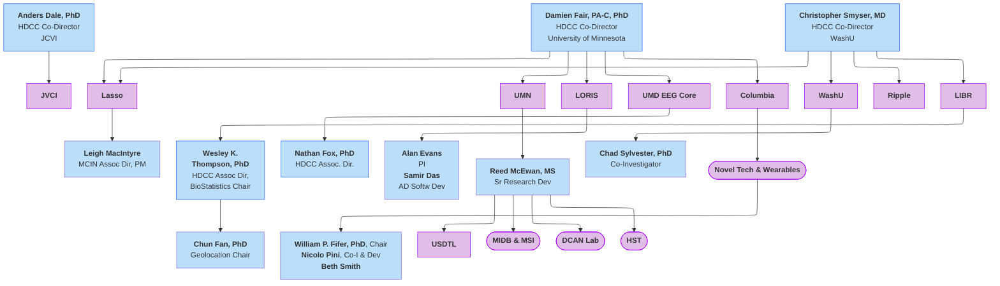
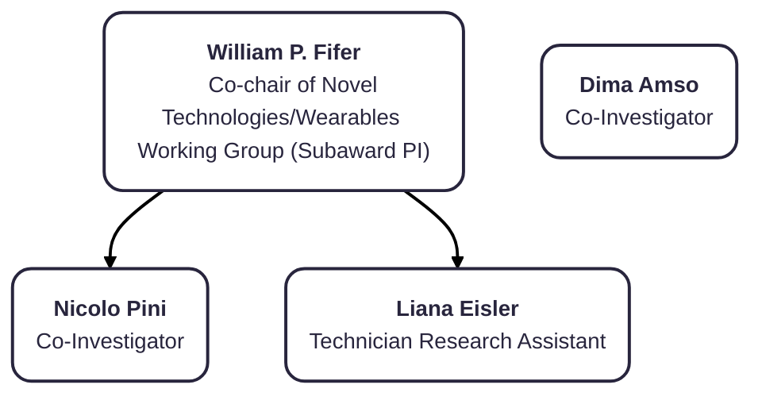

## Elk Overview chatgpt

```mermaid
---
config:
  flowchart:
    defaultRenderer: "elk"
    useMaxWidth: false
---
flowchart-v2 TB
    n2["<b>Anders Dale, PhD<br></b>HDCC Co-Director<br>JCVI"] --> jvci["<b>JVCI</b>"]
    E["<b>Damien Fair, PA-C, PhD</b><br>HDCC Co-Director<br>University of Minnesota"] 
    E --> lasso["<b>Lasso</b>"]
    E --> umn["<b>UMN</b>"]
    E --> n7["<b>LORIS</b>"]
    E --> n8["<b>UMD EEG Core</b>"]
    E --> n11["<b>Columbia</b>"]
    lasso --> lasso1["<b>Leigh MacIntyre</b><br>MCIN Assoc Dir, PM"]
    n1["<b>Christopher Smyser, MD<br></b>HDCC Co-Director<br>WashU"] 
    n1 --> n10["<b>WashU</b><br>"] & ripple["<b>Ripple</b>"] & n12["<b>LIBR</b>"] & lasso
    n16["<b>Wesley K.<br>Thompson, PhD</b><br>HDCC Assoc Dir,<br>BioStatistics Chair"] 
    n16 --> n17["<b>Chun Fan, PhD</b><br>Geolocation Chair"]
    n12 --> n16
    n8 --> n19["<b>Nathan Fox, PhD<br></b>HDCC Assoc. Dir."]
    n7 --> n20["<b>Alan Evans</b><br>PI<br><b>Samir Das</b><br>AD Softw Dev"]
    umn --> reed["<b>Reed McEwan, MS</b><br>Sr Research Dev"]
    n10 --> n22["<b>Chad Sylvester, PhD</b><br>Co-Investigator"]
    n11 --> n23(["<b>Novel Tech &amp; Wearables</b>"])
    n23 --> n18["<b>William P. Fifer, PhD</b>, Chair<br><b>Nicolo Pini</b>, Co-I &amp; Dev<br><b>Beth Smith</b>"]
    reed --> n25["<b>USDTL</b>"] & n26(["<b>MIDB &amp; MSI</b>"]) & n27(["<b>DCAN Lab</b>"]) & n30(["<b>HST</b>"])

    %% Style Assignments
    classDef blue fill:#BBDEFB,stroke:#2962FF
    classDef purple fill:#E1BEE7,stroke:#AA00FF
    classDef lightblue fill:#BBDEFB
    classDef round shape:rounded
    classDef rect shape:rect
    classDef text shape:text
    classDef stadium shape:stadium

    class n2,E,n1,n16,n19 blue
    class jvci,lasso,umn,n7,n8,n11,n10,ripple,n12,n23,n25,n26,n27,n30 purple
    class lasso1,n17,n20,reed,n22,n18 lightblue

    class jvci,lasso,umn,n7,n8,n11,n10,ripple,n12,n23,n25,n26,n27,n30 round
    class E,n16,n19 rect
    class lasso1,n17,n20,reed,n22,n18 text
    class n25 stadium

    %% Click Interactions
    click jvci "#j-craig-venter-institute"
    click lasso "#lasso"
    click umn "#university-of-minnesota"
    click n7 "#loris"
    click n8 "#umd-eeg-core"
    click n10 "#washu"
```


## Overview - ELK



box shapes to add:

```
    jvci@{ shape: rounded}
    E@{ shape: rect}
    lasso@{ shape: rounded}
    umn@{ shape: rounded}
    n7@{ shape: rounded}
    n8@{ shape: rounded}
    n11@{ shape: rounded}
    lasso1@{ shape: text}
    n10@{ shape: rounded}
    ripple@{ shape: rounded}
    n12@{ shape: rounded}
    n16@{ shape: rect}
    n17@{ shape: text}
    n19@{ shape: rect}
    n20@{ shape: text}
    reed@{ shape: text}
    n22@{ shape: text}
    n18@{ shape: text}
    n25@{ shape: stadium}
```

## Columbia University




## LIBR

<div id="table-banner" class="table-banner" onclick="toggleCollapse(this)">
  <span class="table-text">Data Dictionary Column Definitions</span>
  <span class="arrow">▸</span>
</div>
<div class="table-open-collapsible-content">
<table style="width: 100%; border-collapse: collapse; table-layout: fixed; font-size: 13px;">
    <thead>
      <tr>
        <th style="width: 15%; border: 1px solid #ddd; padding: 5px; text-align: center;">Name</th>
        <th style="width: 5%; border: 1px solid #ddd; padding: 5px; text-align: center;">Title</th>
        <th style="width: 30%; border: 1px solid #ddd; padding: 5px; text-align: center;">Role on HDCC</th>
      </tr>
    </thead>
    <tbody>
    <tr>
        <td style="border: 1px solid #ddd; padding: 4px; word-wrap: break-word; white-space: normal;">Jim Wilgenbusch</td>
        <td style="border: 1px solid #ddd; padding: 4px; word-wrap: break-word; white-space: normal;">Director of Research Computing in the Research & Innovation Office, UMN</td>
        <td style="border: 1px solid #ddd; padding: 4px; word-wrap: break-word; white-space: normal;">Administration</td>
    </tr>
</tbody>
</table>
</div>

