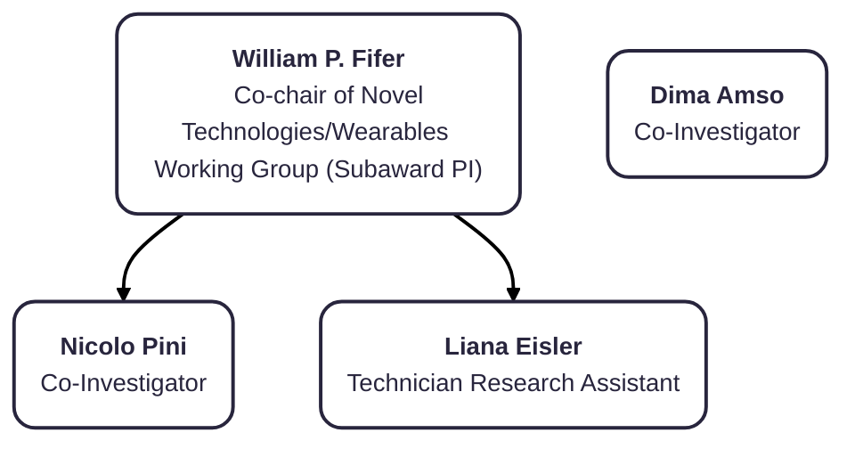
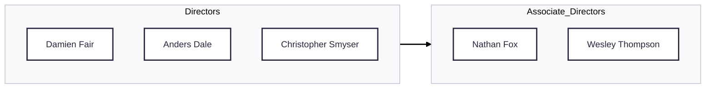

# Org Charts Extra

## Columbia University

### Roles and Responsibilities
##### William P. Fifer, Professor of Medical Psychology (Psych/Peds)

<i>Role:</i> Co-chair of Novel Technologies/Wearables Working Group (Subaward Principal Investigator)
 

<i>Responsibilities:</i> Overall management and data analytics, writing, and review of manuscripts

## LIBR

#### Wesley K Thompson, HDCC Associate Director

<i>Role:</i> BioStatistics Work Group Chair
 

- Provides guidance on statistical analysis, study design, novel methods development, for large, longitudinal, multi-site studies. Specifically:

- Direction of statistical analyses for HBCD design and assessments
- Co-supervise and lead the development and maintenance of the statistical aspects of the Data Exploration and Analysis Portal 2.0 (DEAP 2.0)
- Assist in the geolocation of residences of HBCD participants, and linking these geolocated addresses with external databases

