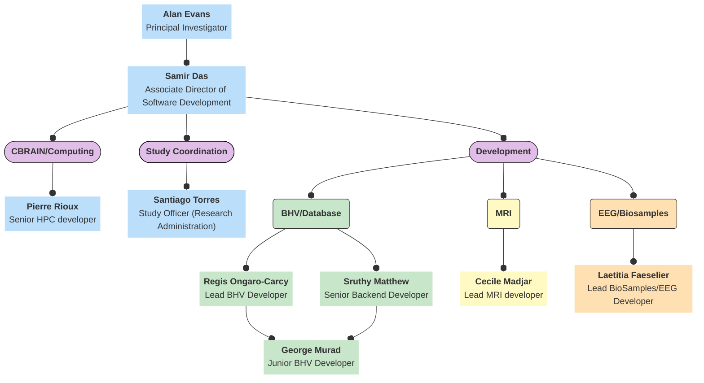
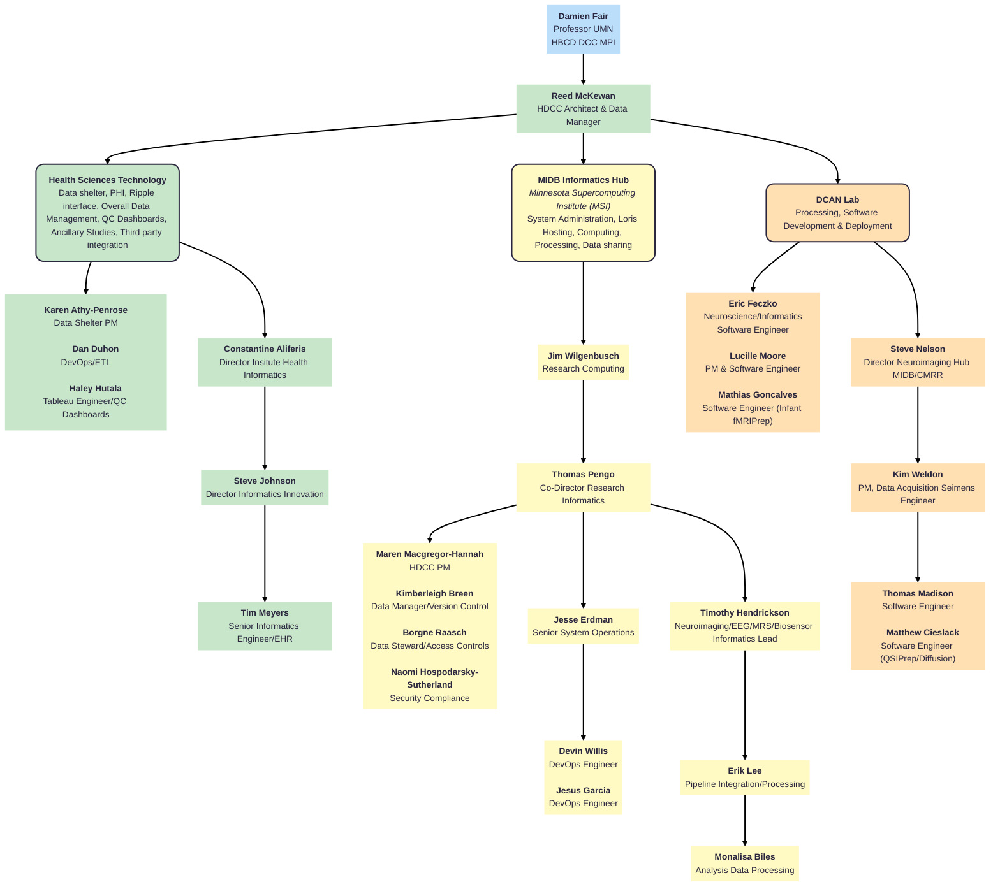

# HBCD Data Coordinating Center (HDCC) Organizational Charts

## LORIS

  <i class="fa-regular fa-lightbulb"></i>
    Tip: Click on names to be directed to information on responsibilities

##### Alan Evans, Principal Investigator

<i>Oversight and management of MCIN and LORIS operations:</i>

- Ensure regulatory compliance between LORIS, McGill and affiliated institutions.
- Engage with stakeholders to ensure the study's relevance and applicability.
- Secure funding and resources for the study.

##### Samir Das, Associate Director of Software Development

<i>General planning and oversight of LORIS operations for the HBCD study including:</i>

- Administration of LORIS operations.
- Overseeing and managing allocated study budget.
- Provide guidance, and mentorship to the research and development team.
- Conceptualization, establishment and planning of standardized workflow procedures and experimental protocols with the aim of maintaining data consistency and integrity across study.
- Establish project plans, outlining tasks, timelines, and dependencies for the development of the HBCD project.
- Attend workgroup meetings with SMEs and workgroup leads to gather requirements and periodic feedback crucial for aligning project outcomes with expectations throughout the project duration.
- General oversight of structural functionality and new features and tools in LORIS.

## University of Minnesota (UMN)

## LIBR
### Organizational Chart
(ADD ORG CHART DIAGRAM HERE)

### Roles and Responsibilities

## Columbia
### Organizational Chart
(ADD ORG CHART DIAGRAM HERE)

### Roles and Responsibilities
