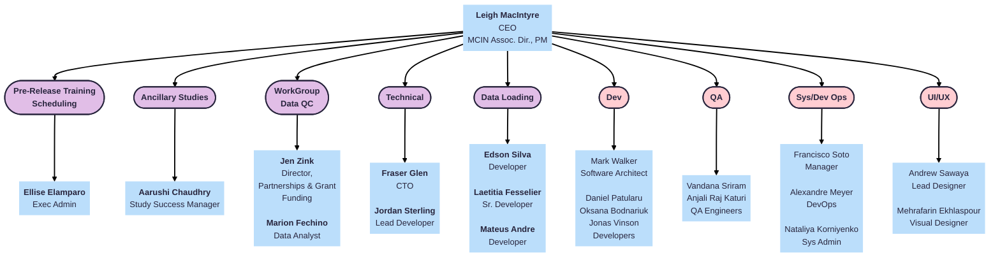
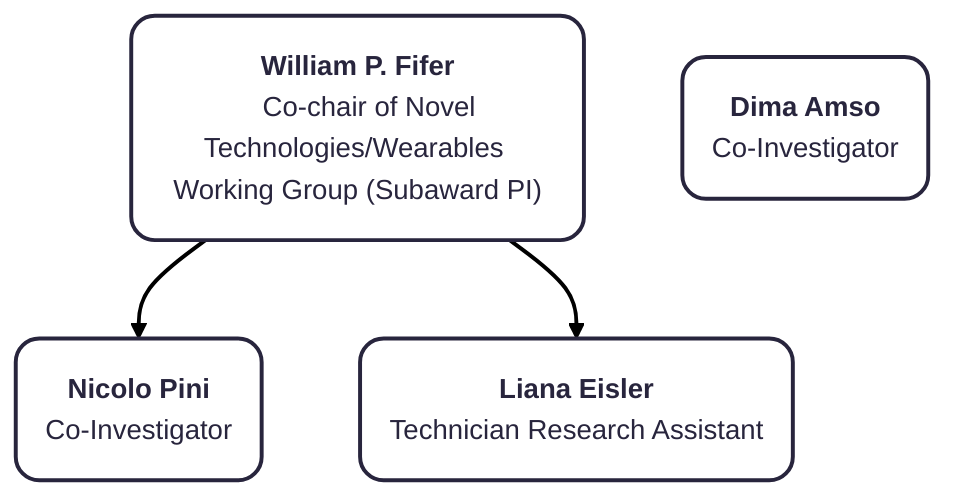

# Org Charts Extra

## MIDB roles & resp table

  Roles & Responsibilities
  ▸

<table style="width: 100%; border-collapse: collapse; table-layout: fixed; font-size: 14px;">
    <thead>
      <tr>
        <th style="width: 25%;">Name</th>
        <th style="width: 25%;">Role on HDCC</th>
        <th style="width: 50%;">Title</th>
      </tr>
    </thead>
    <tbody>
    <tr>
        <td style="word-wrap: break-word; white-space: normal;">Jim Wilgenbusch</td>
        <td style="word-wrap: break-word; white-space: normal;">Administration</td>
        <td style="word-wrap: break-word; white-space: normal;">Director of Research Computing in the Research & Innovation Office, UMN</td>
    </tr>
    <tr>
        <td style="word-wrap: break-word; white-space: normal;">Thomas Pengo, PhD</td>
        <td style="word-wrap: break-word; white-space: normal;">IG Lead</td>
        <td style="word-wrap: break-word; white-space: normal;">Co-Director, MIDB Informatics Group</td>
    </tr>
    <tr>
        <td style="word-wrap: break-word; white-space: normal;">Maren Macgregor-Hannah</td>
        <td style="word-wrap: break-word; white-space: normal;">HDCC Project Manager</td>
        <td style="word-wrap: break-word; white-space: normal;">Project Manager</td>
    </tr>
    <tr>
    <td>Jesse Erdmann</td>
    <td>ASO oversight</td>
    <td>Systems Operations</td>
    </tr>
    <tr>
    <td>Devin Willis</td>
    <td>Dev Ops</td>
    <td>DevOps Engineer</td>
    </tr>
    <tr>
    <td>Jesus Garcia</td>
    <td>Dev Ops</td>
    <td>DevOps Engineer</td>
    </tr>
    <tr>
    <td>Timothy Hendrickson</td>
    <td>Neuroimaging lead</td>
    <td>MIDB-IG Neuroimaging Informatics Manager</td>
    </tr>
    <tr>
    <td>Erik Lee</td>
    <td>Pipeline lead</td>
    <td>Neuroimaging Analyst</td>
    </tr>
    <tr>
    <td>Monalisa Biles</td>
    <td>Analyst</td>
    <td>&nbsp;</td>
    </tr>
    <tr>
    <td>Kimberleigh Breen</td>
    <td>Data Manager</td>
    <td>Data Manager</td>
    </tr>
    <tr>
  <td>Borgne Raasch</td>
  <td>Data Steward</td>
  <td>Data Steward</td>
  </tr>
  <tr>
  <td>Naomi Hospodarsky-Sutherland</td>
  <td>Security/Compliance</td>
  <td>Research Security and Compliance Analyst</td>
  </tr>
</tbody>
</table>

## Columbia University

## LIBR

  Data Dictionary Column Definitions
  ▸

<table style="width: 100%; border-collapse: collapse; table-layout: fixed; font-size: 13px;">
    <thead>
      <tr>
        <th style="width: 15%; border: 1px solid #ddd; padding: 5px; text-align: center;">Name</th>
        <th style="width: 5%; border: 1px solid #ddd; padding: 5px; text-align: center;">Title</th>
        <th style="width: 30%; border: 1px solid #ddd; padding: 5px; text-align: center;">Role on HDCC</th>
      </tr>
    </thead>
    <tbody>
    <tr>
        <td style="border: 1px solid #ddd; padding: 4px; word-wrap: break-word; white-space: normal;">Jim Wilgenbusch</td>
        <td style="border: 1px solid #ddd; padding: 4px; word-wrap: break-word; white-space: normal;">Director of Research Computing in the Research & Innovation Office, UMN</td>
        <td style="border: 1px solid #ddd; padding: 4px; word-wrap: break-word; white-space: normal;">Administration</td>
    </tr>
</tbody>
</table>

