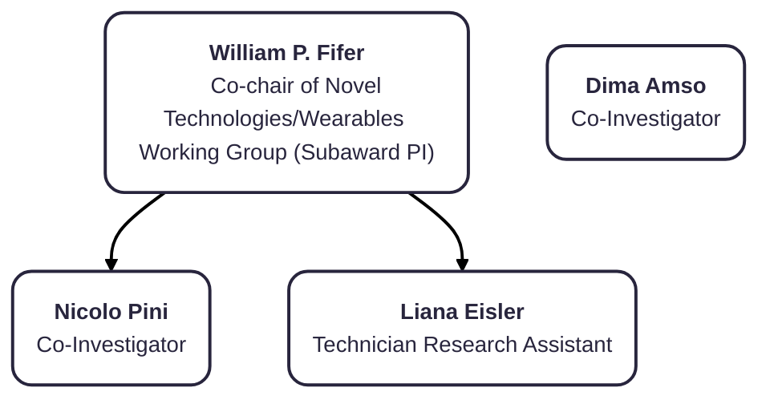

# Org Charts Extra

## Columbia University

### Roles and Responsibilities
##### William P. Fifer, Professor of Medical Psychology (Psych/Peds)

<i>Role:</i> Co-chair of Novel Technologies/Wearables Working Group (Subaward Principal Investigator)
 

<i>Responsibilities:</i> Overall management and data analytics, writing, and review of manuscripts
