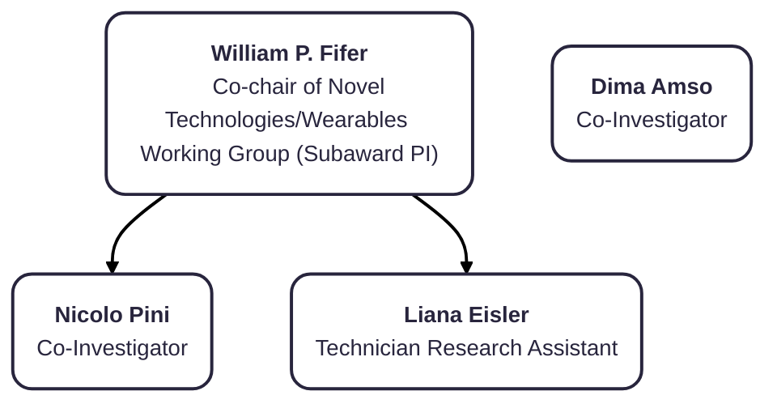

## WashU
```mermaid

```

## UMD

```mermaid
---
config:
  layout: elk
---
flowchart TB
    n16["<b>Nathan Fox</b><br>Associate Director, Data Core"]
    --- UMD2["<b>Santiago Morales</b>, Co-I<br><br><b>Jamie Listokin</b>, EEG Core Research Coordinator"]
    UMD2 --- n17(["<b>EEG Processing</b>"]) & n18(["<b>CBRAIN</b>"]) & n21(["<b>QC, Training, &amp; Troubleshooting</b>"])
    n17 --- n19["<b>Marco McSweeney</b><br>Pre-processing &amp; Derivatives"]
    n18 --- n20["<b>Whitney Kasenetz</b><br>EEG pre-processing in CBRAIN"]
    n21 --- n22["<b>Savannah McNair<br>Jessica Norris</b>"]
    style n16 fill:#BBDEFB,stroke:#2962FF
    style UMD2 fill:#BBDEFB,stroke:#2962FF
    style n17 fill:#E1BEE7,stroke:#AA00FF
    style n18 fill:#E1BEE7,stroke:#AA00FF
    style n21 fill:#E1BEE7,stroke:#AA00FF
    style n19 fill:#BBDEFB,stroke:#2962FF
    style n20 fill:#BBDEFB,stroke:#2962FF
    style n22 fill:#BBDEFB,stroke:#2962FF
```


## Columbia University




## LIBR

<div id="table-banner" class="table-banner" onclick="toggleCollapse(this)">
  <span class="table-text">Data Dictionary Column Definitions</span>
  <span class="arrow">▸</span>
</div>
<div class="table-open-collapsible-content">
<table style="width: 100%; border-collapse: collapse; table-layout: fixed; font-size: 13px;">
    <thead>
      <tr>
        <th style="width: 15%; border: 1px solid #ddd; padding: 5px; text-align: center;">Name</th>
        <th style="width: 5%; border: 1px solid #ddd; padding: 5px; text-align: center;">Title</th>
        <th style="width: 30%; border: 1px solid #ddd; padding: 5px; text-align: center;">Role on HDCC</th>
      </tr>
    </thead>
    <tbody>
    <tr>
        <td style="border: 1px solid #ddd; padding: 4px; word-wrap: break-word; white-space: normal;">Jim Wilgenbusch</td>
        <td style="border: 1px solid #ddd; padding: 4px; word-wrap: break-word; white-space: normal;">Director of Research Computing in the Research & Innovation Office, UMN</td>
        <td style="border: 1px solid #ddd; padding: 4px; word-wrap: break-word; white-space: normal;">Administration</td>
    </tr>
</tbody>
</table>
</div>

