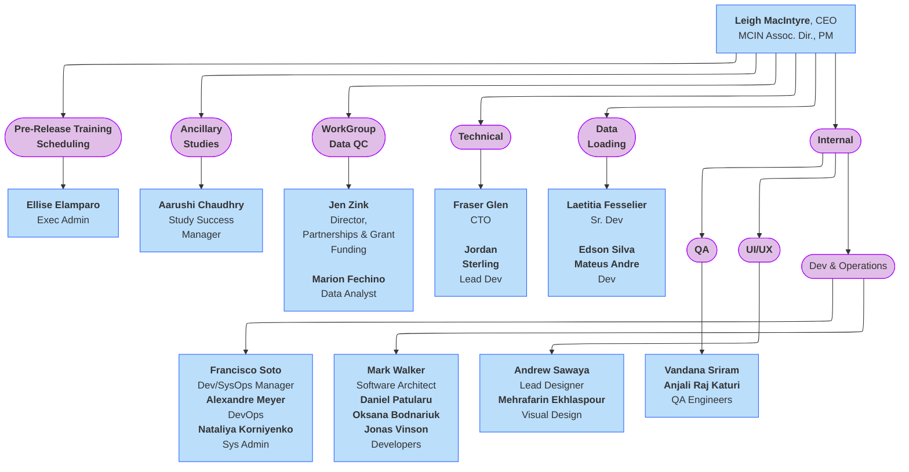

## lasso alt

## lasso alt 2

## lasso with subgraph

## Columbia University

## LIBR

  Data Dictionary Column Definitions
  ▸

<table style="width: 100%; border-collapse: collapse; table-layout: fixed; font-size: 13px;">
    <thead>
      <tr>
        <th style="width: 15%; border: 1px solid #ddd; padding: 5px; text-align: center;">Name</th>
        <th style="width: 5%; border: 1px solid #ddd; padding: 5px; text-align: center;">Title</th>
        <th style="width: 30%; border: 1px solid #ddd; padding: 5px; text-align: center;">Role on HDCC</th>
      </tr>
    </thead>
    <tbody>
    <tr>
        <td style="border: 1px solid #ddd; padding: 4px; word-wrap: break-word; white-space: normal;">Jim Wilgenbusch</td>
        <td style="border: 1px solid #ddd; padding: 4px; word-wrap: break-word; white-space: normal;">Director of Research Computing in the Research & Innovation Office, UMN</td>
        <td style="border: 1px solid #ddd; padding: 4px; word-wrap: break-word; white-space: normal;">Administration</td>
    </tr>
</tbody>
</table>

