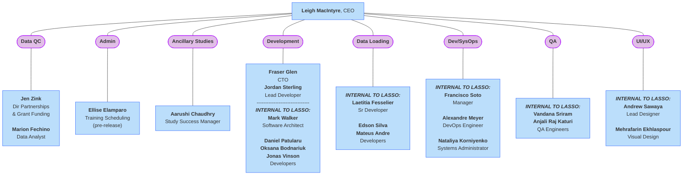

# Lasso

## Lasso3

### Code

```mermaid
---
config:
  layout: dagre
---
flowchart TB
    A["<b>Leigh MacIntyre</b>, CEO"] --- n1(["<b>Data QC</b>"]) & n3(["<b>Admin</b>"]) & n5(["<b>Ancillary Studies</b>"]) & n7(["<b>Development</b>"]) & n9(["<b>Data Loading</b>"]) & n11(["<b>Dev/SysOps</b>"]) & n13(["<b>QA</b>"]) & n15(["<b>UI/UX</b>"])
    n1 --- n2["<b>Jen Zink<br></b>Dir Partnerships<br>&amp; Grant Funding<br><br><b>Marion Fechino</b><br>Data Analyst"]
    n3 --- n4["<b>Ellise Elamparo</b><br>Training Scheduling<br>(pre-release)"]
    n5 --- n6["<b>Aarushi Chaudhry<br></b>Study Success Manager"]
    n7 --- n8["<b>Fraser Glen<br></b>CTO<br><b>Jordan Sterling<br></b>Lead Developer
    -------------------------------
    <b><i>INTERNAL TO LASSO:</i>
    Mark Walker</b><br>Software Architect<br>
    <b>Daniel Patularu</b><br><b>Oksana Bodnariuk<br>Jonas Vinson<br></b>Developers"]
    n9 --- n10["<b><i>INTERNAL TO LASSO:</i></b><br><b>Laetitia Fesselier</b><br>Sr Developer<br>
    <b>Edson Silva</b><br><b>Mateus Andre</b><br>Developers"]
    n11 --- n12["<b><i>INTERNAL TO LASSO:</i><br>Francisco Soto</b><br>Manager<br>
    <b>Alexandre Meyer</b><br>DevOps Engineer<br><br><b>Nataliya Korniyenko<br></b>Systems Administrator"]
    n13 --- n14["<b><i>INTERNAL TO LASSO:</i></b>
    <b>Vandana Sriram</b><br><b>Anjali Raj Katuri<br></b>QA Engineers"]
    n15 --- n16["<b><i>INTERNAL TO LASSO:</i></b>
    <b>Andrew Sawaya</b><br>Lead Designer<br>
    <b>Mehrafarin Ekhlaspour</b><br>Visual Design"]
    style A fill:#BBDEFB,stroke:#2962FF
    style n1 fill:#E1BEE7,stroke:#AA00FF
    style n3 fill:#E1BEE7,stroke:#AA00FF
    style n5 fill:#E1BEE7,stroke:#AA00FF
    style n7 fill:#E1BEE7,stroke:#AA00FF
    style n9 fill:#E1BEE7,stroke:#AA00FF
    style n11 fill:#E1BEE7,stroke:#AA00FF
    style n13 fill:#E1BEE7,stroke:#AA00FF
    style n15 fill:#E1BEE7,stroke:#AA00FF
    style n2 fill:#BBDEFB,stroke:#2962FF
    style n4 fill:#BBDEFB,stroke:#2962FF
    style n6 fill:#BBDEFB,stroke:#2962FF
    style n8 fill:#BBDEFB,stroke:#2962FF
    style n10 fill:#BBDEFB,stroke:#2962FF
    style n12 fill:#BBDEFB,stroke:#2962FF
    style n14 fill:#BBDEFB,stroke:#2962FF
    style n16 fill:#BBDEFB,stroke:#2962FF
```

### SVG

