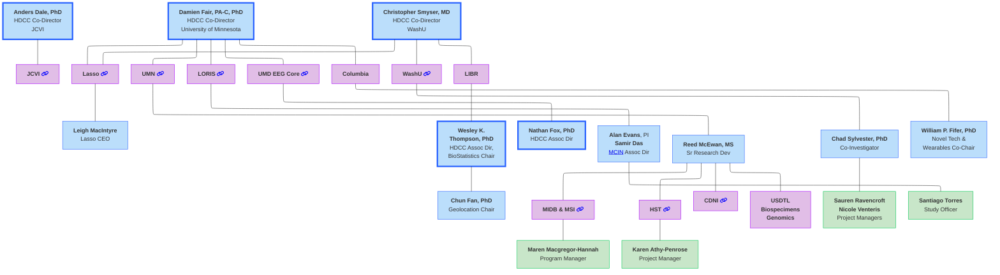

# Overview

## Version with Maren repositioned under MIDB

```mermaid
---
config:
  layout: elk
---
flowchart TB
    n2["<b>Anders Dale, PhD<br></b>HDCC Co-Director<br>JCVI"] --- jcvi["<b>JCVI</b> <i class="fa-solid fa-link" style="color: blue;"></i>"]
    E["<b>Damien Fair, PA-C, PhD</b><br>HDCC Co-Director<br>University of Minnesota"] --- lasso["<b>Lasso</b> <i class="fa-solid fa-link" style="color: blue;"></i>"] & umn["<b>UMN</b> <i class="fa-solid fa-link" style="color: blue;"></i>"] & n7["<b>LORIS</b> <i class="fa-solid fa-link" style="color: blue;"></i>"] & n8["<b>UMD EEG Core</b> <i class="fa-solid fa-link" style="color: blue;"></i>"] & n11["<b>Columbia</b>"]
    lasso --- lasso1["<b>Leigh MacIntyre</b><br>Lasso CEO"]
    n1["<b>Christopher Smyser, MD<br></b>HDCC Co-Director<br>WashU"] --- n10["<b>WashU</b> <i class="fa-solid fa-link" style="color: blue;"></i>"] & n12["<b>LIBR</b>"] & lasso
    n16["<b>Wesley K.<br>Thompson, PhD</b><br>HDCC Assoc Dir,<br>BioStatistics Chair"] --- n17["<b>Chun Fan, PhD</b><br>Geolocation Chair"]
    n12 --- n16
    n8 --- n19["<b>Nathan Fox, PhD<br></b>HDCC Assoc Dir"]
    n7 --- n20["<b>Alan Evans</b>, PI<br><b>Samir Das</b><br><a href="https://mcin.ca/about-mcin/" target="_blank">MCIN</a> Assoc Dir"]
    umn --- reed["<b>Reed McEwan, MS</b><br>Sr Research Dev"]
    n10 --- n22["<b>Chad Sylvester, PhD</b><br>Co-Investigator"]
    n11 --- n18["<b>William P. Fifer, PhD</b><br>Novel Tech &<br>Wearables Co-Chair"]
    reed --- n25["<b>MIDB &amp; MSI</b> <i class="fa-solid fa-link" style="color: blue;"></i>"] & n27["<b>HST</b> <i class="fa-solid fa-link" style="color: blue;"></i>"] & n28["<b>CDNI</b> <i class="fa-solid fa-link" style="color: blue;"></i>"] & n29["<b>USDTL<br>Biospecimens<br>Genomics</b>"]
    n25 --- n30["<b>Maren Macgregor-Hannah</b><br>Program Manager"]
    n27 --- n31["<b>Karen Athy-Penrose</b><br>Project Manager"]
    n22 --- n32["<b>Sauren Ravencroft<br>Nicole Venteris</b><br>Project Managers"]
    n20 --- n33["<b>Santiago Torres</b><br>Study Officer"]
    style n2 fill:#BBDEFB,stroke:#2962FF,stroke-width:4px
    style jcvi fill:#E1BEE7,stroke:#AA00FF
    style E fill:#BBDEFB,stroke:#2962FF,stroke-width:4px
    style lasso fill:#E1BEE7,stroke:#AA00FF
    style umn fill:#E1BEE7,stroke:#AA00FF
    style n7 fill:#E1BEE7,stroke:#AA00FF
    style n8 fill:#E1BEE7,stroke:#AA00FF
    style n11 fill:#E1BEE7,stroke:#AA00FF
    style lasso1 fill:#BBDEFB,stroke:#2962FF
    style n1 fill:#BBDEFB,stroke:#2962FF,stroke-width:4px
    style n10 fill:#E1BEE7,stroke:#AA00FF
    style n12 fill:#E1BEE7,stroke:#AA00FF
    style n16 fill:#BBDEFB,stroke:#2962FF,stroke-width:4px
    style n17 fill:#BBDEFB,stroke:#2962FF
    style n19 fill:#BBDEFB,stroke:#2962FF,stroke-width:4px
    style n20 fill:#BBDEFB,stroke:#2962FF
    style reed fill:#BBDEFB,stroke:#2962FF
    style n22 fill:#BBDEFB,stroke:#2962FF
    style n18 fill:#BBDEFB,stroke:#2962FF
    style n25 fill:#E1BEE7,stroke:#AA00FF
    style n27 fill:#E1BEE7,stroke:#AA00FF
    style n28 fill:#E1BEE7,stroke:#AA00FF
    style n29 fill:#E1BEE7,stroke:#AA00FF
    style n30 fill:#C8E6C9,stroke:#00C853
    style n31 fill:#C8E6C9,stroke:#00C853
    style n32 fill:#C8E6C9,stroke:#00C853
    style n33 fill:#C8E6C9,stroke:#00C853
    click jcvi "#j-craig-venter-institute"
    click lasso "#lasso"
    click umn "#university-of-minnesota"
    click n7 "#loris"
    click n8 "#university-of-maryland-eeg-core"
    click n10 "#washu"
    click n25 "#midb-informatics-hub-msi"
    click n27 "#health-sciences-technology"
    click n28 "#center-for-developmental-neuroimaging"
```