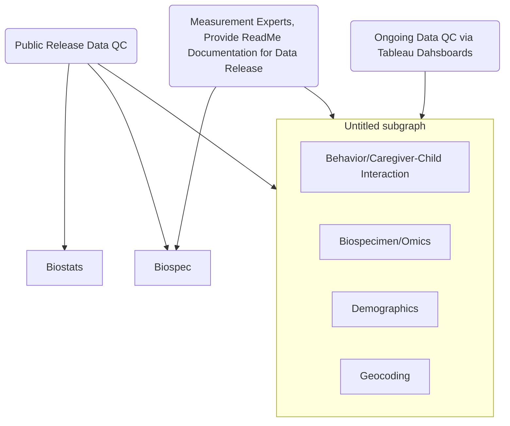

```mermaid
---
config:
  layout: dagre
---
flowchart TB
 subgraph s1["Untitled subgraph"]
        n4@{ label: "<span style=\"color:\">Behavior/Caregiver-Child Interaction</span>" }
        n6@{ label: "<span style=\"color:\">Biospecimen/Omics</span>" }
        n7["Demographics"]
        n9["Geocoding"]
  end
    A["Public Release Data QC"] --> s1 & n10["Biostats"] & n11["Biospec"]
    n2@{ label: "<span style=\"background-color:\">Ongoing Data QC via Tableau Dahsboards</span>" } --> s1
    n3@{ label: "<span style=\"color:\">Measurement Experts, Provide ReadMe Documentation for Data Release</span>" } --> s1
    n3 --> n11
    n4@{ shape: rect}
    n6@{ shape: rect}
    A@{ shape: rounded}
    n2@{ shape: rounded}
    n3@{ shape: rounded}
```