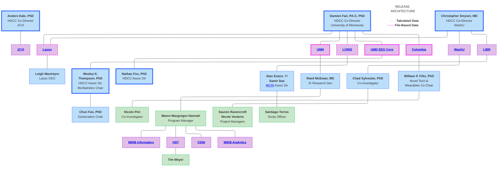

- - - - <b>Tabulated Data</b>

```mermaid
---
config:
  layout: elk
---
flowchart TB
    n2["<b>Anders Dale, PhD<br></b>HDCC Co-Director<br>JCVI"] --- jcvi["<a href="#j-craig-venter-institute" target="_top"><b>JCVI</b></a>"]
    E["<b>Damien Fair, PA-C, PhD</b><br>HDCC Co-Director<br>University of Minnesota"] --- lasso["<a href="#lasso" target="_top"><b>Lasso</b></a>"] & umn["<a href="#university-of-minnesota" target="_top"><b>UMN</b></a>"] & n7["<a href="#loris" target="_top"><b>LORIS</b></a>"] & n8["<a href="#university-of-maryland" target="_top"><b>UMD EEG Core</b></a>"] & n11["<a href="#columbia-university" target="_top"><b>Columbia</b></a>"]
    lasso --- lasso1["<b>Leigh MacIntyre</b><br>Lasso CEO"]
    n36["RELEASE ARCHITECTURE<br>
    <font color='#FF1FF4'>- - -</font> <b>Tabulated Data</b><br><font color='#FF1FF4'>───</font> <b>File-Based Data</b>"]
    n1["<b>Christopher Smyser, MD<br></b>HDCC Co-Director<br>WashU"] --- n10["<a href="#washu" target="_top"><b>WashU</b></a>"] & n12["<a href="#libr" target="_top"><b>LIBR</b></a>"] & lasso
    n16["<b>Wesley K.<br>Thompson, PhD</b><br>HDCC Assoc Dir,<br>BioStatistics Chair"] --- n17["<b>Chun Fan, PhD</b><br>Geolocation Chair"]
    n12 --- n16
    n8 --- n19["<b>Nathan Fox, PhD<br></b>HDCC Assoc Dir"]
    n7 --- n20["<b>Alan Evans</b>, PI<br><b>Samir Das</b><br><a href="https://mcin.ca/about-mcin/" target="_blank">MCIN</a> Assoc Dir"]
    umn --- reed["<b>Reed McEwan, MS</b><br>Sr Research Dev"]
    n10 --- n22["<b>Chad Sylvester, PhD</b><br>Co-Investigator"]
    n11 --- n18["<b>William P. Fifer, PhD</b><br>Novel Tech &<br>Wearables Co-Chair"]
    n18 --- n34["<b>Nicolo Pini</b><br>Co-Investigator"]
    reed --- n30["<b>Maren Macgregor-Hannah</b><br>Program Manager"]
    n30 --- n25["<a href="#midb-informatics-hub-msi" target="_top"><b>MIDB Informatics</b></a>"]
    n30 --- n27["<a href="#health-sciences-technology" target="_top"><b>HST</b></a>"]
    n30 --- n28["<a href="#center-for-developmental-neuroimaging" target="_top"><b>CDNI</b></a>"]
    n30 --- n29["<a href="#midb-analytics-hub" target="_top"><b>MIDB Analytics</b></a>"]
    n27 --- n31["<b>Tim Meyer</b>"]
    n22 --- n32["<b>Sauren Ravencroft<br>Nicole Venteris</b><br>Project Managers"]
    n20 --- n33["<b>Santiago Torres</b><br>Study Officer"]
    style n36 fill:#FFFFFF,stroke:#FFFFFF
    style n2 fill:#BBDEFB,stroke:#2962FF,stroke-width:4px
    style jcvi fill:#E1BEE7,stroke:#AA00FF
    style E fill:#BBDEFB,stroke:#2962FF,stroke-width:4px
    style lasso fill:#E1BEE7,stroke:#FF1FF4,stroke-width:3px,stroke-dasharray: 5
    style umn fill:#E1BEE7,stroke:#FF1FF4,stroke-width:3px,stroke-dasharray: 0
    style n7 fill:#E1BEE7,stroke:#FF1FF4,stroke-width:3px,stroke-dasharray: 5
    style n8 fill:#E1BEE7,stroke:#FF1FF4,stroke-width:3px,stroke-dasharray: 0
    style n11 fill:#E1BEE7,stroke:#FF1FF4,stroke-width:3px,stroke-dasharray: 0
    style lasso1 fill:#BBDEFB,stroke:#2962FF
    style n1 fill:#BBDEFB,stroke:#2962FF,stroke-width:4px
    style n10 fill:#E1BEE7,stroke:#AA00FF
    style n12 fill:#E1BEE7,stroke:#AA00FF
    style n16 fill:#BBDEFB,stroke:#2962FF,stroke-width:4px
    style n17 fill:#BBDEFB,stroke:#2962FF
    style n19 fill:#BBDEFB,stroke:#2962FF,stroke-width:4px
    style n20 fill:#BBDEFB,stroke:#2962FF
    style reed fill:#BBDEFB,stroke:#2962FF
    style n22 fill:#BBDEFB,stroke:#2962FF
    style n18 fill:#BBDEFB,stroke:#2962FF
    style n25 fill:#E1BEE7,stroke:#AA00FF
    style n27 fill:#E1BEE7,stroke:#AA00FF
    style n28 fill:#E1BEE7,stroke:#AA00FF
    style n29 fill:#E1BEE7,stroke:#AA00FF
    style n30 fill:#C8E6C9,stroke:#00C853
    style n31 fill:#C8E6C9,stroke:#00C853
    style n32 fill:#C8E6C9,stroke:#00C853
    style n33 fill:#C8E6C9,stroke:#00C853
    style n34 fill:#C8E6C9,stroke:#00C853
    click jcvi "#j-craig-venter-institute"
    click lasso "#lasso"
    click umn "#university-of-minnesota"
    click n7 "#loris"
    click n8 "#university-of-maryland"
    click n10 "#washu"
    click n25 "#midb-informatics-hub-msi"
    click n29 "#midb-analytics-hub"
    click n27 "#health-sciences-technology"
    click n28 "#center-for-developmental-neuroimaging"
    click n12 "#libr"
    click n11 "#columbia-university"
```