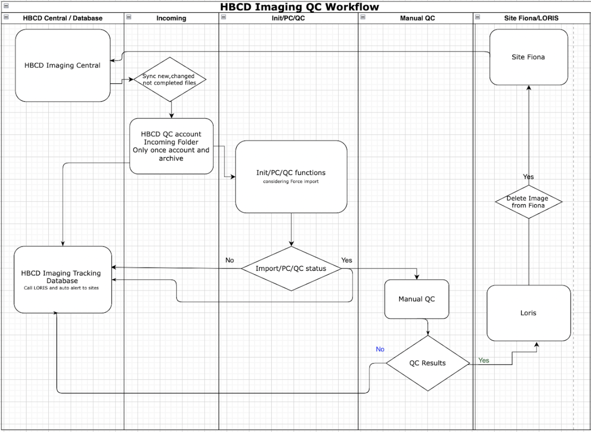

# HBCD Data Processing Workflows

This section outlines the full HBCD processing workflows for [tabulated data](#tabulated-data) and [file-based data](#file-based-data), detailing each step from data capture at study sites to final ingestion into Lasso. Each subsection of the workflow diagram includes the name of the responsible organization in the lower left-hand corner. Clicking on an organization name directs you to its corresponding section on the [Org Charts](../orgcharts.md) page, where you can find more information about that organization's role in the HBCD Study and its team members. 

  
  Definition of Terms
  <a class="anchor-link" href="#def-terms" title="Copy link">
    <i class="fa-solid fa-link"></i>
  </a>
  
  ▸

<table style="width: 100%; border-collapse: collapse; table-layout: fixed; font-size: 14px;">
    <thead>
      <tr>
        <th style="width: 10%;">Term</th>
        <th style="width: 90%;">Definition</th>
      </tr>
    </thead>
    <tbody>
        <tr>
        <td>DCCID/PSCID</td>
        <td style="word-wrap: break-word; white-space: normal;">Original BIDS participant ID numbers prior to de-identification (e.g. <code>sub-1234</code> where <code>1234</code> is the DCCID). These participant IDs are primarily used by LORIS and study sites, with PSCID being more commonly used by sites during the data collection and debugging process</td>
        </tr>
        <tr>
        <td>SCE</td>
        <td style="word-wrap: break-word; white-space: normal;">Secure computing environment at the UMN <a href="../../orgcharts/#health-sciences-technology">Health Sciences Technology</a> Office</td>
        </tr>
    </tbody>
    </table>

## Tabulated Data

<object type="image/svg+xml" data="../images/tabulated-proc-WF.svg" width="100%"></object>
<b>**</b> <i>Third party includes: Pearson's, ERICA, CDI, Bayley, Vineland, NIH BTB, and BISQR.</i>

  
  S3 Bucket Paths Key (Tabulated data)
  <a class="anchor-link" href="#s3-paths-tab" title="Copy link">
    <i class="fa-solid fa-link"></i>
  </a>
  
  ▸

<table style="width: 100%; border-collapse: collapse; table-layout: fixed; font-size: 14px;">
    <thead>
      <tr>
        <th style="width: 30%; word-wrap: break-word; white-space: normal;">Name<i>as referenced in diagrams</i></th>
        <th style="width: 40%;">S3 URL</th>
        <th style="width: 30%;">Description</th>
      </tr>
    </thead>
    <tbody>
    <tr>
      <td>xxxx</td>
      <td><code>s3://xxxxx</code></td>
      <td style="word-wrap: break-word; white-space: normal;">xxxx</td>
    </tr>
</tbody>
</table>

  
  S3 Bucket Paths Key (Lasso Ingestion - both file-based and tabulated data)
  <a class="anchor-link" href="#s3-paths-lasso" title="Copy link">
    <i class="fa-solid fa-link"></i>
  </a>
  
  ▸

<table style="width: 100%; border-collapse: collapse; table-layout: fixed; font-size: 14px;">
    <thead>
      <tr>
        <th style="width: 30%; word-wrap: break-word; white-space: normal;">Name<i>as referenced in diagrams</i></th>
        <th style="width: 40%;">S3 URL</th>
        <th style="width: 30%;">Description</th>
      </tr>
    </thead>
    <tbody>
    <tr>
      <td>Lasso Staging S3</td>
      <td><code>s3://midb-hbcd-lasso-staging/</code></td>
      <td style="word-wrap: break-word; white-space: normal;">Lasso staging bucket where LORIS deposits the data after running the data release script for each BR</td>
    </tr>
    <tr>
      <td>Lasso Release S3</td>
      <td><code>s3://midb-hbcd-lasso-release/</code></td>
      <td>Lasso release bucket</td>
    </tr>
    <tr>
      <td>Lasso Prerelease S3</td>
      <td><code>s3://midb-hbcd-lasso-data-prerelease/br{BETA RELEASE#}/hbcd/</code></td>
      <td style="word-wrap: break-word; white-space: normal;">Contains release version-specific data, including participant list to be included in the release (<code>rawdata/participants.tsv</code>). This is the final repository after de-identification and prior to Lasso ingestion.</td>
    </tr>
</tbody>
</table>

## File-Based Data

<i>Note: Select ⓘ <i>Click for Details</i> for a given step to be linked to the relevant section on this page with additional details.</i>

<object type="image/svg+xml" data="../images/file-based-proc-WF.svg" width="100%"></object>

  
  S3 Bucket Paths Key (File-Based Data)
  <a class="anchor-link" href="#s3-paths-fb" title="Copy link">
    <i class="fa-solid fa-link"></i>
  </a>
  
  ▸

<table style="width: 100%; border-collapse: collapse; table-layout: fixed; font-size: 14px;">
    <thead>
      <tr>
        <th style="width: 20%; word-wrap: break-word; white-space: normal;">Name<i>as referenced in diagrams</i></th>
        <th style="width: 40%;">S3 URL</th>
        <th style="width: 30%;">Description</th>
      </tr>
    </thead>
    <tbody>
    <tr>
      <td>JCVI DICOMs S3</td>
      <td><code>s3://midb-hbcd-ucsd-main-pr-dicoms/</code></td>
      <td style="word-wrap: break-word; white-space: normal;">JCVI DICOMs and raw data QC results</td>
    </tr>
    <tr>
      <td>MRS BIDS S3</td>
      <td><code>s3://midb-hbcd-main-pr-mrs/</code></td>
      <td>MRS data post-BIDS conversion</td>
    </tr>
    <tr>
      <td>De-ID S3</td>
      <td><code>s3://midb-hbcd-main-deid/</code></td>
      <td style="word-wrap: break-word; white-space: normal;">De-identified raw BIDS, derivatives, and BrainSwipes data</td>
    </tr>
    <tr>
      <td>Main PR S3</td>
      <td><code>s3://midb-hbcd-main-pr/</code></td>
      <td>Contains LORIS-curated BIDS data for the full HBCD study, including: 
       • De-identfied: raw BIDS<i>assembly_bids/</i> and participant lists<i>deidentification-lists/</i> 
       • Re-identfied: derivatives<i>derivatives/</i> and BrainSwipes data<i>reid_brainswipes/</i>
      </td>
    </tr>
    <tr>
      <td>Pre-Release S3</td>
      <td><code>s3://midb-hbcd-prerelease-bids/</code></td>
      <td style="word-wrap: break-word; white-space: normal;">Contains pre-release derivatives 
      - This bucket holds de-identified data, both QC-passed and failed images per UCSD, sent to CBRAIN for processing 
      - Derivatives are stored in session-specific folders (e.g., derivatives/ses-V02/bibsnet/) 
      - Currently, it mainly includes subjects/sessions flagged by LORIS for release, but will eventually include more non-release data as well.
      </td>
    </tr>
</tbody>
</table>

  
  S3 Bucket Paths Key (Lasso Ingestion - both file-based and tabulated data)
  <a class="anchor-link" href="#s3-paths-lasso" title="Copy link">
    <i class="fa-solid fa-link"></i>
  </a>
  
  ▸

<table style="width: 100%; border-collapse: collapse; table-layout: fixed; font-size: 14px;">
    <thead>
      <tr>
        <th style="width: 30%; word-wrap: break-word; white-space: normal;">Name<i>as referenced in diagrams</i></th>
        <th style="width: 40%;">S3 URL</th>
        <th style="width: 30%;">Description</th>
      </tr>
    </thead>
    <tbody>
    <tr>
      <td>Lasso Staging S3</td>
      <td><code>s3://midb-hbcd-lasso-staging/</code></td>
      <td style="word-wrap: break-word; white-space: normal;">Lasso staging bucket where LORIS deposits the data after running the data release script for each BR</td>
    </tr>
    <tr>
      <td>Lasso Release S3</td>
      <td><code>s3://midb-hbcd-lasso-release/</code></td>
      <td>Lasso release bucket</td>
    </tr>
    <tr>
      <td>Lasso Prerelease S3</td>
      <td><code>s3://midb-hbcd-lasso-data-prerelease/br{BETA RELEASE#}/hbcd/</code></td>
      <td style="word-wrap: break-word; white-space: normal;">Contains release version-specific data, including participant list to be included in the release (<code>rawdata/participants.tsv</code>). This is the final repository after de-identification and prior to Lasso ingestion.</td>
    </tr>
</tbody>
</table>

### LORIS Formatting Updates
LORIS makes changes to the `assembly_bids` metadata and formatting based on identified issues. This process happens irregularly, and includes changes from QC/DICOMS sent via UCSD, along with other related elements.

### De-Identification
De-identification is run daily to update `s3://midb-hbcd-main-deid/assembly_bids` from `s3://midb-hbcd-main-pr/assembly_bids` as well as tabulated data. In the process of de-identification, any DCCIDs/PSCIDs/Site IDs are removed or replaced with Release Candidate IDs and/or Anonymized Site IDs, where applicable. In addition to de-identifying new sessions, existing sessions are also updated.

### CBRAIN Processing
Processing pipelines are run in CBRAIN and outputs are stored in session-specific folders on `s3://midb-hbcd-main-deid/derivatives`. When processing is launched, a record of which files were used for processing is stored under `s3://midb-hbcd-main-deid/derivatives/ses-<label>/cbrain_misc`. In the future, this will likely be replaced with a simple database in the S3 bucket that keeps track of these (and other) details more centrally.

#### Record Query & Derivatives Cleanup
After CBRAIN processing, previous processing records are queried against the contents of `s3://midb-hbcd-main-deid/assembly_bids` to ensure that processing is still up-to-date with the current BIDS data. For any cases where the derivative data has become out of sync with the assembly_bids data, the impacted derivative data along with CBRAIN processing task objects are deleted. The next time the query scripts are run that look for new subjects to process, the processing will be re-initiated for these subjects.

### BrainSwipes
The workflow for BrainSwipes is unique compared to other data due to the fact that the quality control (QC) is performed post-CBRAIN processing and therefore must go through additional steps. Some details to note:

- After transfer of the visual reports used for QC to the Prerelease Derivatives S3 URL (`s3://midb-hbcd-prerelease-bids/derivatives/ses-V02/xcp_d/{{SUBJECT}}/figures/{{FILENAME}}.png`), a query is run to identify outputs that are out of date and either remove or archive records related to out-of-date files
- **TBD**: Participant sessions that fail structural QC (based on XCP-D derivative visual reports) are flagged to perform manual corrections on the corresponding BIBSNet brain segmentations. The corrected segmentations will not be fed back into the main processing workflows, but are instead integrated into the training set for future BIBSNet models.

### Re-Identification
Following CBRAIN processing, processing records are queried for new derivative outputs ready to be re-identified. Re-identification involves replacing all release candidate IDs with DCCIDs in processing outputs and occurs in the process of copying the data from the source (`s3://midb-hbcd-main-deid/derivatives/`) to destination (`s3://midb-hbcd-main-pr/derivatives`) S3 paths.

Duplicating the derivatives enables LORIS to (1) maintain QC dashboards for HBCD users based on processing outputs (primarily important for EEG) and (2) prepare tabulated summary outputs for Lasso ingestion.

Prior to re-identification, `s3://midb-hbcd-main-pr/derivatives` is first queried to find and delete any data that either does not have associated files in `s3://midb-hbcd-main-deid/derivatives`. When there is a newer copy of derivative data available from the source bucket, these are deleted and repopulated. Finally, new derivative data that has never existed in the LORIS bucket is copied over.

#### LORIS Ingestion of Re-Identified Derivatives
LORIS updates their database from `s3://midb-hbcd-main-pr/derivatives` by:

1. Removing any database entries related to derivative outputs that no longer exist
2. Looking for cases where there are newer derivative outputs than what exists in LORIS records and replacing the old records with the new data
3. Adding in records for any new subjects/sessions

### Copying Release Data to Staging Bucket
The details of this process are as follows:

1. Find release-ready subject/sessions in `s3://midb-hbcd-main-deid/`
2. Edit assembly_bids structure like so:
    - Remove low-QC images/files that were not used for attempted processing
    - Reconstruct `scans.tsv` files to only include entries for files included in the release
    - Reconstruct `sessions.tsv` files to only include sessions from the release
3. Squash the derivatives folders across imaging sessions so that there is one common derivatives folder for all imaging sessions
4. Copy the resulting assembly_bids and derivatives data to `rawdata/` and `derivatives/`, respectively, under:     
 `s3://midb-hbcd-lasso-data-release-staging/<release_identifier>/hbcd/` 

### Modality-Specific Worfklow Details

#### Magnetic Resonance Raw Data Quality Control

#### MRS Processing

The following magnetic resonance spectroscopy (MRS) data processing workflow diagram is sourced from [Dean et al. 2024](https://doi.org/10.1016/j.dcn.2024.101452):

<figure>
  
  <figcaption style="text-align: center; font-style: italic;">Fig. 9. : Summary of the fully automated MRS data processing workflow. The workflow includes automated data transfer and ingestion, integrates derivatives from the HBCD MRI analysis, performs the MRS analysis, and generates quantitative results and summary reports.</figcaption>
</figure>

