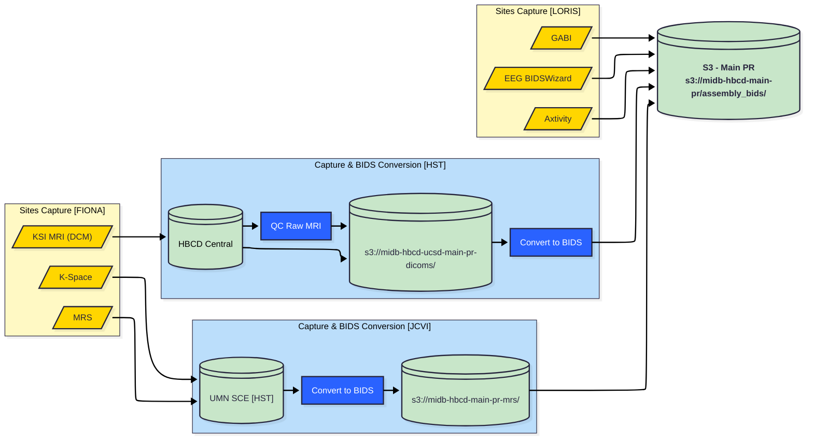

# File Based Data Processing Workflow

S3 - MRS BIDS: `s3://midb-hbcd-main-pr-mrs/`        
S3 JCVI DICOMs: `s3://midb-hbcd-ucsd-main-pr-dicoms/`       
S3 MAIN PR: `s3://midb-hbcd-main-pr/assembly_bids/`

