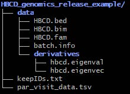

# Genomics Workflows

## IDAT to raw PLINK files

* Raw IDAT generated by vendor and placed within HST secure computing environment  
* Workflow run which takes raw IDAT files:  
    * Normalization  
    * Genotyping  
    * Final report  
    * PLINK conversion

## PLINK Files

#### PLINK files: `.bed`, `.bim`, `.fam` - Space delimited with six columns:
  1. Family ID (FID)      
  2. Within-family ID (IID) - i.e. FID plus relationship in family C = child, M = mother      
  3. Within-family ID of father     
  4. Within-family ID of mother     
  5. Sex    
  6. Phenotype  

#### [batch.info](http://batch.info) - Tab delimited with 3 columns:
1. IID (character, 10 digits + 1 letter either M or C)   
2. plate_number (float)    
3. visit (character)  

#### `.fam` and [batch.info](http://batch.info) have the same ordering of IID column

## Genomic Derivatives

* Principal components - `.eigenvec`, `.eigenval`  
* Inferred Sex  
* Inferred Ancestry

## Prerelease staging file structure

* Example directory structure for internal data storage  
    * This data is not ready for public as it is not deidentified!!!  
    * Only files in the “data” subdirectory are to be shared other files are supporting files in generating the release data  
* For each release files will be placed here before running deidentification  
    * `/projects/standard/basu_hbcd/shared/HBCD_genomics_release_<release details> ` 
    * Newly associated files that are not included release (such as par_visit_data.tsv) will be in the firs level of this directory  
    * Data to be released will be in the “data” directory  
    * QC’d genomic data will be stored as Plink1 binary (`.bed`/`.bim`/`.fam`) format in the first level of the “data” directory  
    * [Derivatives associated with genomics release](#genomic-derivatives) will be stored in “data/derivatives”

## Generation of release ready PLINK files

* Sample-Level QC (match with .fam file generated by Sampled) - *call rate, sex check, family relatedness, PCA*  
* Sample-Level QC (match with the LORIS demographic file) - *sex check, relatedness, ancestry*
* Variant level QC - *Batch effects*  
* To ensure that PLINKs are ready for a given release they must be filtered with the `par_visit_data.tsv` used for the release

## Deidentification, folder structure, and push to release bucket

* Use a recent mapping file present within `s3://midb-hbcd-main-pr-deidentification-list` - *maps pscid to release candid*  
* Script within [https://github.umn.edu/MIDB-IG/data-release/tree/genomics-de-id](https://github.umn.edu/MIDB-IG/data-release/tree/genomics-de-id) named `deidentify_genomics.py`  
    * Will de-identify  `.fam`, and batch info file based on provided mapping file  
    * Copy de-identified `.fam` and batch info file along with `.bed` and `.bim` files into a separate folder  
    * Folder designed to emulate ABCD directory structure  (i.e. `<output folder>/concat/genetics/genotype_microarray/GDA`)  
* Once produced a [validation script](https://github.com/UMN-GDC/hbcdGenomicReleaseCheck/tree/main) will be run to ensure that appropriate participants are present and that all are de-id’ed  
      * Confirming that FID columns are completely numeric  
      * Confirming that IID columns are numeric plus a single character (1 of either “M” or “C”)  
      * Confirming that the FID and IID columns are of fixed width (9 and 10 characters respectively  
* Once validated, de-id’ed release data will be pushed to pre-release bucket - [i.e.BR](http://i.e.BR): `s3://midb-hbcd-lasso-hdcc-qc-br/br<number>`
