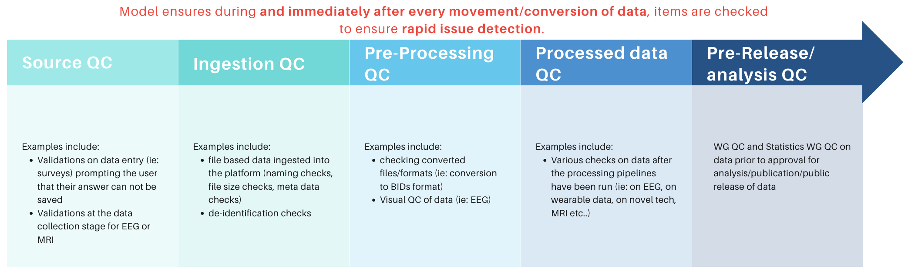

# HBCD Quality Control

## File-Based MRI Data

  
  Source QC
  <a class="anchor-link" href="#source" title="Copy link">
  <i class="fa-solid fa-link"></i>
  </a>
  
  ▸

ADD CONTENT

  
  Ingestion QC
  <a class="anchor-link" href="#ingestion" title="Copy link">
  <i class="fa-solid fa-link"></i>
  </a>
  
  ▸

ADD CONTENT

  
  Pre-Processing QC
  <a class="anchor-link" href="#preproc" title="Copy link">
  <i class="fa-solid fa-link"></i>
  </a>
  
  ▸

  
  Processed Data QC
  <a class="anchor-link" href="#proc" title="Copy link">
  <i class="fa-solid fa-link"></i>
  </a>
  
  ▸

ADD CONTENT

  
  Pre-Release/Analysis QC
  <a class="anchor-link" href="#pre-release" title="Copy link">
  <i class="fa-solid fa-link"></i>
  </a>
  
  ▸

ADD CONTENT

