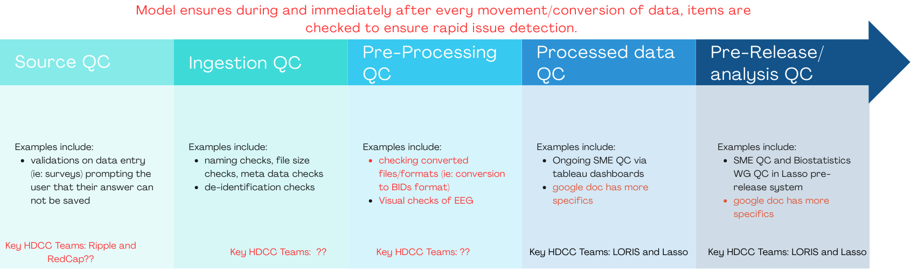

🚧 <i>UNDER CONSTRUCTION</i> 🚧 

# HBCD Quality Control 

  <a href="../../#data-quality-checks" target="_blank" class="pill-link-wrapper">
    
      
        <i class="fa-solid fa-clipboard-check" style="color: #6300d3;"></i>
        Data quality checks <i>Click to learn more</i>
      
    
  </a>
  <a href="../#project-management" target="_blank" class="pill-link-wrapper">
    
      
        <i class="fa-solid fa-diagram-project" style="color: #6300d3;"></i>
        Project Management <i>Click to learn more</i>
      
    
  </a>
  <a href="../../#reproducibility" target="_blank" class="pill-link-wrapper">
    
      
        <i class="fa-solid fa-code-compare" style="color: #6300d3;"></i>
        Reproducibility <i>Click to learn more</i>
      
    
  </a>
  <a href="../../#transparency" target="_blank" class="pill-link-wrapper">
      
        
          <i class="fa-solid fa-eye" style="color: #6300d3;"></i>
          Transparency <i>Click to learn more</i>
        
      
  </a>

As part of one of the primary pillars of the **HBCD Data Release Framework**, we have a comprehensive quality control (QC) process that ensures all data released to the public is **accurate**, **consistent**, and **reproducible**. This process is designed to catch errors at multiple stages, from initial data entry through to final public release.

## Pre-Release QC: 5 Stages

The following outlines the 5 stages of QC performed for all study data prior to release. Below we outline the specific details of each stage associated with tabulated [Behavior, Biology, & Environment](#behavior-biology-environment) data and file-based data for [MRI & MRS](#mri-mrs-data) and [EEG](#eeg-data).

### Behavior, Biology, & Environment

The majority HBCD data are provided as tabulated data, including [demographics & visit information](https://docs.hbcdstudy.org/latest/instruments/#demo) and [study instruments](https://docs.hbcdstudy.org/latest/instruments/#behavior-biology-environment). The QC processes outlined below describe processes for all HBCD Workgroups ([see details](../orgcharts.md#hbcd-workgroups)) unless otherwise specified. Note that, in the context of tabulated instrument data, "processing" refers to scoring the data where applicable. Instrument-specific QC procedures are documented on the HBCD Data Release Docs site under the <strong>Administration & Quality Control</strong> section for each instrument page (e.g. see <a href="https://docs.hbcdstudy.org/latest/instruments/bcgi/ecpromis/#administration-quality-control">here</a>). 

  
  Source QC
  <a class="anchor-link" href="#source-pheno" title="Copy link">
  <i class="fa-solid fa-link"></i>
  </a>
  
  ▸

Automated source QC is performed via <a href="../../orgcharts/#redcap">REDCap</a>, <a href="../../orgcharts/#ripple">Ripple</a>, and <a href="../../orgcharts/#loris">LORIS</a> when site staff or participants enter the data. The following checks are performed:

<b>Input Validation</b> 

<strong>Range Checks</strong>
<i class="fas fa-users" style="margin-right: 6px; color: blue;"></i><a href="../../orgcharts/#loris">LORIS</a>
 
LORIS works with Workgroups to establish plausible value ranges (e.g. see <a href="https://docs.hbcdstudy.org/latest/changelog/versions/R1/#filtered-field-values">Filtered Field Values</a> for R1.0). For these variables, the following checks are performed:
<ol>
<li>Enforce numeric bounds for all fields with defined minimum or maximum values.  </li>
<li>Automatically verify all date fields fall within protocol-defined windows.  </li>
<li>For derived fields (e.g., BMI), ensure source values are present and valid.  </li>
<li>Identify and flag inconsistent or reversed event sequences (e.g., follow-up before baseline).</li>
</ol>

<strong>Required Fields</strong>
<i class="fas fa-users" style="margin-right: 6px; color: blue;"></i><a href="../../orgcharts/#redcap">REDCap</a>

<i class="fas fa-users" style="margin-right: 6px; color: blue;"></i><a href="../../orgcharts/#ripple">Ripple</a>
 
To enforce completeness without violating participant autonomy, we treat all fields as *required* by including standardized non-answer response options. This enables complete data collection while capturing legitimate missingness and refusals.
<ol>
<i>Implementation Steps:</i>
<li>For every field (except calculated fields or system-generated timestamps), ensure there is a valid value recorded.</li>
<li>Include explicit non-answer choices-999 = "Don’t know"  -888 = "Refused to answer"  -777 = "Not applicable" in all multiple choice or dropdown fields.</li>
<li>Limit use of open text fields to ensure consistency, support downstream coding, and reduce manual data cleaning.</li>
</ol>
<i>Rules Applied:</i>
<ol>
<li>Open text fields are prohibited by default unless:
  <ul>
  <li>The field is explicitly designed for collecting novel, uncategorized input.  </li>
  <li>The data cannot be anticipated or meaningfully pre-coded at design time.</li>
  </ul>
</li>
<li>When text fields are used, they are treated as temporary input capture mechanisms for refining structured options.</li>
<li>For any field that begins as free text:
  <ul>
  <li>Responses are monitored regularly.  </li>
  <li>Common answers are converted into predefined choices in future versions of the form.  </li>
  <li>A structured dropdown or radio field is created, with an &quot;Other, specify&quot; option.</li>
  </ul>
</li>
</ol>

<strong>Handling of Special Codes in Standardized method</strong> 
All non-response fields are confirmed to be using standardized special codes-999 = Don’t know  -888 = Refused to answer  -777 = Not applicable. In addition, checks are made to ensure that these codes are not used in computed or date fields.

<b>Branching Logic Enforcement</b>
<i class="fas fa-users" style="margin-right: 6px; color: blue;"></i><a href="../../orgcharts/#redcap">REDCap</a>
 
<ol>
<li>Extract branching logic from the REDCap Data Dictionary.  </li>
<li>For each field with logic conditions:
  <ul>
  <li>Identify records where data are present, but the logic condition is not satisfied.  </li>
  <li>Flag violations where fields are populated outside of their visible state.</li>
  </ul>
</li>
<li>For required fields inside conditional blocks, ensure logic has been triggered if data are expected.</li>
</ol>

<b>Table & Variable Naming Schema Standardization & Validation</b> 
All variable names are parsed and validated against naming rules outlined <a href="https://docs.hbcdstudy.org/latest/access/metadata/#naming-conventions">here</a>.

<b>Staff/Site Violation Corrections & Workflow Improvements</b>

<b>Some non-complex scoring</b>

  
  Ingestion QC
  <a class="anchor-link" href="#ingestion-pheno" title="Copy link">
  <i class="fa-solid fa-link"></i>
  </a>
  
  ▸

<i class="fas fa-users" style="margin-right: 6px; color: blue;"></i><a href="../../orgcharts/#loris">LORIS</a>

<i class="fas fa-users" style="margin-right: 6px; color: blue;"></i><a href="../../orgcharts/#redcap">REDCap</a>

<i class="fas fa-users" style="margin-right: 6px; color: blue;"></i><a href="../../orgcharts/#ripple">Ripple</a>

<i class="fas fa-users" style="margin-right: 6px; color: blue;"></i><a href="../../orgcharts/#j-craig-venter-institute">JCVI</a>

Ingestion QC is performed when data is transferred from the capture source (i.e. REDCap or Ripple) to the central LORIS repository. It includes: 
<ul>
<li>Data tracking via LORIS and RBA Dashboards</li>
<li>Ensuring what was saved in REDCap was successfully transferred to LORIS via scripts in ETL/LORIS</li>
<li>Transfer warnings/errors via scripts in ETL/LORIS</li>
<li>Completeness warnings via LORIS launch pad</li>
</ul>

 

  
  Pre-Processing QC
  <a class="anchor-link" href="#preproc-pheno" title="Copy link">
  <i class="fa-solid fa-link"></i>
  </a>
  
  ▸

<i class="fas fa-users" style="margin-right: 6px; color: blue;"></i><a href="../../orgcharts/#hbcd-workgroups">Workgroups</a>

<i class="fas fa-users" style="margin-right: 6px; color: blue;"></i><a href="../../orgcharts/#loris">LORIS</a>

<i class="fas fa-users" style="margin-right: 6px; color: blue;"></i><b>Site Staff</b>

Pre-processing QC involves the following, performed by the indicated parties responsible:

<table class="table-no-vertical-lines" style="width: 100%; border-collapse: collapse; table-layout: fixed;">
<thead>
  <th></th>
  <th>Responsible Party</th>
</thead>
<tbody>
<tr>
  <td><b>Outlier identification</b></td>
  <td>Workgroups (via Tableau and DQTDictionary Query Tool)</td>
</tr>
<tr>
  <td><b>Data entry corrections</b></td>
  <td>HBCD Study Site Staff (generally after being notified by HDCC or WGs)</td>
</tr>
<tr>
  <td><b>Answer distribution and missingness checks</b></td>
  <td>Workgroups (via Tableau and DQTDictionary Query Tool)</td>
</tr>
<tr>
  <td><b>Complex scoring not handled in REDCap</b>e.g. look up tables</td>
  <td>LORIS</td>
</tr>
</tbody>
</table>

  
  Processed Data QC
  <a class="anchor-link" href="#proc-pheno" title="Copy link">
  <i class="fa-solid fa-link"></i>
  </a>
  
  ▸

<b>QC Dashboards</b>
<i class="fas fa-users" style="margin-right: 6px; color: blue;"></i><a href="../../orgcharts/#hbcd-workgroups">Workgroups</a>

<i class="fas fa-users" style="margin-right: 6px; color: blue;"></i><a href="../../orgcharts/#lasso">Lasso</a>

<i class="fas fa-users" style="margin-right: 6px; color: blue;"></i><a href="../../orgcharts/#health-sciences-technology">HST</a>

<i class="fas fa-users" style="margin-right: 6px; color: blue;"></i><a href="../../orgcharts/#ripple">Ripple</a>
 

Workgroups perform processed data QC (on all data <strong>and</strong> site-specific data) via QC Dashboards to assess missingness, protocol compliance, and scoring calculation checks. The specific Dashboard utilized by each HBCD Workgroup is as follows:
 
<table class="table-no-vertical-lines" style="width: 100%; border-collapse: collapse; table-layout: fixed;">
<tbody>
<tr><td><b>Tableau Dashboards (administered by Lasso)</b></td>
<td>Behavior and Caregiver-Child Interaction 
Biostatistics 
Neurocognition & Language 
Novel Technologies & Wearables 
Physical Health 
Pregnancy & Exposure, including Substance Use 
Social & Environmental Determinants</td></tr>
<tr><td><b>HST Dashboards</b></td>
<td>Biospecimens & Omics </td></tr>
<tr><td><b>Ripple</b></td>
<td>Geocoding & Linking External Data 
Transitions in Care</td></tr>
</tbody>
</table>

<b>Monthly Reports Submitted to Lasso</b> 
Based on the processed data QC performed via these dashboards, subject matter experts (SMEs) submit monthly reports to Lasso where they describe, for each issue identified, whether it impacts one variable or the entire instrument, the number of participants impacted, and at what level the required fix will need to occur (including data entry/collection at the site, scoring correction from LORIS or RedCAP, and/or new data import). After review, Lasso connects the Workgroup with the relevant parties to resolve them.

    
    
<i>Example of Data View on Tableau Dashboard</i>

  
  Pre-Release Final QC
  <a class="anchor-link" href="#pre-release-pheno" title="Copy link">
  <i class="fa-solid fa-link"></i>
  </a>
  
  ▸

<b>Lasso Ingestion</b>
<i class="fas fa-users" style="margin-right: 6px; color: blue;"></i><a href="../../orgcharts/#lasso">Lasso</a>
 
Data ready for release is first ingested into Lasso. Errors in ingestion are addressed and the following checks are performed: 
<ul>
<li>Ingestion logs are queried to check for skipped sessions and insertion errors</li>
<li>Quality Assurance (QA) of the file transfer UI and Globus transfer performed</li>
</ul>

<b>Subject Matter Expert (SME) Sign-Off</b>
<i class="fas fa-users" style="margin-right: 6px; color: blue;"></i><a href="../../orgcharts/#lasso">Lasso</a>

<i class="fas fa-users" style="margin-right: 6px; color: blue;"></i><a href="../../orgcharts/#hbcd-workgroups">Workgroups</a>
 
Lasso obtains final sign-off from Workgroups on datasets in their release-ready form, with <a href="https://docs.hbcdstudy.org/latest/changelog/versions/R1/#exclusion-criteria-filters">applied filters</a>, via the Lasso Pre-Release System:
<ul>
<li>All SMEs review data in Lasso pre-release system and sign off prior to public release  <ul>
<li>Instrument scoring, mins/maxes/BIV   </li>
<li>Missingness/Shadow matrix  </li>
<li>Data dictionary</li>
<li>Known issues are documented</li>
</ul>
</li>
<li>Biostatistics WG also reviews data and data dictionary in Lasso pre-release system  <ul>
<li>mins/maxes/BIV  </li>
<li>Descriptives (means, frequencies)  </li>
<li>Missingness/Shadow matrix   </li>
<li>Data dictionary</li>
<li>Known issues are documented</li>
</ul>
</li>
</ul>

    
    
<i>Example of Data View on Lasso Pre-Release System</i>

### MRI & MRS Data

These data include both file-based and tabulated data for the instruments listed on the HBCD Data Release Docs site [here](https://docs.hbcdstudy.org/latest/instruments/#mri).

  
  Source QC
  <a class="anchor-link" href="#source-mri" title="Copy link">
  <i class="fa-solid fa-link"></i>
  </a>
  
  ▸

<i class="fas fa-users" style="margin-right: 6px; color: blue;"></i><a href="../../orgcharts/#fiona">FIONA</a>

<i class="fas fa-users" style="margin-right: 6px; color: blue;"></i><a href="../../orgcharts/#loris">LORIS</a>

<i class="fas fa-users" style="margin-right: 6px; color: blue;"></i><b>Site Staff</b>

<ul>
<b>Acquisition</b>
<li>fBIRN phantom scans, used to monitor drift, occur either every day that an HBCD subject is acquired or weekly if the former is impractical. In terms of acquisition, the main criteria should be consistency. Sites with multiple operators are directed to discuss positioning of the phantom to make sure it is done in a similar manner every time. For weight, entering 100 lbs every time is recommended (age and height not needed).</li>
<li><a href="https://firmm.readthedocs.io/">FIRMM</a> software is used to monitor motion during acquisition.</li>
<li>There are additional QC processes in place for when sites receive upgrades or a new scanner.</li>
</ul>

<ul>
<b>FIONA</b>
  <li>Updates patient ID by cross-checking against the Loris database to ensure no manual entry errors at the scanner</li>
  <li>Checks all expected files are on the transfer device</li>
  <li>Checks that all files were sent properly to their destination (UCSD: all DICOMs; UMN/HST: MRS/k-space)</li>
</ul>

<ul><b>Data Tracking</b> 
The time of all data transfers at any given stage is documented and transfer completion is confirmed (monitored in LORIS).
</ul>

  
  Ingestion QC
  <a class="anchor-link" href="#ingestion-mri" title="Copy link">
  <i class="fa-solid fa-link"></i>
  </a>
  
  ▸

<i class="fas fa-users" style="margin-right: 6px; color: blue;"></i><a href="../../orgcharts/#j-craig-venter-institute">JCVI</a>

<i class="fas fa-users" style="margin-right: 6px; color: blue;"></i><a href="../../orgcharts/#health-sciences-technology">HST</a>

As outlined in the <a href="../data-proc-wf">data processing workflow diagram</a>, raw data are sent via FIONA to UMN SCE/HST and HBCD Central/JCVI. Data are checked for protocal compliance and completion - see <a href="https://docs.hbcdstudy.org/latest/instruments/mri/qc/#automated-qc">HBCD Data Release Docs</a> for full details. In summary:
 

<b>Protocol compliance</b> 
This is based on extraction of information from DICOM headers to identify common issues and protocol deviations (e.g.  missing files or incorrect patient orientation). Criteria include whether key imaging parameters, such as voxel size or repetition time, match the expected values for a given scanner.
 

<b>Completeness checks</b> 
A complete imaging session consists of the following valid series:
<table class="table-no-vertical-lines" style="width: 100%; border-collapse: collapse; table-layout: fixed;">
    <tbody>
    <tr>
        <td>Structural T1 Block:</td>
        <td>T1</td>
    </tr>
    <tr>
        <td>Structural T2 Block:</td>
        <td>T2</td>
    </tr>
    <tr>
        <td>Diffusion (dMRI) Block:</td>
        <td>dMRI AP; dMRI PA</td>
    </tr>
    <tr>
        <td>Resting state (rsfMRI) Block:</td>
        <td>fMRI field map AP; fMRI field map PA; rsfMRI (run 1); rsfMRI (run 2)</td>
    </tr>
    <tr>
        <td>MRS Block</td>
        <td>SVS localizer; MRS</td>
    </tr>
    <tr>
        <td>Quantitative (qMRI) Block</td>
        <td>B1 Map; 3DMagic/QALAS</td>
    </tr>
</tbody>
</table>

  
  Pre-Processing QC
  <a class="anchor-link" href="#preproc-mri" title="Copy link">
  <i class="fa-solid fa-link"></i>
  </a>
  
  ▸

<i class="fas fa-users" style="margin-right: 6px; color: blue;"></i><a href="../../orgcharts/#j-craig-venter-institute">JCVI</a>

<b>AUTOMATED QC</b> (see <a href="https://docs.hbcdstudy.org/latest/instruments/mri/qc/#automated-qc">HBCD Data Release Docs</a> for full details)

<table style="width: 100%; border-collapse: collapse; table-layout: fixed; font-size: 14px">
<thead>
<tr>
    <th style="width: 20%; text-align: center;">Modality</th>
    <th style="width: 80%; text-align: center;">QC Procedures</th>
</tr>
</thead>
<tbody>
<tr>
<td style="word-wrap: break-word; white-space: normal;">Structural (T1w, T2w, qMRI)</td>
<td style="word-wrap: break-word; white-space: normal;">• Deep learning model estimates motion artifacts • Signal-to-noise ratio (SNR) computed</td>
</tr>
<tr>
<td style="word-wrap: break-word; white-space: normal;">dMRI</td>
<td style="word-wrap: break-word; white-space: normal;">• Framewise displacement (FD) for head motion • Head motion estimated via registration to tensor-synthesized imagesaccounts for contrast differences across orientations (<a href="https://doi.org/10.1002/hbm.20619">Hagler et al. 2009</a>) • Identification of dark slicesartifacts caused by abrupt head movements via RMS difference between raw and tensor-fitted data • Total slices and frames with motion artifacts calculated • Metrics for line artifacts and field-of-view (FOV) cutoff</td>
</tr>
<tr>
<td style="word-wrap: break-word; white-space: normal;">fMRI</td>
<td style="word-wrap: break-word; white-space: normal;">• FD for head motion (average FD and seconds with FD &lt; 0.2 mm, 0.3 mm, 0.4 mm) (<a href="https://doi.org/10.1016/j.neuroimage.2011.10.018">Power et al., 2012</a>) • Metrics for line artifacts and FOV cutoff • FWHMFull width half max () spatial smoothness and tSNRtemporal SNR computed after motion correction (<a href="https://doi.org/10.1016/j.neuroimage.2005.01.007">Triantafyllou et al. 2005</a>)</td>
</tr>
<tr>
<td style="word-wrap: break-word; white-space: normal;">Field Maps</td>
<td style="word-wrap: break-word; white-space: normal;">• Metrics for line artifacts and FOV cutoff</td>
</tr>
<tr>
<td style="word-wrap: break-word; white-space: normal;">All Modalities</td>
<td style="word-wrap: break-word; white-space: normal;">• SNR computed where applicable</td>
</tr>
</tbody>
</table>

<b>MANUAL QC</b> (see <a href="https://docs.hbcdstudy.org/latest/instruments/mri/qc/#manual-review">HBCD Data Release Docs</a> for full details) 
Data is selection for manual review based on multivariate prediction and Bayesian classifier. Manual review involves scoring images based on severity of the following artifacts:

<table style="width: 100%; border-collapse: collapse; table-layout: fixed; font-size: 14px">
<thead>
<tr>
    <th style="width: 20%; text-align: center;">Modality</th>
    <th style="width: 80%; text-align: center;">QC Procedures</th>
</tr>
</thead>
<tbody>
<tr>
<td>T1w, T2w</td>
<td style="word-wrap: break-word; white-space: normal;"> • Scored for <strong>motion artifacts</strong> (e.g., ripples, blurring) on a 0-3 scale (0 = none, 3 = severe)  • Other documented issues include intensity inhomogeneity and ghostingfaint displaced copy of anatomy due to slices outside FOV</td>
</tr>
<tr>
<td>qMRI</td>
<td style="word-wrap: break-word; white-space: normal;"> • Same artifact scoring as above (0 - 3)  • Inspection of derived data (parametric maps, ROI analysis, and quantitative comparisons for 3D-QALAS)</td>
</tr>
<tr>
<td>B1 field maps</td>
<td style="word-wrap: break-word; white-space: normal;"> • Visual inspection and overall QC only; used for bias field correction of qMRI scans.</td>
</tr>
<tr>
<td>SVS localizer scans (MRS)</td>
<td style="word-wrap: break-word; white-space: normal;"> • Visual inspection and overall QC only; used to define ROI for spectroscopy.</td>
</tr>
<tr>
<td>dMRI, fMRI, field maps</td>
<td style="word-wrap: break-word; white-space: normal;"> • Scored for susceptibility artifacts, FOV cutoff, and line artifactshorizontal lines present in the sagittal view, including dark slice-frame and interleaved sliced offset.  • Susceptibility issues include signal dropoutConsistent with prior infant fMRI using posterior-anterior (PA) acquisitions, signal dropout is commonly noted in the posterior occipital cortex, signal bunching, and warping.</td>
</tr>
</tbody>
</table>

<b>Modality-Specific Worfklow Details</b>

  
  Processed Data QC
  <a class="anchor-link" href="#proc-mri" title="Copy link">
  <i class="fa-solid fa-link"></i>
  </a>
  
  ▸

QC is performed on processed MR data using several automated and manual approaches:

<ul><b>AUTOMATED QC</b>
<i class="fas fa-users" style="margin-right: 6px; color: blue;"></i><a href="../../orgcharts/#mri-subgroups">MRI Workgroups</a>

<table class="table-no-vertical-lines" style="width: 100%; border-collapse: collapse; table-layout: fixed;">
    <tbody>
    <tr>
        <td><strong>QSIPrep pipeline (dMRI)</strong></td>
        <td style="word-wrap: break-word; white-space: normal;">QSIPrep produces robust QC metrics - see <a href="https://docs.hbcdstudy.org/latest/instruments/mri/qc/#dwi-qc">Automated QC for Processed Diffusion Data</a> for details.</td>
    </tr>
    <tr>
        <td><strong>XCP-D pipeline (sMRI/fMRI)</strong></td>
        <td style="word-wrap: break-word; white-space: normal;">XCP-D produces several QC metrics and visual reports to aid in data evaluation. One key metric is <a href="https://xcp-d.readthedocs.io/en/latest/workflows.html#framewise-displacement-calculation-and-thresholding">framewise displacement</a> (FD), which quantifies head motion across the scan. For each run, the amount of low-motion data, based on an FD threshold of 0.3 mm, is calculated. Only runs with at least 210 seconds of low-motion data are retained in the final outputs.</td>
    </tr>   
    <tr>
        <td><strong>MRIQC utility</strong></td>
        <td style="word-wrap: break-word; white-space: normal;">MRIQC extracts image quality metrics, provided in the release data, from structural and functional MRI - <a href="https://docs.hbcdstudy.org/latest/datacuration/derivatives/#mriqc-mriqc">see details</a>.</td>
    </tr>    
</tbody>
</table>

<ul><b>MANUAL QC</b>
<i class="fas fa-users" style="margin-right: 6px; color: blue;"></i><a href="../../orgcharts/center-for-developmental-neuroimaging">CDNI</a>

<li>BrainSwipes - please see full details <a href="https://docs.hbcdstudy.org/latest/instruments/mri/qc/#brainswipes">here</a>. BrainSwipes results will be included for diffusion MRI in the future.</li>
</ul>

  
  Pre-Release Final QC
  <a class="anchor-link" href="#pre-release-mri" title="Copy link">
  <i class="fa-solid fa-link"></i>
  </a>
  
  ▸

Prior to inclusion in the release data, the following checks are performed:

<b>Structural MRI</b>
<i class="fas fa-users" style="margin-right: 6px; color: blue;"></i><a href="../../orgcharts/center-for-developmental-neuroimaging">CDNI</a>
  
Processed structural MRI data, based on <a href="https://docs.hbcdstudy.org/latest/datacuration/phenotypes/">tabulated data</a> derived from XCP-D outputs, were analyzed using R-based scripts. ROI-level measures included:
<ul>
<li><strong>Cortical metrics</strong> (Gordon parcellation, 333 ROIs): cortical thickness, surface area, and curvature</li>
<li><strong>Subcortical metrics</strong> (Freesurfer segmentation, 19 ROIs): volume</li>
</ul>
BrainSwipes visual QC outputs were used to assess data quality and its impact on the underlying distributions. We also evaluated associations with demographic variables. Over 90% of data passed BrainSwipes QC, indicating high overall quality. No significant effects of data quality or associations with demographic factors were detected, suggesting either minimal confounding or limited statistical power to detect such effects in the current sample.
 

<b>Functional MRI</b>
<i class="fas fa-users" style="margin-right: 6px; color: blue;"></i><a href="../../orgcharts/center-for-developmental-neuroimaging">CDNI</a>
  
QC performed for processed resting-state fMRI (rs-fMRI) data, derived from XCP-D outputs, is performed on both <a href="https://docs.hbcdstudy.org/latest/datacuration/phenotypes/">tabulated</a> and file-based data. Analyses leverage R-based scripts and BrainSwipes QC outputs.

<strong><i>Tabulated Data</i></strong> 
We analyzed ALFF and ReHo measures from the Gordon cortical parcellation and Freesurfer subcortical segmentation, covering a total of 352 ROIs. BrainSwipes visual QC was used to assess the proportion of rs-fMRI data meeting quality thresholds and to evaluate its impact on distributional characteristics. The QC metric exhibited a linear trend, supporting its interpretation as a continuous measure. Examining effects of data quality, we find that data quality effects are most minimized when the pass rate for BrainSwipes QC exceeds 70%.
 

<strong><i>File-Based Imaging Data</i></strong> 
We also analyzed mean ROI-to-ROI functional connectivity maps from the same parcellations (Gordon cortical and Freesurfer subcortical, 352 ROIs). As with tabulated data, BrainSwipes QC outputs were used to assess data quality and its influence on connectivity estimates. A similar linear relationship was observed, and QC effects were minimized when only data with at least a 70% pass rate were included.
 

<b>Diffusion MRI</b>
<i class="fas fa-users" style="margin-right: 6px; color: blue;"></i><a href="../../orgcharts/#hbcd-workgroups">dMRI Workgroup</a>  
The dMRI Workgroup checked that automated QC metrics such as the neighboring DWI correlation (NDC) increase in preprocessed data compared to raw data. They also compared the Contrast to Noise Ratio (CNR) for each shell to the CNR values for the ABCC QSIPrep outputs, checking for approximately similar ranges per vendor. Postprocessed (QSIRecon) data was checked to be sure that most bundles were recovered for most scans.

<b>Magnetic Resonance Spectroscopy (MRS)</b>
<i class="fas fa-users" style="margin-right: 6px; color: blue;"></i><a href="../../orgcharts/#hbcd-workgroups">MRS Workgroup</a>  
MRS QC is based on tabulated data-derived distributions of Osprey derivatives. R-based scripts examine distributions of MRS-derived measures from tabulated data.
 

See <a href="https://docs.hbcdstudy.org/latest/instruments/mri/qc/#qc-summary-statistics">QC Summary Statistics</a> on the HBCD Data Release Docs for some findings from these analysis shared with users.

### EEG Data

Electroencephalography data include both file-based and tabulated data for the tasks listed on the HBCD Data Release Docs site [here](https://docs.hbcdstudy.org/latest/instruments/#eeg). EEG QC procedures shared with users are outlined in the HBCD Docs site [here](https://docs.hbcdstudy.org/latest/instruments/eeg/#quality-control). For a detailed description of QC procedures in the HBCD Study EEG protocol, refer to [Fox et al., 2024](https://doi.org/10.1016/j.dcn.2024.101447).

  
  Source QC
  <a class="anchor-link" href="#source-eeg" title="Copy link">
  <i class="fa-solid fa-link"></i>
  </a>
  
  ▸

<i class="fas fa-users" style="margin-right: 6px; color: blue;"></i><a href="../../orgcharts/#university-of-maryland">UMD EEG Data Core
</a>

<i class="fas fa-users" style="margin-right: 6px; color: blue;"></i><a href="../../orgcharts/#loris">LORIS</a>

After EEG acquisition, quality control checks are performed using <a href="https://github.com/aces/eeg2bids">EEG2BIDS Wizard</a>, a custom MATLAB application installed at all HBCD sites. These checks are immediately provided to staff to ensure the data's integrity and usability. The process includes:

<ul>
<li>Verifying event markers in the EEG data to confirm all required events are accurately recorded.</li>
<li>Ensuring the setup for stimulus presentation and EEG data acquisition adheres to the study protocol.</li>
<li>Inspecting electrode impedances to ensure they are within acceptable limits.</li>
<li>Detecting multiple task runs and incomplete recordings.</li>
<li>Confirming the use of correct E-Prime task versions.</li>
</ul>

In addition to the post-acquisition checks performed by the EEG2BIDS Wizard, site staff complete an <strong>EEG Acquisition Form</strong> directly in LORIS at the time of the EEG visit to document key procedural and quality control details. This form captures real-time information on net placement, signal quality, and task completion status, ensuring protocol adherence and supporting downstream data evaluation.

The EEG Acquisition Form records:
<ul>
<li><strong>Net placement checks</strong> ensure electrodes are correctly positioned, using anatomical landmarks (nasion, inion, preauricular points), and that cables are secured and symmetrical. Visual inspections are done for impedance and physical fit.</li>
<li><strong>EEG acquisition QC</strong> documents whether impedances are within acceptable limits, the number of channels with good signal, and issues like high noise or signal dropout.</li>
<li><strong>For each phase</strong> (e.g., Resting State, VEP Task), the system tracks whether data were acquired, any problems occurred, and whether the segments are marked for review or re-collection.</li>
</ul>

  
  Ingestion QC
  <a class="anchor-link" href="#ingestion-eeg" title="Copy link">
  <i class="fa-solid fa-link"></i>
  </a>
  
  ▸

The EEG2BIDS Wizard additionally facilitates the transfer of data to both a dedicated SCE (secure computing environment) housed at the University of Minnesota (UMN) and to an ASW S3 bucket, each of which facilitates different aspects of QC:

<b>UMN SCE</b>
<i class="fas fa-users" style="margin-right: 6px; color: blue;"></i><a href="../../orgcharts/#university-of-minnesota">UMN</a>
 
The Wizard handles the transfer of <code>.mff</code> files containing raw EEG, metadata, and personally identifiable information (PII) to the SCE. PII includes video recordings of the EEG session and photographs of EEG cap placement from multiple angles, which are used to rate quality of cap placement according to a rubric.

<b>ASW S3 bucket</b>
<i class="fas fa-users" style="margin-right: 6px; color: blue;"></i><a href="../../orgcharts/#loris">LORIS</a>
 
A subset of data consisting of <code>.set</code> files, E-Prime stimuli files and associated non-PII metadata are uploaded to an AWS S3 bucket curated by the LORIS data management system where they are stored for subsequent processing and analysis. The contents of the ASW S3 bucket are represented on the EEG Quality Control dashboard, which is used by both study sites and the EEG Core team to access and monitor incoming EEG data and QC metrics, such as retained epochs and line noise levels.

  
  Pre-Processing QC
  <a class="anchor-link" href="#preproc-eeg" title="Copy link">
  <i class="fa-solid fa-link"></i>
  </a>
  
  ▸

<i class="fas fa-users" style="margin-right: 6px; color: blue;"></i><a href="../../orgcharts/#university-of-maryland">UMD EEG Data Core
</a>

EEG capping quality ratings are used to determine inclusion in the data release pool and subsequent processing. Photos are taken for each acquisition from the front, back, top, left, and right angles of the participant's head and uploaded via the BIDS Wizard application to a secure computing environment. They are then reviewed by the EEG Core at the University of Maryland to rate the quality of EEG net placement, or "capping quality," for each acquisition. Please see the section <a href="https://docs.hbcdstudy.org/latest/instruments/eeg/#eeg-net-placement-capping-quality-ratings">EEG Net Placement ("Capping Quality") Ratings</a> in the HBCD Data Release Docs for full details.

  
  Processed Data QC
  <a class="anchor-link" href="#proc-eeg" title="Copy link">
  <i class="fa-solid fa-link"></i>
  </a>
  
  ▸

<i class="fas fa-users" style="margin-right: 6px; color: blue;"></i><a href="../../orgcharts/#university-of-maryland">UMD EEG Data Core
</a>

Outputs from the HBCD-Maryland Analysis of Developmental EEG (<a href="https://hbcd-made.readthedocs.io/en/latest/">HBCD-MADE</a>) pipeline, which handles preprocessing and data cleaning, are also integrated into the dashboard. These outputs include key metrics like outlier statistics for specific task epochs (<a href="https://doi.org/10.1111/psyp.13580">Debnath et al., 2020</a>). Regular site-specific check-ins and troubleshooting are conducted to ensure consistent protocol adherence and data quality across sites.

  
  Pre-Release Final QC
  <a class="anchor-link" href="#pre-release-eeg" title="Copy link">
  <i class="fa-solid fa-link"></i>
  </a>
  
  ▸

<i class="fas fa-users" style="margin-right: 6px; color: blue;"></i><a href="../../orgcharts/#university-of-maryland">UMD EEG Data Core
</a>

<i class="fas fa-users" style="margin-right: 6px; color: blue;"></i><a href="../../orgcharts/#lasso">Lasso</a>

The EEG Workgroup performs a final review of the data to be included in the release via the Lasso Pre-Release System and provides official sign off that the data is ready for release. Known issues are documented as needed on the HBCD Data Release Docs site.

## Post-Release QC

After data is released, additional QC is conducted in response to user-reported issues:

  
  

    

  
✓

  
Users report issues by submitting tickets via the <a href="https://nbdc-datashare.lassoinformatics.com/help-center">Lasso Help Center</a>.

 

  
✓

  
Tickets are triaged to the appropriate subject matter experts (SMEs).

 

  
✓

  
Verified issues are documented on the <a href="https://docs.hbcdstudy.org/latest/changelog/knownissues/">HBCD Data Release Docs</a> site and addressed in a future release, as noted in the corresponding known issue entry.

## Software Standards

  <a href="../../#data-quality-checks" target="_blank" class="pill-link-wrapper">
      
        
          <i class="fa-solid fa-clipboard-check" style="color: #6300d3;"></i>
          Data quality checks <i>Click to learn more</i>
        
      
  </a>
  <a href="../../#reproducibility" target="_blank" class="pill-link-wrapper">
    
      
        <i class="fa-solid fa-code-compare" style="color: #6300d3;"></i>
        Reproducibility <i>Click to learn more</i>
      
    
  </a>
  <a href="../../#clear-objectives-and-scope" target="_blank" class="pill-link-wrapper">
    
      <i class="fa-solid fa-bullseye" style="color: #6300d3;"></i>Clear objectives & scope <i>Click to learn more</i>
    
  </a>
  <a href="../../#transparency" target="_blank" class="pill-link-wrapper">
      
        
          <i class="fa-solid fa-eye" style="color: #6300d3;"></i>
          Transparency <i>Click to learn more</i>
        
      
  </a>

The following procedures are performed to support transparency, reproducibility, and standard environments for our databases and systems controls:

### Processing & Analytic Standards

See the full details on the HBCD Data Release Docs site [here](https://docs.hbcdstudy.org/latest/instruments/#processing-analytic-standards). This includes the use of standardized processing pipelines for MRI, EEG, and other modalities, as well as the use of standardized analytic approaches across sites. Independent code review is performed for all processing pipelines via the NMIND Coding Standards Checklist, with a focus on ensuring that the code is well-documented, reproducible, and follows best practices in software development. This includes version control of all internal and public-facing code bases, including the documentation websites.

### Data Storage and Backup

 - Large data files are stored in MSI's Tier 2 Ceph storage system, while the LORIS systems operate off of the storage in MSI's OpenStack cloud environment.
 - Research data is encrypted and backed up to AWS Deep Glacier on a nightly basis.
 - The LORIS systems (prod, sandbox, and staging) have their database backed up on a nightly basis to MSI Tier 2 storage.
 - Currently all data is held, although we are in the final phases of determining a system for retiring some nightly backups after six months, reducing to retaining weekly backups for another three months and then monthly after nine total months.

### Code Versioning
All code, both LORIS customizations and Puppet orchestration code, are maintained in the University of Minnesota's local Enterprise GitHub. These code bases are kept in separate internal GitHub organizations with different memberships and access controls. The orchestration code is also subject to our Internal Change Control process that requires a change to get a separate approval and verification from someone other than the implementer to ensure safety and reliability.

### Access Controls
Data access is modified through the same Internal Change Control process governing orchestration changes. All change requests must be signed off on by a senior staff manner and are vetted by data stewards or managers of the projects.
