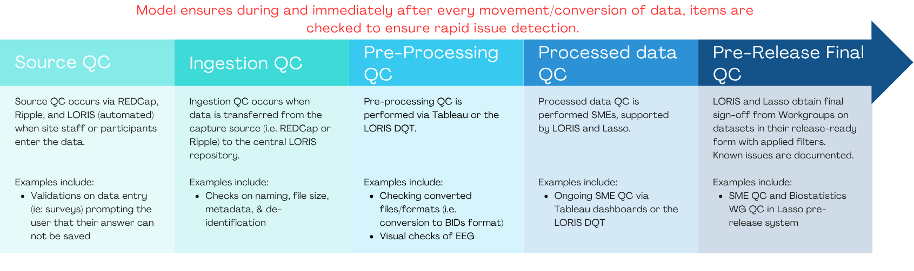

# HBCD Quality Control: 5 Stages

The following outlines the 5 stages of QC performed for all study data:

## Behavior, Biology, & Environment

The majority HBCD data are provided as tabulated data, including [demographics & visit information](https://docs.hbcdstudy.org/latest/instruments/#demo) and [study instruments](https://docs.hbcdstudy.org/latest/instruments/#behavior-biology-environment). The QC processes outlined below describes processes for all HBCD Workgroups ([see details](https://hbcdstudy.org/workgroups-and-committees/)) unless otherwise specified:

  
  Source QC
  <a class="anchor-link" href="#source-pheno" title="Copy link">
  <i class="fa-solid fa-link"></i>
  </a>
  
  ▸

Source QC is performed via REDCap, Ripple, and LORIS (automated) when site staff or participants enter the data. The following checks are performed:

<b>Input Validation</b> 

<strong>Range Checks</strong> 
In cases where plausible ranges are established for a given study instrument, the following checks are performed:
<ol>
<li>Enforce numeric bounds for all fields with defined minimum or maximum values.  </li>
<li>Automatically verify all date fields fall within protocol-defined windows.  </li>
<li>For derived fields (e.g., BMI), ensure source values are present and valid.  </li>
<li>Identify and flag inconsistent or reversed event sequences (e.g., follow-up before baseline).</li>
</ol>

<strong>Required Fields</strong> 
To enforce completeness without violating participant autonomy, we treat all fields as *required* by including standardized non-answer response options. This enables complete data collection while capturing legitimate missingness and refusals.
<ol>
<i>Implementation Steps:</i>
<li>For every field (except calculated fields or system-generated timestamps), ensure there is a valid value recorded.</li>
<li>Include explicit non-answer choices-999 = "Don’t know"  -888 = "Refused to answer"  -777 = "Not applicable" in all multiple choice or dropdown fields.</li>
<li>No Open Text F Limiting Use of Open Text Fields. We limit the use of open-ended text fields to ensure consistency, support downstream coding, and reduce manual data cleaning.</li>
</ol>

<i>Rules Applied:</i>
<ol>
<li>Open text fields are prohibited by default unless:
  <ul>
  <li>The field is explicitly designed for collecting novel, uncategorized input.  </li>
  <li>The data cannot be anticipated or meaningfully pre-coded at design time.</li>
  </ul>
</li>
<li>When text fields are used, they are treated as temporary input capture mechanisms for refining structured options.</li>
<li>For any field that begins as free text:
  <ul>
  <li>Responses are monitored regularly.  </li>
  <li>Common answers are converted into predefined choices in future versions of the form.  </li>
  <li>A structured dropdown or radio field is created, with an &quot;Other, specify&quot; option.</li>
  </ul>
</li>
</ol>

<strong>Handling of Special Codes in Standardized method</strong> 
All non-response fields are confirmed to be using standardized special codes-999 = Don’t know  -888 = Refused to answer  -777 = Not applicable. In addition, checks are made to ensure that these codes are not used in computed or date fields.

<b>Branching Logic Enforcement</b> 
<ol>
<li>Extract branching logic from the REDCap Data Dictionary.  </li>
<li>For each field with logic conditions:
  <ul>
  <li>Identify records where data are present but the logic condition is not satisfied.  </li>
  <li>Flag violations where fields are populated outside of their visible state.</li>
  </ul>
</li>
<li>For required fields inside conditional blocks, ensure logic has been triggered if data are expected.</li>
</ol>

<b>Table & Variable Naming Schema Standardization & Validation</b> 
All variable names are parsed and validated against naming rules outlined <a href="https://docs.hbcdstudy.org/latest/access/metadata/#naming-conventions">here</a>.

<b>Staff/Site Violation Corrections & Workflow Improvements</b>

<b>Some non-complex scoring</b>

  
  Ingestion QC
  <a class="anchor-link" href="#ingestion-pheno" title="Copy link">
  <i class="fa-solid fa-link"></i>
  </a>
  
  ▸

Ingestion QC is performed when data is transferred from the capture source (i.e. REDCap or Ripple) to the central LORIS repository. It includes: 
<ul>
<li>Data tracking via LORIS and RBA Dashboards</li>
<li>Ensuring what was saved in REDCap was successfully transferred to LORIS via scripts in ETL/LORIS</li>
<li>Transfer warnings/errors via scripts in ETL/LORIS</li>
<li>Completeness warnings via LORIS launch pad</li>
</ul>

 

  
  Pre-Processing QC
  <a class="anchor-link" href="#preproc-pheno" title="Copy link">
  <i class="fa-solid fa-link"></i>
  </a>
  
  ▸

Pre-processing QC involves the following: 
<ul>
<li>Outlier identification: performed by Workgroups via Tableau and DQT (Dictionary Query Tool)</li>
<li>Data entry corrections: performed by site staff, generally after being notified by HDCC or Workgroups</li>
<li>Answer distribution and missingness checks: performed by Workgroups via Tableau and DQT (Dictionary Query Tool)</li>
<li>Complex Scoring (i.e. look up tables and other scoring that REDCap does not do): performed by LORIS</li>
</ul>

  
  Processed Data QC
  <a class="anchor-link" href="#proc-pheno" title="Copy link">
  <i class="fa-solid fa-link"></i>
  </a>
  
  ▸

<b>QC Dashboards</b> 
Processed data QC is performed via the following QC Dashboards for the Workgroups indicated:
<table class="table-no-vertical-lines" style="width: 100%; border-collapse: collapse; table-layout: fixed;">
<tbody>
<tr><td><b>Tableau Dashboards</b></td>
<td>Behavior and Caregiver-Child Interaction 
Neurocognition & Language 
Novel Technologies & Wearables 
Physical Health 
Pregnancy & Exposure, including Substance Use 
Social & Environmental Determinants</td></tr>
<tr><td><b>HST Dashboards</b></td>
<td>Biospecimens & Omics </td></tr>
<tr><td><b>Ripple</b></td>
<td>Geocoding & Linking External Data 
Transitions in Care</td></tr>
</tbody>
</table>
Workgroups review the processed data via these QC Dashboards. QC performed on all data <strong>and</strong> site-specific data include: 
<ul>
<li>Missingness   </li>
<li>Protocol compliance </li>
<li>Scoring calculation checks</li>
</ul>

    
    
<i>Example of Data View on Tableau Dashboard</i>

<b>Monthly Reports Submitted to Lasso</b> 
Based on the processed data QC performed via these dashboards, subject matter experts (SMEs) submit monthly reports to Lasso where they describe, for each issue identified, whether it impacts one variable or the entire instrument, the number of participants impacted, and at what level the required fix will need to occur (including data entry/collection at the site, scoring correction from LORIS or RedCAP, and/or new data import). After review, Lasso connects the Workgroup with the relevant parties to resolve them.

  
  Pre-Release/Analysis QC
  <a class="anchor-link" href="#pre-release-pheno" title="Copy link">
  <i class="fa-solid fa-link"></i>
  </a>
  
  ▸

Pre-release data QC is performed via the Lasso Pre-Release System and involves the following:
<ul>
<li>All SMEs review data in Lasso pre-release system and sign off prior to public release  <ul>
<li>Instrument scoring, mins/maxes/BIV   </li>
<li>Missingness/Shadow matrix  </li>
<li>Data dictionary</li>
</ul>
</li>
<li>Biostatistics WG also reviews data and data dictionary in Lasso pre-release system  <ul>
<li>mins/maxes/BIV  </li>
<li>Descriptives (means, frequencies)  </li>
<li>Missingness/Shadow matrix   </li>
<li>Data dictionary</li>
</ul>
</li>
</ul>

    
    
<i>Example of Data View on Lasso Pre-Release System</i>

## MRI & MRS Data

These data include both file-based and tabulated data for the instruments listed on the HBCD Data Release Docs site [here](https://docs.hbcdstudy.org/latest/instruments/#mri).

  
  Source QC
  <a class="anchor-link" href="#source-mri" title="Copy link">
  <i class="fa-solid fa-link"></i>
  </a>
  
  ▸

<b>Validations performed during MRI &amp; MRS data acquisition include:</b>
<ol>
  <li>FIRMM during acquisition</li>
  <li>FIONA
    <ul>
      <li>Updates patient ID by cross-checking against the Loris database to ensure no manual entry errors at the scanner</li>
      <li>Checks all expected files are on the transfer device</li>
      <li>Checks that all files were sent properly to their destination (UCSD: all DICOMs; UMN/HST: MRS/k-space)</li>
    </ul>
  </li>
  <li>Data Tracking: Documents time of all data transfers at any given stage and confirms transfer completion, monitored in Loris</li>
</ol>

  
  Ingestion QC
  <a class="anchor-link" href="#ingestion-mri" title="Copy link">
  <i class="fa-solid fa-link"></i>
  </a>
  
  ▸

As outlined in the <a href="../data-proc-wf">data processing workflow diagram</a>, raw data are sent via FIONA to UMN SCE/HST and HBCD Central/JCVI. Data are checked for protocal compliance and completion - see <a href="https://docs.hbcdstudy.org/latest/instruments/mri/qc/#automated-qc">HBCD Data Release Docs</a> for full details. In summary:
 

<b>Protocol compliance</b> 
This is based on extraction of information from DICOM headers to identify common issues and protocol deviations (e.g.  missing files or incorrect patient orientation). Criteria include whether key imaging parameters, such as voxel size or repetition time, match the expected values for a given scanner.
 

<b>Completeness checks</b> 
A complete imaging session consists of the following valid series:
<table class="table-no-vertical-lines" style="width: 100%; border-collapse: collapse; table-layout: fixed;">
    <tbody>
    <tr>
        <td>Structural T1 Block:</td>
        <td>T1</td>
    </tr>
    <tr>
        <td>Structural T2 Block:</td>
        <td>T2</td>
    </tr>
    <tr>
        <td>Diffusion (dMRI) Block:</td>
        <td>dMRI AP; dMRI PA</td>
    </tr>
    <tr>
        <td>Resting state (rsfMRI) Block:</td>
        <td>fMRI field map AP; fMRI field map PA; rsfMRI (run 1); rsfMRI (run 2)</td>
    </tr>
    <tr>
        <td>MRS Block</td>
        <td>SVS localizer; MRS</td>
    </tr>
    <tr>
        <td>Quantitative (qMRI) Block</td>
        <td>B1 Map; 3DMagic/QALAS</td>
    </tr>
</tbody>
</table>

  
  Pre-Processing QC
  <a class="anchor-link" href="#preproc-mri" title="Copy link">
  <i class="fa-solid fa-link"></i>
  </a>
  
  ▸

<b>AUTOMATED QC</b> (see <a href="https://docs.hbcdstudy.org/latest/instruments/mri/qc/#automated-qc">HBCD Data Release Docs</a> for full details)

<table style="width: 100%; border-collapse: collapse; table-layout: fixed; font-size: 14px">
<thead>
<tr>
    <th style="width: 20%; text-align: center;">Modality</th>
    <th style="width: 80%; text-align: center;">QC Procedures</th>
</tr>
</thead>
<tbody>
<tr>
<td style="word-wrap: break-word; white-space: normal;">Structural (T1w, T2w, qMRI)</td>
<td style="word-wrap: break-word; white-space: normal;">• Deep learning model estimates motion artifacts • Signal-to-noise ratio (SNR) computed</td>
</tr>
<tr>
<td style="word-wrap: break-word; white-space: normal;">dMRI</td>
<td style="word-wrap: break-word; white-space: normal;">• Framewise displacement (FD) for head motion • Head motion estimated via registration to tensor-synthesized imagesaccounts for contrast differences across orientations (<a href="https://doi.org/10.1002/hbm.20619">Hagler et al. 2009</a>) • Identification of dark slicesartifacts caused by abrupt head movements via RMS difference between raw and tensor-fitted data • Total slices and frames with motion artifacts calculated • Metrics for line artifacts and field-of-view (FOV) cutoff</td>
</tr>
<tr>
<td style="word-wrap: break-word; white-space: normal;">fMRI</td>
<td style="word-wrap: break-word; white-space: normal;">• FD for head motion (average FD and seconds with FD &lt; 0.2 mm, 0.3 mm, 0.4 mm) (<a href="https://doi.org/10.1016/j.neuroimage.2011.10.018">Power et al., 2012</a>) • Metrics for line artifacts and FOV cutoff • FWHMFull width half max () spatial smoothness and tSNRtemporal SNR computed after motion correction (<a href="https://doi.org/10.1016/j.neuroimage.2005.01.007">Triantafyllou et al. 2005</a>)</td>
</tr>
<tr>
<td style="word-wrap: break-word; white-space: normal;">Field Maps</td>
<td style="word-wrap: break-word; white-space: normal;">• Metrics for line artifacts and FOV cutoff</td>
</tr>
<tr>
<td style="word-wrap: break-word; white-space: normal;">All Modalities</td>
<td style="word-wrap: break-word; white-space: normal;">• SNR computed where applicable</td>
</tr>
</tbody>
</table>

<b>MANUAL QC</b> (see <a href="https://docs.hbcdstudy.org/latest/instruments/mri/qc/#manual-review">HBCD Data Release Docs</a> for full details) 
Data is selection for manual review based on multivariate prediction and Bayesian classifier. Manual review involves scoring images based on severity of the following artifacts:

<table style="width: 100%; border-collapse: collapse; table-layout: fixed; font-size: 14px">
<thead>
<tr>
    <th style="width: 20%; text-align: center;">Modality</th>
    <th style="width: 80%; text-align: center;">QC Procedures</th>
</tr>
</thead>
<tbody>
<tr>
<td>T1w, T2w</td>
<td style="word-wrap: break-word; white-space: normal;"> • Scored for <strong>motion artifacts</strong> (e.g., ripples, blurring) on a 0-3 scale (0 = none, 3 = severe)  • Other documented issues include intensity inhomogeneity and ghostingfaint displaced copy of anatomy due to slices outside FOV</td>
</tr>
<tr>
<td>qMRI</td>
<td style="word-wrap: break-word; white-space: normal;"> • Same artifact scoring as above (0 - 3)  • Inspection of derived data (parametric maps, ROI analysis, and quantitative comparisons for 3D-QALAS)</td>
</tr>
<tr>
<td>B1 field maps</td>
<td style="word-wrap: break-word; white-space: normal;"> • Visual inspection and overall QC only; used for bias field correction of qMRI scans.</td>
</tr>
<tr>
<td>SVS localizer scans (MRS)</td>
<td style="word-wrap: break-word; white-space: normal;"> • Visual inspection and overall QC only; used to define ROI for spectroscopy.</td>
</tr>
<tr>
<td>dMRI, fMRI, field maps</td>
<td style="word-wrap: break-word; white-space: normal;"> • Scored for susceptibility artifacts, FOV cutoff, and line artifactshorizontal lines present in the sagittal view, including dark slice-frame and interleaved sliced offset.  • Susceptibility issues include signal dropoutConsistent with prior infant fMRI using posterior-anterior (PA) acquisitions, signal dropout is commonly noted in the posterior occipital cortex, signal bunching, and warping.</td>
</tr>
</tbody>
</table>

  
  Processed Data QC
  <a class="anchor-link" href="#proc-mri" title="Copy link">
  <i class="fa-solid fa-link"></i>
  </a>
  
  ▸

QC is performed on processed MR data using several automated and manual approaches:

<ul><b>AUTOMATED QC</b>
<li>Diffusion: QSIPrep pipeline generates fairly robust automated QC metrics - see <a href="https://docs.hbcdstudy.org/latest/instruments/mri/qc/#dwi-qc">Automated QC for Processed Diffusion Data</a> for details.</li>
<li>BOLD: XCP-D pipeline generates several QC measurements and QC reports (e.g., Framewise displacement
  <ul>
  <li>Rules here:</li>
  </ul>
  </li>
<li>MRIQC:</li>
</ul>

<ul><b>MANUAL QC</b>
<li>BrainSwipes - please see full details <a href="https://docs.hbcdstudy.org/latest/instruments/mri/qc/#brainswipes">here</a>. BrainSwipes results will be included for diffusion MRI in the future.</li>
</ul>

  
  Pre-Release/Analysis QC
  <a class="anchor-link" href="#pre-release-mri" title="Copy link">
  <i class="fa-solid fa-link"></i>
  </a>
  
  ▸

Prior to inclusion in the release data, the following checks are performed:

<b>Structural MRI</b>  
Analysis of processed structural data is based on <a href="https://docs.hbcdstudy.org/latest/datacuration/phenotypes/">tabulated data</a> derived from XCP-D file-based outputs. R-based scripts examined the distribution of region of interest (ROI) anatomical MRI structural measures from the cortical gordon parcellation and Freesurfer subcortical segmentation. The cortical gordon parcellation comprised 333 ROIs  measuring cortical thickness, surface area, and curvature per ROI. The Freesurfer subcortical segmentation comprised 19 ROIs measuring volume. BrainSwipes visual QC outputs were used to examine the amount of anatomical data passing data quality and its effect on the underlying distributions. In addition, demographic effects associated with  structure were also examined. We found that over 90% of data passes BrainSwipes QC, indicating that the data available in the release is of high quality. Furthermore, we found no significant effects of data quality, nor associations with demographic factors. While reassuring, this indicates that effects of demographics and data quality cannot be detected with this sample size.
 

<b>Functional MRI</b>  
<strong><i>Tabulated Data</i></strong> 
Analysis of processed functional data based on <a href="https://docs.hbcdstudy.org/latest/datacuration/phenotypes/">tabulated data</a> derived from XCP-D file-based outputs is as follows: R-based scripts examined the alff and reho rs-fMRI measures from the cortical gordon parcellation and Freesurfer subcortical segmentation, totaling 352 ROIs.  BrainSwipes visual QC outputs were used to examine the amount of rs-fMRI  data passing data quality and its effect on the underlying distributions.  We found that BrainSwipes QC showed a linear trend, indicating that the QC metric here reflects more of a continuous measure. Examining effects of data quality, we find that data quality effects are most minimized when the %pass for BrainSwipes QC exceeds 70%.
 
<strong><i>File-Based Data</i></strong> 
Analysis of processed functional data based on imaging data derived from XCP-D file-based outputs is as follows: R-based scripts examined the mean connectivity maps  of region of interest by region of interest  (ROIxROI) functional connectivity  rs-fMRI measures from the cortical gordon parcellation and Freesurfer subcortical segmentation, totaling 352 ROIs.  BrainSwipes visual QC outputs were used to examine the amount of rs-fMRI  data passing data quality and its effect on the underlying mean connectivity maps.  We found that BrainSwipes QC showed a linear trend, indicating that the QC metric here reflects more of a continuous measure. Examining effects of data quality, we find that data quality effects are most minimized when the % pass for BrainSwipes QC exceeds 70%.
 

<b>Diffusion MRI</b>  
Based on diffusion derivatives from QSIPrep, analysis of automated QC metric distributions was conducted by the diffusion Workgroup.

<b>Magnetic Resonance Spectroscopy (MRS)</b>  
MRS QC is based on tabulated data-derived distributions of Osprey derivatives. R-based scripts examine distributions of MRS-derived measures from tabulated data.
 

See <a href="https://docs.hbcdstudy.org/latest/instruments/mri/qc/#qc-summary-statistics">QC Summary Statistics</a> on the HBCD Data Release Docs for some findings from these analysis shared with users.

## EEG Data

Electroencephalography data include both file-based and tabulated data for the tasks listed on the HBCD Data Release Docs site [here](https://docs.hbcdstudy.org/latest/instruments/#eeg). EEG QC procedures shared with users are outlined in the HBCD Docs site [here](https://docs.hbcdstudy.org/latest/instruments/eeg/#quality-control). For a detailed description of QC procedures in the HBCD Study EEG protocol, refer to [Fox et al., 2024](https://doi.org/10.1016/j.dcn.2024.101447).

  
  Source QC
  <a class="anchor-link" href="#source-eeg" title="Copy link">
  <i class="fa-solid fa-link"></i>
  </a>
  
  ▸

After EEG acquisition, quality control checks are performed using <a href="https://github.com/aces/eeg2bids">EEG2BIDS Wizard</a>, a custom MATLAB application installed at all HBCD sites. These checks are immediately provided to the user to ensure the data&#39;s integrity and usability. The process includes:

<ul>
<li>Verifying event markers in the EEG data to confirm all required events are accurately recorded.</li>
<li>Ensuring the setup for stimulus presentation and EEG data acquisition adheres to the study protocol.</li>
<li>Inspecting electrode impedances to ensure they are within acceptable limits.</li>
<li>Detecting multiple task runs and incomplete recordings.</li>
<li>Confirming the use of correct E-Prime task versions.</li>
</ul>

  
  Ingestion QC
  <a class="anchor-link" href="#ingestion-eeg" title="Copy link">
  <i class="fa-solid fa-link"></i>
  </a>
  
  ▸

Both study sites and the EEG Core team use an EEG Quality Control dashboard developed by LORIS to access and monitor incoming EEG data and QC metrics, such as retained epochs and line noise levels.

  
  Pre-Processing QC
  <a class="anchor-link" href="#preproc-eeg" title="Copy link">
  <i class="fa-solid fa-link"></i>
  </a>
  
  ▸

EEG capping quality ratings are used to determine inclusion in the data release pool and subsequent processing. Photos are taken for each acquisition from the front, back, top, left, and right angles of the participant's head and uploaded via the BIDS Wizard application to a secure computing environment. They are then reviewed by the EEG Core at the University of Maryland to rate the quality of EEG net placement, or "capping quality," for each acquisition. Please see the section <a href="https://docs.hbcdstudy.org/latest/instruments/eeg/#eeg-net-placement-capping-quality-ratings">EEG Net Placement ("Capping Quality") Ratings</a> in the HBCD Data Release Docs for full details.

  
  Processed Data QC
  <a class="anchor-link" href="#proc-eeg" title="Copy link">
  <i class="fa-solid fa-link"></i>
  </a>
  
  ▸

Outputs from the HBCD-Maryland Analysis of Developmental EEG (<a href="https://hbcd-made.readthedocs.io/en/latest/">HBCD-MADE</a>) pipeline, which handles preprocessing and data cleaning, are also integrated into the dashboard. These outputs include key metrics like outlier statistics for specific task epochs (<a href="https://doi.org/10.1111/psyp.13580">Debnath et al., 2020</a>). Regular site-specific check-ins and troubleshooting are conducted to ensure consistent protocol adherence and data quality across sites.

  
  Pre-Release/Analysis QC
  <a class="anchor-link" href="#pre-release-eeg" title="Copy link">
  <i class="fa-solid fa-link"></i>
  </a>
  
  ▸

TO DO

 
