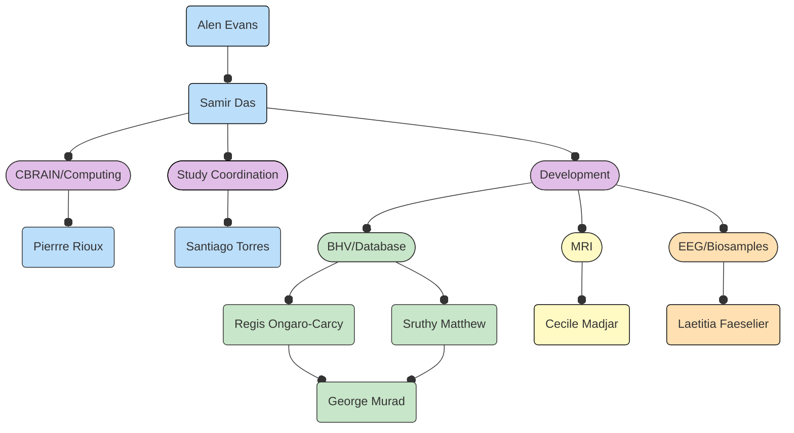

  - mermaid2:
      version: 10.0.2
      javascript: https://unpkg.com/mermaid@10.4.0/dist/mermaid.esm.min.mjs

```mermaid
flowchart TB
A["Alen Evans"] --o nl("Samir Das")
nl --o n9(["Study Coordination"]) & C(["CBRAIN/Computing"]) & B(["Development"])
C --o D["Pierrre Rioux"]
n9 --o E["Santiago Torres"]
B --o F(["BHV/Database"]) & H(["EEG/Biosamples"]) & G(["MRI"])
F --o I["Regis Ongaro-Carcy"] & J["Sruthy Matthew"]
I --o K["George Murad"]
J --o K
G --o L["Cecile Madjar"]
H --o M["Laetitia Faeselier"]

A@{ shape: rounded}
D@{ shape: rounded}
E@{ shape: rounded}
I@{ shape: rounded}
J@{ shape: rounded}
K@{ shape: rounded}
L@{ shape: rounded}
M@{ shape: rounded}
style A stroke:#000000,fill:#BBDEFB
style nl stroke:#000000,fill:#BBDEFB
style n9 stroke:#000000,fill:#E1BEE7,stroke-width:1px,stroke-dasharray: 0
style C stroke:#333,fill:#E1BEE7
style B stroke:#333,fill:#E1BEE7
style D stroke:#333,fill:#BBDEFB
style E stroke:#333,fill:#BBDEFB
style F stroke:#333,fill:#C8E6C9
style H stroke:#333,fill:#FFE0B2
style G stroke:#333,fill:#FFF9C4
style I stroke:#333,fill:#C8E6C9
style J stroke:#333,fill:#C8E6C9
style K stroke:#333,fill:#C8E6C9
style L stroke:#000000,fill:#FFF9C4
style M fill:#FFE0B2,stroke:#000000
```